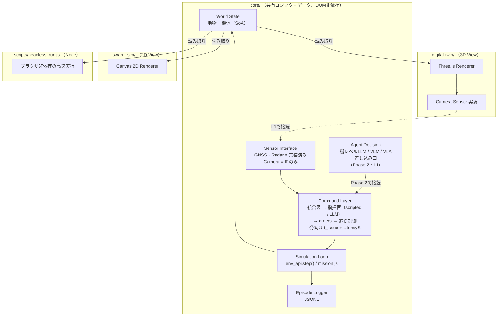

# asv_swarm_dt

マルチASVスウォーム攻防シミュレーション基盤 — 海域デジタルツイン × フィジカルAI（LLM/VLM/VLA） × 安全保障

「AIエージェント社会シミュレーションハッカソン Vol.2」（[automata-lab](https://hackathon.automata-lab.jp/)）向けの開発リポジトリ。**GPU利用申請の根拠資料として、このREADMEを参照する。**

- **公開デモ（GitHub Pages）**: [digital-twin（3D海域DT）](https://sbilxxxx.github.io/asv_swarm_dt/digital-twin/) / [swarm-sim（2Dバードビュー）](https://sbilxxxx.github.io/asv_swarm_dt/swarm-sim/)
- 設計の詳細: [`docs/system-design.md`](docs/system-design.md)
- **舞台となる海域は固定しない。** デフォルトのデモシナリオは東京湾（[`core/scenarios/tokyo_bay_minimal.json`](core/scenarios/tokyo_bay_minimal.json)）。座標・海岸線は簡略化した例示データで、実際の地理を正確には表さない。

## デモ

| 3D海域デジタルツイン（`digital-twin/`） | 2Dバードビュー・攻防シム（`swarm-sim/`） |
|---|---|
|  |  |
| センサー実証: カメラ画像・レーダーPPI・GNSS（北基準コンパス表示）をHUDに表示。船体は多断面ロフト形状（喫水線塗り分け・波追従・影・環境マップ反射込み） | 防護対象への侵入・防御側の迎撃（リード追尾）・エピソード終了時の自動リセットが自律ループで回り続ける。右パネルは陣営間の構造化通信（contact_report）ログ |

*両ビューとも [`core/`](core/) の同一ロジック・同一座標系を使用（現状は別々のWorldインスタンスとして独立実行。接続方針は[`docs/system-design.md`](docs/system-design.md) §2.2）。*

## GPU利用の根拠

このプロジェクトが計算資源を必要とする理由と、現時点で実証済みの内容。

1. **多数体・多エピソードをheadlessで高速に回せる（実証済み）** — `core/`はDOM非依存の純粋なESModulesで、ブラウザなしにNode上で無改造実行できる。同梱の[`scripts/headless_run.js`](scripts/headless_run.js)で誰でも1コマンドで再現・実測できる（詳細は下記「ヘッドレス実行」）。CPU 1コアの実測で3隻 約108,600 steps/s・30隻 約6,400 steps/sを確認済み — GPU上での大規模並列実行（多数体×多環境×多エピソード）に自然に拡張できる設計。
2. **攻防エピソードが実際に終了条件・報酬を持つ（実証済み）** — 「互いに追いかけ回すだけ」ではなく、防護対象への侵入・防御側の迎撃・時間切れの3種の終了条件と、防御側視点の報酬（`core/sim/mission.js`）を持つ。`env.reset()`でエピソードを繰り返し実行でき、反復対戦・自己対戦・強化学習ループの土台になる。
3. **学習データ互換のログを標準搭載（実証済み）** — `step()`の入出力をper-agentフラットJSON Lines形式でロギング（[`core/log/episode_logger.js`](core/log/episode_logger.js)）。UIからのダウンロード導線もあり、模倣学習・強化学習の学習データとしてそのまま使える形式で吐き出せる。
4. **実LLM推論が指揮官レベルで動いている（実証済み・ただし指揮官まで）** — 統合図の生成→プロンプト→OpenAI互換HTTP→JSON指示のパース→艇への追従制御まで一気通貫で実装済み（`core/sim/command/`、[`docs/l0-experiment-log.md`](docs/l0-experiment-log.md)）。ローカルOllama（`qwen2.5:7b`）に対し150エピソード・1,554回の実推論を連続実行し、パース失敗1件・通信失敗0件を実測。推論の遅延はシム時間上の設定値`latencyS`としてモデル化されているため、統制群（ルールベース指揮官）と**同じ遅延の床**で比較できる（[`docs/time-model.md`](docs/time-model.md)）。カメラセンサーの実装・注入設計も機能済み（`digital-twin/camera_sensor.js`）。**未実装は艇レベルLLM（Phase 2、ハッカソンの主題本体）とVLM/VLA（L1）** — GPUはここを多数体・多エピソードで並列に回す用途に使う計画。
5. **視覚的な密度を上げる余地が大きい（GPU上の描画余地）** — 3Dシーンの総頂点数は約34,000（詳細は[`docs/3d-quality-plan.md`](docs/3d-quality-plan.md)）。現代GPUの処理能力に対して極めて小さく、隻数・地物密度・描画品質を伸ばす余地は計算資源側ではなく実装側にある。

**正直な現状**: 上記1〜4は実測・実装済み。ただし4は**指揮官2体まで**で、主題である艇レベルLLM（Phase 2）とVLM（L1）はまだコードがない。そして手元のRTX 3060では、艇6隻を`TIME_SCALE=3`で回すのに必要なスループット（6.6判断/秒）に**3.4倍足りない**ことが実測で分かっている（[`docs/llm-probe-measurements-2026-08-13.md`](docs/llm-probe-measurements-2026-08-13.md) §5）。GPU申請はこの「主題を実際に回す」段階に進むためのもの。もう一点正直に書いておくと、**指揮官をLLMにしても統制群に対する勝率の改善は統計的に確認できていない**（25エピソード/アームでは同条件反復の揺らぎに埋もれる。[`docs/l0-experiment-log.md`](docs/l0-experiment-log.md) §6）。現状の制約・未実装項目は[`docs/review-findings-2026-08-07.md`](docs/review-findings-2026-08-07.md)に独立レビューの実測根拠つきで一覧化している（誇張のない自己評価として、判断材料になれば）。

## 構成

| ディレクトリ | 役割 |
|---|---|
| [`core/`](core/) | データ取り込み・シーン表現・シミュレーション・意思決定・学習データ互換ログを担う共有ロジック（DOM非依存、Node/ブラウザ両対応） |
| [`digital-twin/`](digital-twin/) | 3D海域DT（センサー実証: カメラ・レーダー・GNSS、Three.js） |
| [`swarm-sim/`](swarm-sim/) | 2Dバードビューの戦術マップ・マルチASVスウォーム攻防（Canvas 2D） |
| [`scripts/`](scripts/) | ヘッドレス実行ランナー（[`headless_run.js`](scripts/headless_run.js)）・推論サーバの単体計測ツール（[`llm_probe.js`](scripts/llm_probe.js)）・実行結果の分析レポート生成（[`analyze_run.js`](scripts/analyze_run.js)） |
| [`docs/`](docs/) | 設計書・時間モデル・実験ログ・独立レビュー記録・品質向上計画 |



## 別環境で作業を再開する

別PC（GPUマシン等）へ移す場合、リポジトリだけで足りるもの・別途用意が要るものは次のとおり。

```bash
git clone https://github.com/sbilxxxx/asv_swarm_dt.git
cd asv_swarm_dt
git branch -a                      # 作業中のブランチを確認（master とは限らない）
node tests/core_smoke.test.js && node tests/command.test.js
node scripts/headless_run.js --episodes 5
```

ルートに`package.json`は無く、`core/`・`tests/`・`scripts/`はNodeだけで動く（npm依存ゼロ）。上のコマンドはcloneした直後にそのまま通る。

**別途用意が必要なもの**:

| | 何のために | 備考 |
|---|---|---|
| Node v22以降（実測は v24.15.0） | core・テスト・headless実行 | これだけあればシミュレータ本体は動く（指揮官はルールベース） |
| 静的サーバー（`npx serve .` / `python -m http.server`） | ブラウザ側（`digital-twin/`・`swarm-sim/`） | `file://`直開きは`fetch()`のCORSで動かない |
| インターネット接続 | `digital-twin/`のThree.js（importmap経由でunpkgから取得） | `swarm-sim/`は外部依存なしで動く |
| Ollama本体＋モデル（`ollama pull qwen2.5:7b`） | LLM指揮官（`--blue llm`等）。リポジトリには含まれない | ブラウザから使う場合は`OLLAMA_ORIGINS=*`。指揮官2体の直列化を避けるため`OLLAMA_NUM_PARALLEL=4`を推奨。**推論サーバは別ホストでよい**（下記） |
| `.devtools/`で`npm install` | スクリーンショット駆動QA（puppeteer） | `node_modules/`はgitignore対象。見た目の変更をしないなら不要 |
| Claude Code の superpowers プラグイン | [`docs/l0-llm-agent-plan.md`](docs/l0-llm-agent-plan.md)が指定する実装ワークフロー | 設計・計画の文脈自体は[`CLAUDE.md`](CLAUDE.md)を起点にリポジトリ内で完結する |

**推論サーバを別ホストに置く構成**は設計上の想定内で、コード変更を伴わない。推論はOpenAI互換のHTTPエンドポイント越しに呼ぶため、`--llm-url`（ブラウザは`?llm=`）の向き先を変えるだけでよい。重要なのは、シムの展開を決めるのが実測レイテンシではなく**設定値`latencyS`**であること（[`docs/time-model.md`](docs/time-model.md) §5）。推論を速いマシンへ移してもシム結果は変わらず、変わるのは実行に要する実時間だけなので、「開発は手元・実行はGPU環境」と分けても実験の比較可能性が保たれる。

ただしL1（VLM）では、意思決定のたびに`digital-twin/`のレンダリング画像が推論の入力になる。推論だけをリモートへ置くと判断ごとに画像が回線を渡るため、レンダリング（headless Chromium）も推論側へ同居させるか、転送時間を時間モデルのステージとして明示的に宣言する（[`docs/time-model.md`](docs/time-model.md) §12.5 のパイプライン宣言）。

## 実行方法

ビルド不要のES Modulesで書かれているが、`fetch()`でシナリオJSONを読むためローカルの静的サーバー経由で開く必要がある（`file://`で直接開くとCORSエラーになる）。

```bash
# リポジトリ直下で
npx serve .
# または
python -m http.server 8000
```

起動後、ブラウザで以下を開く。

- `http://localhost:8000/digital-twin/` — 3D海域DT（センサー実証）
- `http://localhost:8000/swarm-sim/` — 2Dバードビュー戦術マップ・攻防シム
- `http://localhost:8000/replay-viewer/` — `headless_run.js`で記録済みのエピソードを2D／3D／指揮官・艇AIの判断ログの3画面で同期再生するビュアー（[`replay-viewer/`](replay-viewer/)）

両者は現在ランタイムを接続していない（独立したシナリオ・独立した`core`インスタンス）。接続方式の設計は[`docs/system-design.md`](docs/system-design.md) §2.2を参照。

## ヘッドレス実行

`core/`はDOM非依存のためNode上でも無改造で動く（ブラウザ・Three.js・Canvas一切不要）。
その主張を実証するためのランナーを同梱している（[`scripts/headless_run.js`](scripts/headless_run.js)、npm依存なし）。

```bash
# 既定シナリオ（3隻: 防御2・侵入1）で5エピソード。指揮官は両陣営ともルールベース（推論サーバ不要）
node scripts/headless_run.js --episodes 5

# 隻数を30隻まで増やして5エピソード（シナリオのspawnを起点に決定論的に合成）
node scripts/headless_run.js --episodes 5 --boats 30

# 陣営ごとに指揮官の腕を選ぶ（既定は両方 scripted）
node scripts/headless_run.js --blue scripted --red scripted --boats 3 --episodes 25 --quiet

# ログをJSON Linesとしてファイルへ書き出す（core自体はfs非依存のまま、書き出しはこのスクリプト側の責務）
node scripts/headless_run.js --episodes 5 --out episodes.jsonl --quiet

# 全オプション
node scripts/headless_run.js --help
```

エピソードごとに`outcome`（defended/breached/timeout）・シム時間・壁時計時間を表示し、
最後に総step数・総壁時計時間・**steps/s**（1隻あたりのsteps/sも）を出力する。
併せて**指揮官の判断サイクルの検証行**（発行数・発効数・`t_issue + latencyS`に厳密一致した件数・最大ずれ）も出力する。
艇の追従制御（`core/sim/command/boat_controller.js`）は毎ステップ・瞬時で、
遅延を持つのは指揮官の判断だけである（[`docs/time-model.md`](docs/time-model.md) §6）。

### 実行結果の分析

書き出したJSONLを読んで、単一ファイルのHTMLレポートを作る
（[`scripts/analyze_run.js`](scripts/analyze_run.js)、npm依存なし・外部CDNなし）。

```bash
# 比較したいアームをそれぞれログ付きで回す
node scripts/headless_run.js --blue scripted --red scripted --boats 3 --episodes 25 --quiet \
  --out logs/ss.jsonl --decision-log logs/ss-decisions.jsonl
node scripts/headless_run.js --blue llm --red scripted --model qwen2.5:7b --boats 3 --episodes 25 --quiet \
  --out logs/ls.jsonl --decision-log logs/ls-decisions.jsonl --llm-log logs/ls-calls.jsonl

# レポートを生成（最初の --run が統制群になる）
node scripts/analyze_run.js \
  --run "scripted x scripted=logs/ss" \
  --run "llm x scripted=logs/ls" \
  --out logs/report.html
```

勝率は必ずWilson信頼区間と一緒に出し、統制群との差は**対応あり**のMcNemar厳密検定に掛ける
（同じエピソード番号なら侵入艇の接近角も同じなので、アーム間には対応がある）。
両陣営の指揮官を同時に替えたアームでは、差が有意でも一方の寄与に帰属できない旨を明示する。
勝率のほかに、エピソードごとの結末グリッド・エピソード長の分布・推論の応答時間分布・
采配の質（`intercept`/`move_to`/`patrol`の内訳、見えているtrackから遠い`move_to`の割合、
前回と同一の点を再発行した割合）・エピソード単位の航跡と`intent`の対応を出す。

**実測値（Node v24.15.0、AMD Ryzen 7 5700X、1コアで実行）**:

| 隻数 | 条件 | steps/s |
|---|---|---|
| 3隻（シナリオ既定） | `--episodes 50` | 約108,600 steps/s（1隻あたり約36,200） |
| 30隻（合成spawn） | `--episodes 20 --boats 30` | 約6,400 steps/s（1隻あたり約214） |

*（参考: 旧計測機 Intel Core i5-1145G7・Node v22.17.0 では 3隻 約40,600 / 30隻 約1,900 steps/s だった。指揮官階層の導入後もスループットは落ちていない。）*

30隻側は移動のみのストレステストより低めに出るが、これは本ランナーが素の移動ループではなく、レーダーO(n²)・ミッション判定（`evaluateMission()`）・統合図の生成・指揮官の判断・追従制御を含む実際のエピソードを最後まで走らせているため。いずれも「GPUで並列に多数体・多エピソードを回せる」という主張を、外部スクリプト無しでこのリポジトリだけで再現・検証できることを実測で示す。

統制群（`scripted`同士）は**完全に決定論**で、同じ引数なら何度実行しても結果はバイト単位で一致する（3隻50エピソードで確認済み）。

## 指揮官LLM（実装済み）

陣営ごとに1体の指揮官が、自陣営の統合図（自軍の真値＋レーダー融合した敵トラックと鮮度）を見て、
艇への指示（`intercept` / `move_to` / `patrol`）をJSONで返す。艇はその指示に従って動く（`core/sim/command/`）。

**推論を行うのは指揮官だけで、艇の追従制御は瞬時**である。艇レベルのLLMはPhase 2の対象。

### セットアップ

```bash
ollama pull qwen2.5:7b
# 指揮官2体の並行発行を直列化させないため、サーバは並列度4で起動することを推奨
#   OLLAMA_NUM_PARALLEL=4 ollama serve
```

### ヘッドレスから

```bash
# 防御側だけLLM、侵入側はルールベース（統制群との比較の基本形）
mkdir -p logs   # 出力先ディレクトリは自分で作る。logs/ は .gitignore 対象
node scripts/headless_run.js --blue llm --red scripted --model qwen2.5:7b --boats 3 --episodes 25 \
  --llm-log logs/calls.jsonl --decision-log logs/decisions.jsonl

# 両陣営LLM
node scripts/headless_run.js --blue llm --red llm --model qwen2.5:7b --episodes 5
```

推論サーバは**別ホストでよい**（`--llm-url`。既定 `http://localhost:11434/v1`、OpenAI互換なのでvLLM等も可）。
`--llm-log`には全プロンプト・生応答・パース結果・呼び出しごとの実測レイテンシが残る。

### ブラウザから（`swarm-sim/`）

```text
http://localhost:8000/swarm-sim/?blue=llm&model=qwen2.5:7b
```

| クエリパラメータ | 意味 |
|---|---|
| `blue` / `red` | 指揮官の腕（`scripted`（既定）/ `llm`） |
| `model` | モデル名（`llm`のとき必須） |
| `llm` | OpenAI互換のベースURL（既定 `http://localhost:11434/v1`） |
| `interval` / `latency` | 発行間隔`intervalS`（既定10）／発効遅延`latencyS`（既定3）、シム秒 |
| `deadline` / `onmiss` | 締切（既定`inf`）／不成立時の挙動（`keep-current`（既定）/ `default-order`） |
| `temp` / `maxtokens` | 生成温度（既定0.7）／応答上限トークン（既定300） |

**パラメータ無しの既定動作は推論サーバ不要**（両陣営ルールベース）。ブラウザから使う場合は`OLLAMA_ORIGINS`の設定が要ることがある。
`latencyS`分の実時間（`latencyS / TIME_SCALE`秒）より推論が遅いと、シムを止めて「推論待ち」オーバーレイを表示する（[`docs/time-model.md`](docs/time-model.md) §9）。

### VLM/VLAへ

同じ差し込み口を使う。`latencyS`はステージの宣言合成（`[render] → [infer]`）へ拡張する設計になっており、
L1ではrenderステージを直列に足すだけで済む（[`docs/time-model.md`](docs/time-model.md) §12.5）。
艇レベルの意思決定関数（`decideFn`、[`core/sim/agents/llm_agent.js`](core/sim/agents/llm_agent.js)）の
デフォルトはAPIキー不要のルールベース関数のまま（ブラウザから直接クラウドAPIキーを扱わないための設計判断）。

## 単艦VLM自動航行（L1・実装済み）

**3D海域デジタルツインの中を、1隻のASVがVLMの判断で自動航行する。** ブリッジ一人称のカメラ画像・
レーダー・GNSS・目的地・現行プランを入力に、VLMが航路（waypoint列）を `keep` / `replace` で
監視・差し替えし、既存の追従制御（`boat_controller.js`）がそれを毎ステップ消化して船が動く。

判断のロジックは [`core/sim/navigator/`](core/sim/navigator/) にあり、**ブラウザで見る経路と
ヘッドレスで実験する経路が同じモジュールを使う**（画面の挙動と実験ログの数字が同じコードから出る）。

| モジュール | 役割 |
|---|---|
| [`navigator_picture.js`](core/sim/navigator/navigator_picture.js) | 状況図（GNSS・レーダー・目的地・現行プラン・画像1枚）とプロンプト生成 |
| [`parse_plan.js`](core/sim/navigator/parse_plan.js) | 応答のパースと**サニタイズ**（自船位置の混入・同一点の連続・領域外を落とし、落とした理由を数える） |
| [`plan_follower.js`](core/sim/navigator/plan_follower.js) | 航路プランの保持と、毎ステップの `move_to` 指示への変換 |
| [`vlm_navigator.js`](core/sim/navigator/vlm_navigator.js) | decider 本体。`DecisionScheduler` から見て指揮官・艇LLMと同型 |

アームは3本: `vlm`（画像あり・主経路）/ `blind`（**同一プロンプトで画像だけ無し**＝統制群）/
`scripted`（推論なし・目的地へ直行＝基準線。推論サーバ不要）。

### ブラウザで見る

`?nav=` を付けると3Dビューの中で自動航行が始まり、**VLMへ実際に送った画像・返ってきた `watch`・
差し替えたwaypoint・サニタイズが落とした理由・航跡・挙動統計**がHUDに出る。

```bash
# 静的配信 ＋ 推論サーバへの同一オリジン中継（ブラウザに推論URLを埋めないため）
node scripts/serve_vlm.js
```

- `http://localhost:8080/digital-twin/?scenario=pilotage_m3&nav=vlm&model=qwen2.5vl-7b-ctx3k` — VLM自動航行
  （`pilotage_m3` は **spline 経路を走る交通船2隻**を航路上に置いたシナリオ。直行すると 9m まで寄る配置を
  テストで担保している。`pilotage_m1` は同じ出発点・目的地で空海面の基準線）
- `?nav=blind` — 統制群（同一プロンプトで画像だけ無し）／ `?nav=scripted` — 基準線（推論サーバ不要）
- **VLM が置いた waypoint は3Dシーンの中に柱で立つ**（航路線・到達半径リング・航跡・交通船の経路も）。
  俯瞰カメラ専用レイヤーに描くので、VLM への入力画像には写らない（自分の引いた線を見て判断する循環を防ぐ）
- 俯瞰視点は**方位固定の第三者視点**が既定（`?cam=orbit` で従来の周回表示、`?plan3d=0` で3D表示を切る）
- `?dest=east,north` で目的地を上書き、`?speed=3` で早送り、
  `?interval=10&render=0.1&infer=2.0` で時間の宣言値を変える

`?nav=` を付けなければ従来どおりのセンサー実証表示で、**サーバー不要の静的サイトのまま**である。

### GPUクラスタで動かし、手元のブラウザで見る

**接続方式の設計・手順・失敗モードは [`docs/remote-viewer-connectivity.md`](docs/remote-viewer-connectivity.md) が正典。**

3Dの描画は**見ている側のブラウザ**で走るので、画面転送（VNC・X11・映像ストリーム）は要らない。
クラスタの仕事は「静的ファイルを配る」と「推論を中継する」の2つだけで、
**ポート転送1本で足りる**（帯域は判断1回あたり上り45〜52KB・下り0.5KB＝平均5〜15KB/s の実測）。

```bash
# クラスタ側（VS Code Remote-SSH の統合ターミナルで。端末を閉じても残すなら tmux で）
node scripts/serve_vlm.js --vendor-three

# VS Code なら右下の通知「ポート 8080 ... 使用可能です」→「ブラウザーで開く」で転送は自動。
# 素の SSH なら手元でトンネルを1本:
ssh -N -L 8080:127.0.0.1:8080 <user>@<cluster>
#  → Mac のブラウザで http://localhost:8080/digital-twin/?scenario=pilotage_m3&nav=vlm&model=qwen2.5vl-7b-ctx3k
```

`serve_vlm.js` は**VS Code の統合ターミナルから起動されたことを検出して手順を出し分け**、
上流のモデル一覧を取得して**thinking系VLMを名指しで警告する**（画像判断で本文が空になるため）。
既定は `127.0.0.1` にしか bind しない——この中継は事実上「無認証のGPU推論API」なので、
共有クラスタで素で公開しないための既定である（公開は `--host 0.0.0.0` を明示したときだけ）。

**この環境では手元の Mac が `unpkg.com` へ到達できないことが確認されている**ので、
`--vendor-three` を付ける。Three.js を同一オリジンから配るモードで、
`replay-viewer/vendor/three.module.js`（既に同梱済み）を再利用し、無ければクラスタ側が取得する。
**外部へのリクエスト0件で3Dが出ることを実測済み。** 配信するHTMLの importmap だけを
書き換えるのでリポジトリのファイルは無変更＝GitHub Pages 配置は壊れない。
付け忘れて白紙になった場合は、12秒後に原因と対処が画面に出る。

### ヘッドレスで実験する

```bash
node scripts/vlm_navigator_run.js --arm vlm --model qwen2.5vl-7b-ctx3k     # 既定シナリオは pilotage_m3（交通船あり）
node scripts/vlm_navigator_run.js --arm blind --model qwen2.5vl-7b-ctx3k   # 統制群
node scripts/vlm_navigator_run.js --arm scripted                     # 推論サーバ不要
node scripts/vlm_navigator_run.js --arm vlm --scenario pilotage_m1   # 空海面の基準線
```

`logs/vlm-nav-<日時>-<arm>/` に送信画像・`decisions.jsonl`（プロンプト・生応答・パース結果・
落としたwaypointの理由・**宣言値と実測を別項目で**）・`summary.json`・`overview.png` が残る。
初回は `cd .devtools && npx puppeteer browsers install chrome-headless-shell` が要る。

### 時間の扱い

この航海士が**複数ステージ宣言の最初の実使用者**である（[`docs/time-model.md`](docs/time-model.md) §12.5）。
`stages: [{name:'render'}, {name:'infer'}]` を宣言し、発効は `t_issue + renderS + inferS` になる。
HUDとログに出る実測 ms は**記録**であって、宣言値へ書き戻す口はどこにも無い。

### モデル選定の注意（実測）

thinking系のVLM（`qwen3-vl:8b` 等）は画像1枚の判断で推論に1,100〜1,600文字を費やし、
`maxTokens` を1,400まで上げても本文が空のまま返る（`thinking_overrun`）。
Ollama 0.33.2 では `think:false` を送ってもこのモデルのテンプレートでは thinking が止まらないことを実測した。
**非thinkingのVLM（`qwen2.5vl:7b` / `qwen2.5vl:32b`）を使うこと。**
失敗しても航路は維持され船は走り続けるので、エピソードは必ず終わる。

## 現在の実装状況

- `core/`: データ取り込み（手書き海岸線1種、アダプターレジストリ配線済み）・シーン表現・ASV運動学（環境力の差し込み口`environment.sample()`配線済み）・GNSS/レーダー・攻防ミッション判定（`mission.js`）・ルールベースの意思決定（APIキー不要）・学習データ互換のper-agent JSONLログを実装
- `core/sim/command/`: **指揮官階層**（陣営別の統合図`fused_picture.js`・プロンプト生成`commander_prompt.js`・出力パース`parse_orders.js`・LLM指揮官`llm_commander.js`・ルールベース指揮官`scripted_commanders.js`）と、**時間フレームワーク**（`decision_scheduler.js`: `t_issue → t_apply`・発行トークン・締切`deadlineS`・不成立`onMiss`）、**orders と艇の追従制御**（`orders.js` / `boat_controller.js`）を実装。HTTP経路は`core/sim/agents/llm_http.js`（OpenAI互換）
- `digital-twin/`: Three.jsで海域3Dシーンを構築（多断面船体・環境マップ・ヒーロー艇追従影・海面LOD）、船体視点のカメラ画像・レーダー・GNSSをHUDに表示
- `swarm-sim/`: Canvas 2Dで海岸線・ASVアイコン・航跡・防護対象・**指示のオーバーレイ**を描画し、スケジューラ駆動で攻防エピソード（迎撃・突破・時間切れ→自動リセット）を自律ループで実行。LLM指揮官の**推論待ち停止**と**不成立**を画面とログに表示する
- `core/sim/navigator/`: **単艦VLM航海士**（状況図`navigator_picture.js`・パースとサニタイズ`parse_plan.js`・航路プラン`plan_follower.js`・decider`vlm_navigator.js`）を実装。`llm_http.js` は画像入力（`images`）に対応（画像なしの body は従来とバイト同一）
- `scripts/`: ヘッドレス実行ランナー（3アーム比較・判断サイクルの検証行つき）・推論サーバの単体計測ツール（`llm_probe.js`）・**単艦VLM閉ループの実験ランナー**（`vlm_navigator_run.js`）・**静的配信＋推論中継の開発サーバ**（`serve_vlm.js`）

実測: [`docs/l0-experiment-log.md`](docs/l0-experiment-log.md)（指揮官アームの比較）・[`docs/llm-probe-measurements-2026-08-13.md`](docs/llm-probe-measurements-2026-08-13.md)（推論サーバの性能と`latencyS`の根拠）。

未実装（インターフェースのみ予約、詳細は[`docs/system-design.md`](docs/system-design.md)）: **艇レベルLLM（Phase 2）**、**VLM/VLA推論（L1）**、AUV（2D専用のEntityState/センサーを3D対応させる必要あり）、AIS/ドローン観測アダプターの取込経路、他海域データアダプター、OpenUSD対応、波のサロゲートモデル、学習パイプライン本体、DTとswarm-simのランタイム接続（L1で実施）。

独立レビューによる実測根拠つきの詳細な現状評価は[`docs/review-findings-2026-08-07.md`](docs/review-findings-2026-08-07.md)、3D表現の品質向上計画は[`docs/3d-quality-plan.md`](docs/3d-quality-plan.md)を参照。
