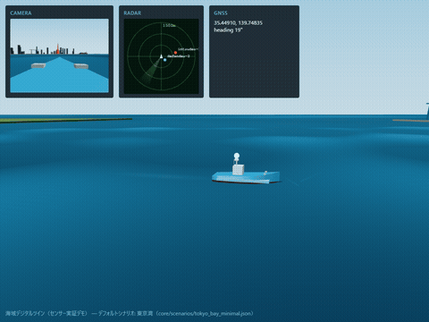
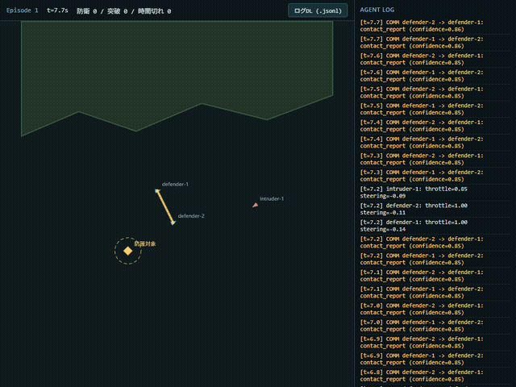
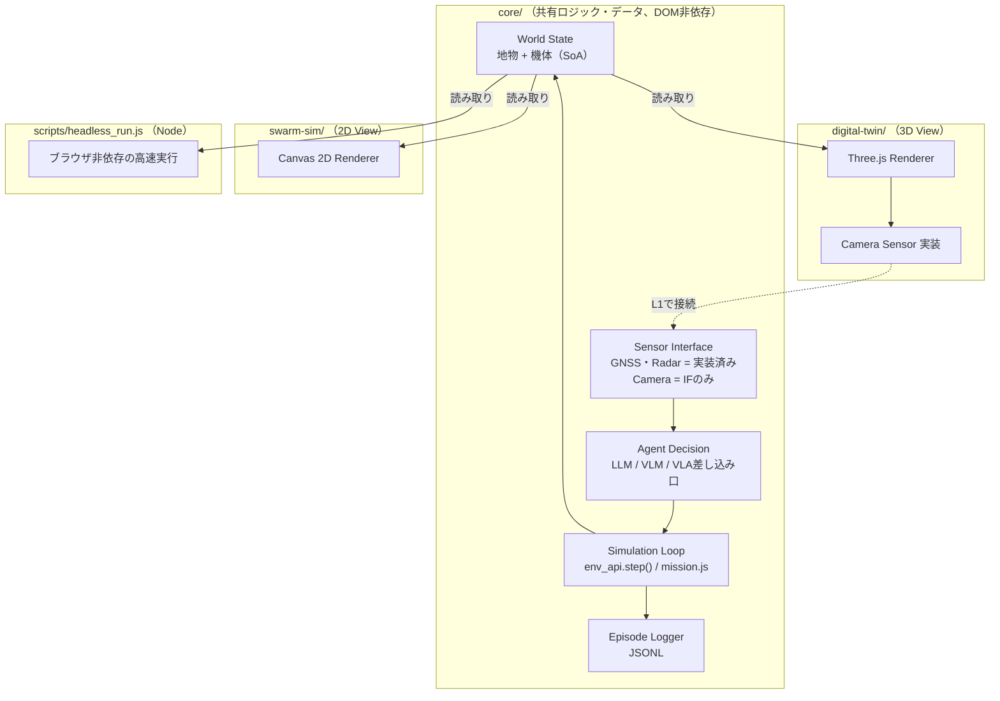

# asv_swarm_dt

マルチASVスウォーム攻防シミュレーション基盤 — 海域デジタルツイン × フィジカルAI（LLM/VLM/VLA） × 安全保障

「AIエージェント社会シミュレーションハッカソン Vol.2」（[automata-lab](https://hackathon.automata-lab.jp/)）向けの開発リポジトリ。**GPU利用申請の根拠資料として、このREADMEを参照する。**

- **公開デモ（GitHub Pages）**: [digital-twin（3D海域DT）](https://sbilxxxx.github.io/asv_swarm_dt/digital-twin/) / [swarm-sim（2Dバードビュー）](https://sbilxxxx.github.io/asv_swarm_dt/swarm-sim/)
- 設計の詳細: [`docs/system-design.md`](docs/system-design.md)
- **舞台となる海域は固定しない。** デフォルトのデモシナリオは東京湾（[`core/scenarios/tokyo_bay_minimal.json`](core/scenarios/tokyo_bay_minimal.json)）。座標・海岸線は簡略化した例示データで、実際の地理を正確には表さない。

## デモ

| 3D海域デジタルツイン（`digital-twin/`） | 2Dバードビュー・攻防シム（`swarm-sim/`） |
|---|---|
|  |  |
| センサー実証: カメラ画像・レーダーPPI・GNSS（北基準コンパス表示）をHUDに表示。船体は多断面ロフト形状（喫水線塗り分け・波追従・影・環境マップ反射込み） | 防護対象への侵入・防御側の迎撃（リード追尾）・エピソード終了時の自動リセットが自律ループで回り続ける。右パネルは陣営間の構造化通信（contact_report）ログ |

*両ビューとも [`core/`](core/) の同一ロジック・同一座標系を使用（現状は別々のWorldインスタンスとして独立実行。接続方針は[`docs/system-design.md`](docs/system-design.md) §2.2）。*

## GPU利用の根拠

このプロジェクトが計算資源を必要とする理由と、現時点で実証済みの内容。

1. **多数体・多エピソードをheadlessで高速に回せる（実証済み）** — `core/`はDOM非依存の純粋なESModulesで、ブラウザなしにNode上で無改造実行できる。同梱の[`scripts/headless_run.js`](scripts/headless_run.js)で誰でも1コマンドで再現・実測できる（詳細は下記「ヘッドレス実行」）。CPU 1コアの実測で3隻 約40,600 steps/s・30隻 約1,900 steps/sを確認済み — GPU上での大規模並列実行（多数体×多環境×多エピソード）に自然に拡張できる設計。
2. **攻防エピソードが実際に終了条件・報酬を持つ（実証済み）** — 「互いに追いかけ回すだけ」ではなく、防護対象への侵入・防御側の迎撃・時間切れの3種の終了条件と、防御側視点の報酬（`core/sim/mission.js`）を持つ。`env.reset()`でエピソードを繰り返し実行でき、反復対戦・自己対戦・強化学習ループの土台になる。
3. **学習データ互換のログを標準搭載（実証済み）** — `step()`の入出力をper-agentフラットJSON Lines形式でロギング（[`core/log/episode_logger.js`](core/log/episode_logger.js)）。UIからのダウンロード導線もあり、模倣学習・強化学習の学習データとしてそのまま使える形式で吐き出せる。
4. **LLM/VLM/VLA意思決定への差し込み口を用意（配線済み・実装は今後）** — エージェントの意思決定関数（`decideFn`）を差し替えるだけでルールベースから実LLM/VLM/VLAへ切り替えられる（[`core/sim/agents/llm_agent.js`](core/sim/agents/llm_agent.js)）。カメラセンサーの実装・注入設計も機能済み（`digital-twin/camera_sensor.js`）。**現時点でLLM/VLM/VLAの推論コードは未実装** — GPUはこの推論（特にVLM/VLAによる画像・状況入力からの意思決定）を多数体・多エピソードで並列に回す用途に使う計画。
5. **視覚的な密度を上げる余地が大きい（GPU上の描画余地）** — 3Dシーンの総頂点数は約34,000（詳細は[`docs/3d-quality-plan.md`](docs/3d-quality-plan.md)）。現代GPUの処理能力に対して極めて小さく、隻数・地物密度・描画品質を伸ばす余地は計算資源側ではなく実装側にある。

**正直な現状**: 上記1〜3は実測・実装済みだが、4（実LLM/VLM/VLA推論）はまだコードがない。GPU申請はこの「推論を実際に回す」段階に進むためのもの。現状の制約・未実装項目は[`docs/review-findings-2026-08-07.md`](docs/review-findings-2026-08-07.md)に独立レビューの実測根拠つきで一覧化している（誇張のない自己評価として、判断材料になれば）。

## 構成

| ディレクトリ | 役割 |
|---|---|
| [`core/`](core/) | データ取り込み・シーン表現・シミュレーション・意思決定・学習データ互換ログを担う共有ロジック（DOM非依存、Node/ブラウザ両対応） |
| [`digital-twin/`](digital-twin/) | 3D海域DT（センサー実証: カメラ・レーダー・GNSS、Three.js） |
| [`swarm-sim/`](swarm-sim/) | 2Dバードビューの戦術マップ・マルチASVスウォーム攻防（Canvas 2D） |
| [`scripts/`](scripts/) | ヘッドレス実行ランナー |
| [`docs/`](docs/) | 設計書・独立レビュー記録・品質向上計画 |



## 実行方法

ビルド不要のES Modulesで書かれているが、`fetch()`でシナリオJSONを読むためローカルの静的サーバー経由で開く必要がある（`file://`で直接開くとCORSエラーになる）。

```bash
# リポジトリ直下で
npx serve .
# または
python -m http.server 8000
```

起動後、ブラウザで以下を開く。

- `http://localhost:8000/digital-twin/` — 3D海域DT（センサー実証）
- `http://localhost:8000/swarm-sim/` — 2Dバードビュー戦術マップ・攻防シム

両者は現在ランタイムを接続していない（独立したシナリオ・独立した`core`インスタンス）。接続方式の設計は[`docs/system-design.md`](docs/system-design.md) §2.2を参照。

## ヘッドレス実行

`core/`はDOM非依存のためNode上でも無改造で動く（ブラウザ・Three.js・Canvas一切不要）。
その主張を実証するためのランナーを同梱している（[`scripts/headless_run.js`](scripts/headless_run.js)、npm依存なし）。

```bash
# 既定シナリオ（3隻: 防御2・侵入1）で5エピソード
node scripts/headless_run.js --episodes 5

# 隻数を30隻まで増やして5エピソード（シナリオのspawnを起点に決定論的に合成）
node scripts/headless_run.js --episodes 5 --boats 30

# ログをJSON Linesとしてファイルへ書き出す（core自体はfs非依存のまま、書き出しはこのスクリプト側の責務）
node scripts/headless_run.js --episodes 5 --out episodes.jsonl --quiet
```

エピソードごとに`outcome`（defended/breached/timeout）・シム時間・壁時計時間を表示し、
最後に総step数・総壁時計時間・**steps/s**（1隻あたりのsteps/sも）を出力する。
意思決定は`swarm-sim/main.js`と同じ間引き間隔（物理6stepに1回、`DECISION_INTERVAL_STEPS=6`）で行う。

**実測値（Windowsノートで実測、Node v22.17.0、Intel Core i5-1145G7 @ 2.60GHz、1コアで実行）**:

| 隻数 | 条件 | steps/s |
|---|---|---|
| 3隻（シナリオ既定） | `--episodes 5` | 約40,600 steps/s |
| 30隻（合成spawn） | `--episodes 5 --boats 30` | 約1,900 steps/s |

30隻側は移動のみのストレステストより低めに出るが、これは本ランナーが素の移動ループではなく、レーダーO(n²)・ミッション判定（`evaluateMission()`）・ルールベース意思決定（`decide()`、6stepに1回）を含む実際のエピソードを最後まで走らせているため。いずれも「GPUで並列に多数体・多エピソードを回せる」という主張を、外部スクリプト無しでこのリポジトリだけで再現・検証できることを実測で示す。

## 実LLM/VLM/VLAへの差し替え

デフォルトはAPIキー不要のルールベース関数（`core/sim/agents/rule_based_fallback.js`）。実際のLLM呼び出しに差し替える場合は、`LlmAgent`の`decideFn`にOllama等のHTTP APIを呼ぶ関数を渡す（ブラウザから直接クラウドAPIキーを扱わないための設計判断。詳細は[`docs/system-design.md`](docs/system-design.md)参照）。GPU上でVLM/VLAを稼働させる場合も同じ差し込み口を使う想定。

## 現在の実装状況

- `core/`: データ取り込み（手書き海岸線1種、アダプターレジストリ配線済み）・シーン表現・ASV運動学（環境力の差し込み口`environment.sample()`配線済み）・GNSS/レーダー・攻防ミッション判定（`mission.js`）・ルールベースの意思決定（APIキー不要）・学習データ互換のper-agent JSONLログを実装
- `digital-twin/`: Three.jsで海域3Dシーンを構築（多断面船体・環境マップ・ヒーロー艇追従影・海面LOD）、船体視点のカメラ画像・レーダー・GNSSをHUDに表示
- `swarm-sim/`: Canvas 2Dで海岸線・ASVアイコン・航跡・防護対象を描画し、固定タイムステップで攻防エピソード（迎撃・突破・時間切れ→自動リセット）を自律ループで実行

未実装（インターフェースのみ予約、詳細は[`docs/system-design.md`](docs/system-design.md)）: 実LLM/VLM/VLA推論コード、AUV（2D専用のEntityState/センサーを3D対応させる必要あり）、AIS/ドローン観測アダプターの取込経路、他海域データアダプター、OpenUSD対応、波のサロゲートモデル、学習パイプライン本体、DTとswarm-simのランタイム接続（L1で実施）。

独立レビューによる実測根拠つきの詳細な現状評価は[`docs/review-findings-2026-08-07.md`](docs/review-findings-2026-08-07.md)、3D表現の品質向上計画は[`docs/3d-quality-plan.md`](docs/3d-quality-plan.md)を参照。
