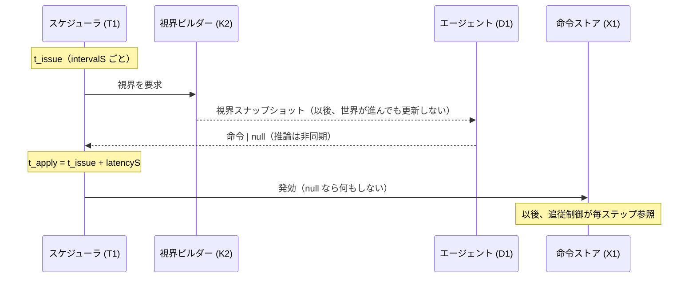

# 判断システム — マルチエージェントの構成

> 作成: 2026-08-30 / v1
> 位置づけ: [`system-architecture.md`](system-architecture.md) のノード D1（判断）＋ T1（時間）を展開した正典。
> 「誰が・いつ・何を見て・何を出すか」と、判断が世界に効くまでのライフサイクルを定める。
> ルールの根拠は [`game-design.md`](game-design.md)、時間の理論は [`time-model.md`](time-model.md)。

---

## 0. 判断システムの骨格 — 3 つの決めごと

1. **全エージェントが単一契約を満たす**: `decide(視界) → 命令 | null`。
   指揮官・艇・（次段階）VLM 索敵艇のすべてが同じ形。スケジューラは中身を区別しない。
2. **判断は離散イベントである**: エージェントは intervalS ごとにしか判断できず、
   判断は latencyS 後にしか効かない。その間、世界は前の命令のまま進む。
3. **知識の非対称が判断を分業させる**: 指揮官は「広いが古い」、艇は「狭いが今」。
   この差が役割分担（指揮官=配分、艇=更新）の物理的根拠であり、プロンプトの工夫ではない。

---

## 1. エージェント台帳

システムに登録される判断主体は 6 つ（＋侵入側は登録されない）。

| ID | 種別 | 頭脳 | intervalS | latencyS | 視界 | 出力語彙 |
|---|---|---|---|---|---|---|
| `blue-commander` | 指揮官 | LLM | 10 s | 3 s | 統合図（陣営融合・識別込み） | engage / identify / screen / hold |
| `def-runner-1` | 艇 | LLM | 3 s | 1 s | 自艦レーダー＋自分の識別 | pursue / disengage / switch ＋ avoid |
| `def-runner-2` | 艇 | LLM | 3 s | 1 s | 同上 | 同上 |
| `def-scout` | 艇 | LLM →（次段階）VLM | 3 s（VLM: 8 s） | 1 s | 同上（VLM: ＋カメラ画像） | 同上（VLM: ＋識別報告） |
| `def-heavy` | — | **なし** | — | — | — | —（命令に従うだけ） |
| `red-commander` 相当 | — | **決定論** | — | — | —（視界を見ない） | 事前航路 |

- **def-heavy に頭脳を載せない理由**: 最終防衛線は「持ち場を守る」が仕事で、現場判断の
  余地が最も小さい。推論コスト（3060 のスループット制約）を判断が効く艇に集中させる。
- **侵入側が登録されない理由**: 統制群。事前に引いた航路の決定論で動き、視界も読まない。
  両陣営を LLM にすると勝率の変化をどちらの寄与か帰属できない。

---

## 2. 判断のライフサイクル

1 回の判断は 4 つの時刻を通る。すべてシミュレーション時刻であり、実測の推論時間は
記録されるだけで結果に影響しない（time-model の一方通行原則）。

| 時刻 | 出来事 | 要点 |
|---|---|---|
| t_issue | 視界を凍結して判断を発行 | **視界は発行時点のスナップショット**。推論中に世界が動いても判断材料は変わらない |
| （推論中） | LLM が考えている | ブラウザは結果が要るまで進み、間に合わなければ「推論待ち」で停止（仕様）。実測時間はログのみ |
| t_apply | 命令が発効 | ここで初めて世界に効く。命令ストアの同じ艇の欄を上書き |
| 次の t_issue | t_issue + intervalS | 前回の結果を待たずに刻む（詰まらない） |

**失敗の意味論**: 推論不達・パース不能・締切超過は、すべて「命令が来なかった」＝ null と同じ
扱いで世界に現れる。**ルールベースでの代行はしない**（LLM の腕の成績にルールの采配が混ざる）。
ただし結末は必ずラベル付きで数える（§5）。

---

## 3. 二層の判断 — 何が違い、なぜ両方要るか

| | 指揮官 | 現場の艇 |
|---|---|---|
| 視界の幅 | 陣営全体（融合図） | 自艦レーダーのみ |
| 視界の鮮度 | **最大 13 秒古い** | **今この瞬間** |
| 判断の問い | 「駒をどう配分するか」 | 「この間合いでどうするか」 |
| 典型の一手 | 未識別の鈍い点に索敵艇を差し向ける | 識別した瞬間「相手は重装、踏み込めば死ぬ」と離脱 |
| 時間スケール | 10 秒（戦術） | 3 秒（間合い） |

**両方要る根拠は数字で言える**: 識別情報が指揮官経由で他艇に届くまで最大 13 秒。
9 m/s の艇にとって 117 m ——迎撃の間合いより大きい。指揮官だけでは間合いの判断が
構造的に間に合わず、艇だけでは配分（誰が本命か・誰を見に行かせるか）が決められない。

### 命令の合流と競合

指揮官の命令も艇の自己判断も、**同じ正規化形で同じ命令ストアに書かれる**。

- 調停規則は置かない。**後から発効した方が勝つ**。
- 艇の上書きが次の指揮サイクルで塗り潰されることは起こり得る。それは不具合ではなく
  観察対象であり、上書き回数として記録する（§5）。

---

## 4. 各エージェントの入出力契約

### 4.1 指揮官

**入力（統合図）に含まれるもの** — 各行が「渡す/渡さない」の決定である:

| 要素 | 渡し方 | 理由 |
|---|---|---|
| 自軍の位置・命令 | 真値として | 味方のことは正確に分かる |
| 敵トラック | 位置＋ `last seen Xs ago` | 鮮度を隠さない。古い判断も観察対象 |
| 敵の艦種 | 識別済みは `CLASS: heavy (blast 100m)`、未識別は `CLASS: unknown` | **unknown の明記が identify という命令の価値を作る** |
| 自分のリズム | 「10 秒ごと・3 秒遅れ」を明記 | 遅延を知らない指揮官は正しく采配できない |
| 旗と制限時間 | 座標(0,0)・残り時間 | 判断材料を視界の中で閉じる |

**出力**: `{orders: [engage|identify|screen|hold ...], intent: 12語以内}` ＋ 名簿検証
（指揮下にない艇・見えていない敵への命令はパース時に落とす）。

### 4.2 現場の艇

**入力（艇の視界）**: 自艦の状態と爆破半径・指揮官からの現在命令・自艦レーダーの点
（自分が識別済みの相手だけ CLASS 付き）・旗までの距離。

**出力**: `{decision: pursue|disengage|switch, target?, avoid?: [...], reason: 10語以内}`。

- `pursue`（従う）を第一級にする。変えないなら何も書き直させない
  （L0 実測: 同一 waypoint 再送 80.9% への対策）。
- `avoid` は座標ではなく**相手の ID のリスト**。回避の幾何（方位ブレンド）は追従制御が解く。
- `reason` を必須にするのは説明のためだけでなく、ログ上で「離脱の判断が識別情報に
  基づいていたか」を後から突き合わせるため。

### 4.3 （次段階）VLM 索敵艇

**入力**: 艇の視界＋一人称カメラ画像 1 枚。
**出力**: 通常の艇の出力＋**識別報告** `{contact: id, class: heavy|runner|scout}`。

- 識別報告は命令ではなく **K1 識別台帳への書き込みイベント**になる。近接識別と同じ型。
- VLM に距離・座標・waypoint を一切出させない。「何がどれか」だけを言わせる
  （2026-08-14 実測: グラウンディングは完全正解、幾何は破綻）。

---

## 5. 観測可能性 — 判断の質を測る計器

判断システムは自身の挙動を必ず数える。勝率（揺らぎに埋もれやすい）ではなく
**挙動指標**を主とする（L0 の教訓: 勝率の分離には 1 腕 170 エピソード要る）。

| 指標 | 何が分かるか |
|---|---|
| 艇の pursue / disengage / switch 比率 | 艇が「考えているか」。pursue 100% なら艇の層は死んでいる |
| 上書き発生数（艇→指揮官の命令を上書き） | 二層が実際に競合しているか |
| 離脱と識別の一致率 | disengage が CLASS 判明の直後に出ているか＝**判断が情報に基づいているか** |
| identify 命令の発行数と成功率 | 指揮官が「知らないことを知る」行動を取れているか |
| null 率（失敗・obey の内訳付き） | 判断が成立しているか。失敗種別（timeout/parse/…）で原因を切り分ける |
| 実測推論時間の分布 | intervalS の宣言値が現実的か（ルールには書き戻さない） |

**比較の腕**: ①全ルールベース（統制群・完全決定論）②指揮官のみ LLM ③指揮官＋艇 LLM
④（次段階）＋VLM。①→③の差で「艇の判断」の寄与、③→④で「視覚」の寄与を読む。

---

## 6. スループット制約と縮退

3060 で LLM 4 体（指揮官 1＋艇 3）が同時に回るとは限らない。詰まったときの縮退順:

1. 艇の intervalS を延ばす（3 → 5 s）
2. 艇の推論を間引く（レーダーに変化があった艇だけ発行する）
3. 艇を 1 隻だけ LLM にする（runner-1 のみ。デモとしては 1 隻の判断が見えれば成立）

いずれも設定値の変更であり、コードの構造は変えない。
