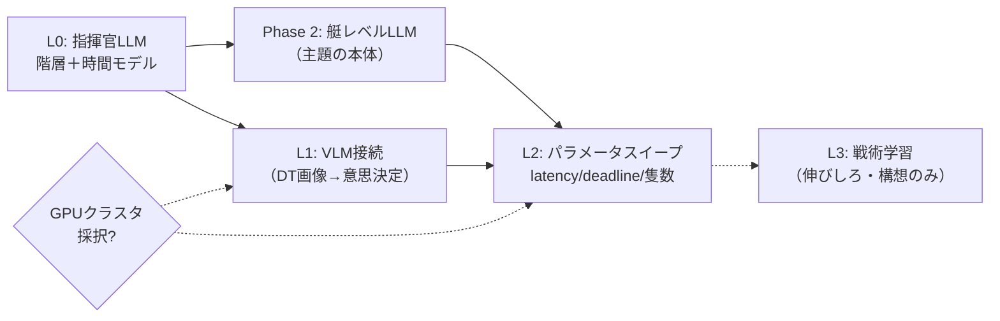

# 開発ロードマップ — L0 から先の見取り図

> 作成: 2026-08-13 / v1
> 位置づけ: フェーズの順序・依存関係・分岐条件をまとめた**上位の計画**。個々のタスク手順は各フェーズの実装計画（現在は [`l0-llm-agent-plan.md`](l0-llm-agent-plan.md) のみ）に置く。
> 前提となる設計: [`system-design.md`](system-design.md)（4層アーキテクチャ）・[`time-model.md`](time-model.md)（時間フレームワーク）
> 現状の穴: [`review-findings-2026-08-07.md`](review-findings-2026-08-07.md)

---

## 1. 現在地

動いているもの、書いてあるだけのもの、その境目をはっきりさせておく。

> 更新: 2026-08-14（L0 完了時）

| 区分 | 内容 |
|---|---|
| **実装・実測済み** | core の4層（データ取込・シーン表現・シミュレーション/センサー・env API）、攻防ミッション判定と3種の終了条件、学習データ互換 JSONL ログ、headless ランナー（3隻 108,600 steps/s・30隻 6,400 steps/s）、3D 海域DT のセンサー実証（カメラ・レーダーPPI・GNSS）、2D 攻防シムの自律ループ／**（L0 で追加）指揮官階層（陣営別の統合図→orders→追従制御）、時間フレームワーク（`DecisionScheduler`・発行トークン・締切 `deadlineS`・不成立 `onMiss`・ステージ別の実測記録）、LLM 指揮官と OpenAI 互換（Ollama）配線、統制群の scripted 指揮官、推論サーバの単体計測（`llm_probe`）、3アームの比較ラン** |
| **設計だけ済み（コードなし）** | パイプライン宣言の複数ステージ合成（`[render] → [infer]`。単一ステージのみ実装・使用）、`latencyModel` の分布化（`constant` のみ実装・使用）、`missArbiter: 'wallclock'` |
| **未着手** | 艇レベル LLM（Phase 2）、VLM 接続（L1）、パラメータスイープ（L2）、戦術学習（L3）、AIS/ドローンの動的取込経路（B-2） |

レビュー指摘 B-7「LLM/VLM/VLA のコードが1行も無い」は**対応済**（指揮官レベルまで。1,893行。実測は [`l0-experiment-log.md`](l0-experiment-log.md)）。
ただし GPU 申請の本命である VLM（L1）と、ハッカソンの主題である艇レベル LLM（Phase 2）はまだコードが無い。**穴は「推論が1行も無い」から「主題の推論がまだ無い」へ移った。**

L0 の実験結果で押さえておくべき点が2つある。**(1) 指揮官を LLM にしても、統制群に対する勝率の改善は 25エピソード/アームでは有意ではない**（同条件反復の揺らぎが 12 ポイントあり、差と同じ大きさ。McNemar p = 0.45）。分離には1アーム約170エピソードが要る——L2 の設計に織り込む。**(2) 采配には再現する具体的な欠陥がある**（`move_to` の 80.9% が直前と同一座標の再送＝更新されない死んだ waypoint）。プロンプトに動作の説明を1行足す A/B では悪化した。詳細は [`l0-experiment-log.md`](l0-experiment-log.md) §4〜§6。

## 2. 締切と資源

| 制約 | 内容 |
|---|---|
| 本選期間 | 2026-08-15 〜 08-30（16日間） |
| 体制 | ソロ |
| 計算資源 | **RTX A5000 × 8基（各24GB / 計192GB）・64コア・376GB RAM・Ollama 0.33.2**（2026-08-30 実測）。当初記載の「手元 RTX 3060 12GB ＋ GPUクラスタ申請待ち」は実環境と乖離していたため更新。32B級を8基へ分散ロードして4並列推論まで確認済み（[`submission/measurements/multi-llm-32b-2026-08-30.md`](../submission/measurements/multi-llm-32b-2026-08-30.md)） |
| ハッカソン主題 | マルチエージェント。**艇レベル LLM は「あれば良い」ではなく主題そのもの** |

主題がマルチエージェントである以上、L0（指揮官2体）で止めた状態は提出物として弱い。Phase 2 までを本選期間内の必達ラインとする。

## 3. フェーズの依存関係

L0 は他の全フェーズの土台なので、これが動かないまま先へは進めない。L1（VLM）と Phase 2（艇LLM）は互いに独立していて、どちらを先にやるかは選択の余地がある——が、主題を踏まえれば Phase 2 が先である。

## 4. L0 — 指揮官階層と時間フレームワークの実装

実装計画は [`l0-llm-agent-plan.md`](l0-llm-agent-plan.md) の Task 1〜10。**time-model v2.0 を受けて、計画からの差分が3点ある。**

| 差分 | 対象 | 内容 |
|---|---|---|
| **D-1** | Task 5 | `DecisionScheduler` に発行トークン（`markIssued` が返し、`provideResult(id, result, token)` が照合）を**必須要件**として実装する。v1.1 では「推奨」だったが、締切処理がこの上に乗るため先送りできない |
| **D-2** | Task 5 | `register()` の引数を拡張する。`{intervalS, latencyS}` に加え、ステージ宣言・`deadlineS`（既定 ∞）・`onMiss`（既定 keep-current）・`latencyModel`（既定 constant）を受け付ける。既定値のままなら L0 の挙動は計画どおりで変わらない |
| **D-3** | Task 8/9 | 実測 t_wall を**ステージ別**に記録する（記録側の変数。ルールには書き戻さない）。L1 で render と infer を分けて測るための土台をここで作っておく |

D-2 は「使わない設定を先に作る」ことになるが、Phase 2 での変更範囲を register の呼び出し側だけに閉じ込められる。スケジューラ本体を2度書くよりは安い。

**実行順序**: Task 1（推論実測）→ 2（レーダー距離）→ 3（観測パイプライン）→ 4（orders・追従制御）→ 5（スケジューラ）→ 6（統合図・パース・scripted）→ 7（LLM指揮官）→ 8（headless）→ 9（ブラウザ）→ 10（比較ラン）。

**完了の定義**: 3アーム（scripted×scripted / llm×scripted / llm×llm）が完走して勝率が並ぶ。指示の発効時刻が `t_issue + latencyS` に一致する（テストで担保）。keptOrders 率 20% 未満。

## 5. Phase 2 — 艇レベル LLM

ハッカソンの主題であり、L0 の直後に着手する。別途 `phase2-boat-llm-plan.md` を書き起こす。

**着手ゲート**（[`time-model.md`](time-model.md) §12.5「段階適用」表）:

1. `deadlineS` と `onMiss` の**値を選ぶ**（設計は済んでいるので、選択だけ）。艇の decider 数が増えると「誰か1人が詰まる確率」が上がるため、有限の締切が現実的な候補になる。
2. 処理能力を実測で裏づける。艇6隻・`intervalS=3s` なら発行レートは 2.2回/シム秒、1エピソード約530回。ブラウザが `TIME_SCALE=3` で停止せずに流れるには実スループット 6.6回/秒が必要で、3060＋8B級（毎秒1〜2回）では届かない。`llm_probe` を Phase 2 の発行パターン（小さいプロンプトの持続負荷）で拡張計測してから、次の4択を決める——wallclock デモモード／`TIME_SCALE` を下げる／`intervalS` を延ばす／GPU 環境で回す。

**設計上の契約**（L0 で壊してはいけないもの）: 艇は `register(boatId, {...})` で decider として登録するだけで時間フレームワークに乗る。艇 LLM の入力は「現在の order ＋ ローカル観測」、出力は order の受諾または局所修正。`BoatController` は艇 LLM の下位層としてそのまま残る。

**設計する必要があるもの**: 艇 LLM のプロンプトと出力スキーマ、指揮官の指示と艇の判断が食い違ったときの調停規則、艇ごとの推論を間引く戦略（全艇が毎サイクル推論する必要はない）。

## 6. L1 — VLM 接続

DT が生成するカメラ画像を意思決定の入力に繋ぐ。時間フレームワーク側の追加は render ステージの直列宣言だけで済む（`[render] → [infer]`）。`renderS` と `inferS` を別々に実測し、宣言値を決める。

VLM は 8B 級でも 3060 には重く、**GPU クラスタの採択が事実上の前提**になる。採択されなかった場合は §8 の分岐に従う。

## 7. L2 / L3

L2 はパラメータスイープ。時間フレームワークが設定値で駆動される設計になったことで、`latencyS`・`latencyModel`（分布）・`deadlineS`・`onMiss`・隻数・レーダー距離がそのまま実験軸になる。「指揮が遅い陣営は負けるのか」「指揮系統が不安定なとき何が起きるか」という問いが、コード変更なしに立てられる。

L3（自己対戦ログによる戦術学習）は構想のまま置く。本選期間内には入らない。

## 8. GPU 採択の有無による分岐

| | 採択された場合 | 採択されなかった場合 |
|---|---|---|
| Phase 2 | 艇 LLM を 8B 級で全艇に載せ、隻数も伸ばす | 艇数を絞る（4〜6隻）＋推論の間引きを強める。`deadlineS` 有限＋`onMiss` を「通信途絶の演出」として積極的に使い、資源制約を実験の題材へ転化する |
| L1 | VLM を本格的に回す | 静止画1枚・低解像度で「接続が動く」ことの実証に留める。`latencyS` は実測に基づく大きめの宣言値で代替し、時間フレームワーク側の妥当性だけ示す |
| L2 | 多条件スイープ | scripted 同士の高速アーム（推論不要）で条件数を稼ぎ、LLM アームは代表条件のみ |

どちらに転んでも、時間フレームワークが「遅延は設定値」という形になっているおかげで、**実験の骨格は変わらない**。変わるのは条件数と、宣言値の根拠に使える実測の質だけである。

## 9. 意図的にやらないこと

- DT と swarm-sim のランタイム接続（L1 の VLM 接続とは別物。画像は DT から取れれば十分で、World の統合はしない）
- 学習パイプライン本体（ログ形式のみ実装済み）
- AIS・ドローン観測の動的取込経路（B-2。時間フレームワークとは無関係で、期間内の優先度が低い）
- 3D 品質のさらなる向上（[`3d-quality-plan.md`](3d-quality-plan.md) §5 の判断どおり、中身が優先）
- 創発の観察を主目的に据えること（前回ハッカソンの枠組みの持ち込み。統制群スイッチは比較手段として残すが、物語の中心には置かない）

## 10. 各フェーズで更新するドキュメント

| フェーズ | 更新対象 |
|---|---|
| L0 完了時 | `review-findings-2026-08-07.md` の B-7 を対応済へ、`README.md` の実装状況、`l0-experiment-log.md` を実測で作成、`system-design.md` に時間モデルへの導線 |
| Phase 2 着手時 | `phase2-boat-llm-plan.md` を新規作成、`time-model.md` §12.5 段階適用表に採用した `deadlineS`/`onMiss` の値を記入 |
| L1 着手時 | `time-model.md` §7 に renderS/inferS の実測値 |
