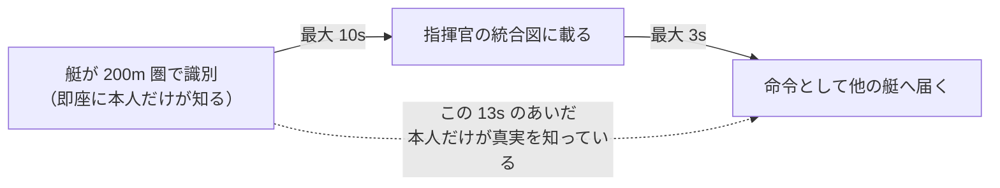

# ゲーム設計 — 旗と間合い

> 作成: 2026-08-30 / v1
> 位置づけ: マルチASVスウォーム攻防を「勝敗のあるゲーム」として成立させる盤面・駒・勝敗条件・
> 役割分担の**正典**。実装計画ではなく、実装が従うべきルールを定める。
> 前提: [`system-design.md`](system-design.md)（4層アーキテクチャ）・[`time-model.md`](time-model.md)（時間の扱い）
> 経緯: [`development-roadmap.md`](development-roadmap.md) §5 Phase 2（艇レベルLLM）の具体化。
> L0 で「指揮官をLLMにしても統制群に勝てない」という結果が出た（[`l0-experiment-log.md`](l0-experiment-log.md) §6）。
> 原因はモデルの弱さではなく**盤面に差の出る余地が無かったこと**であり、この文書はそこを作り直す。

---

## 0. 一行でいうと

無人艇の艦隊が旗ひとつをめぐって攻防する。駒には速さ・目・爆薬の個体差があり、
勝敗を分けるのは「**どこまで近づいてよいか**」を知っているかどうかである。
指揮官と現場の艇は、**別の時間・別の視界**で判断する。

| | |
|---|---|
| 海域 | 約 1.9 km 四方（既存の簡略沿岸モデル。舞台は固定しない） |
| 隻数 | 各陣営 4 隻（快速艇 2・索敵艇 1・重装艇 1） |
| 制限時間 | 240 秒 |
| 物理 | 10 Hz 固定ステップ |

---

## 1. 盤面

侵入側は東から進入し、旗（防護対象）は西にある。防御側はその間に展開する。

```
   西                                                            東
   ┌──────────────────────────────────────────────────────────┐
   │                                                          │
   │  ╭───╮                                       ╭─────╮     │
   │ ( 旗  )      ▶重装   ▶快速                  (  重装 )    │
   │  ╰───╯               ▶索敵  ▶快速            ╰─────╯     │
   │  巻き添え圏                                   爆破 100m   │
   │   100 m                                                  │
   │                                              ◀快速 ◀索敵 │
   └──────────────────────────────────────────────────────────┘
        ├──────────────── 549 m ────────────────────┤
             重装艇 137 秒 / 快速艇 61 秒で到達
```

**レーダーには「点」しか映らない。それがどの艦種かは分からない。**
これが盤面の中核にある不確実性であり、§4 の識別ルールと §5 の情報の流れがここから出る。

---

## 2. 駒 — 三方向への振り分け

各陣営とも 快速艇 2・索敵艇 1・重装艇 1。**同じ表を両陣営が使う**（非対称なのは配置と目的だけ）。

| 艦種 | 速力 | 探知 | 識別 | 爆破半径 | 役割 |
|---|---|---|---|---|---|
| **快速艇**（歩） | **9 m/s** | 300 m | 200 m | 50 m | 先鋒・護衛。速いが踏み込まないと届かない |
| **索敵艇**（金） | 6 m/s | **1200 m** | 200 m | **0 m** | 目。非武装で、旗も艦も壊せない |
| **重装艇**（飛車） | 4 m/s | 400 m | 200 m | **100 m** | 本命。遠くから届くが鈍い |

性能を一つ伸ばせば別の一つが落ちる。**どの駒も単独では勝てない。**

### 爆破半径 — 一つの数字が三つの意味を持つ

このゲームの中心にある唯一の距離である。

1. **対艦**: 相手をこの距離に捉えれば**相討ち**で双方が消える
2. **対旗**: 旗をこの距離に収めれば**旗を壊せる**
3. **巻き添え**: 迎撃したとき、この距離に旗があれば**旗も壊れる**

**3 があるために、防御側は旗の上に固まって待つことができない。必ず前に出る。**
これが無いと防御側は籠城するだけで勝ててしまい、ゲームが成立しない。

### 到達時刻が逆転していること

初期配置から旗まで（549 m）:

| | 距離 | 速力 | 必要な接近 | **到達** |
|---|---|---|---|---|
| 侵入 快速艇 | 549 m | 9 m/s | 50 m まで | **約 61 秒** |
| 侵入 重装艇 | 549 m | 4 m/s | 100 m まで | **約 137 秒** |

**快速艇のほうが倍以上早く着く。**防御側は「まず速い方を止め、次に重い方を待ち受ける」という
二段の時間割を組むことになる。これが指揮官の仕事の実体である。

---

## 3. 勝敗 — 駒の損得は問わない

| | 条件 |
|---|---|
| **防御側の勝ち** | 武装した侵入艇（快速・重装）が全滅した／240 秒を旗を保ったまま使い切った |
| **侵入側の勝ち** | 武装した侵入艇が旗を自分の爆破半径に収めた／防御側の迎撃の巻き添えで旗が壊れた |

**自軍を全て失っていても、旗が立っていれば防御側の勝ちである。**
相討ちは損失ではなく、防御側にとっては成立した仕事として数える。

索敵艇は爆破半径 0 のため旗にも艦にも手を出せない。ただし相手の爆破半径に入れば消える。
純粋な観測役である。

---

## 4. 識別 — 「どこまで近づいてよいか」が分からない

レーダーは点しか返さない。**艦種が分かるのは 200 m 以内に入ってから。**

識別できていない点に迂闊に近づけば、それが重装艇だった場合、100 m の時点で相討ちになる。
つまり識別は「どれが本命か当てる」ためではなく、**生き残るために間合いを知る**ためにある。

**これは速度の推測では代替できない。**（速度が読めれば艦種の推測はできるが、
「今この点にあと何メートル寄れるか」は識別しない限り分からない。）

### 次の段階 — VLM が変えるのは数字ひとつだけ

索敵艇にカメラを載せ、画像から艦種を読ませると、識別距離が伸びる。

| | 今回（VLMなし） | 次段階（VLMあり） |
|---|---|---|
| 索敵艇の識別距離 | **200 m**（近接レーダー） | **1200 m**（カメラ） |
| 索敵艇の生存率 | 低い（前に出るしかない） | 高い（遠くから見える） |
| 間合いの情報 | 遅く・断片的 | 早く・揃う |

**盤面もルールも駒も一切変えずに、視覚の寄与だけを勝率で測れる。**
[`l1-vlm-navigator-plan.md`](l1-vlm-navigator-plan.md) §6 の実験設計思想（センサーごとに障害を割り当てる）と同型で、
かつ VLM に与える仕事は「見えているものの報告」だけ——2026-08-14 のスモークで
**「見るのは強く、測るのは弱い」**と実測された、その強い側だけを使う。

---

## 5. 情報の流れ — 同じ事実が三つの時刻で届く

**識別情報は必ず指揮官を経由して共有される。**

| 誰が知るか | いつ知るか |
|---|---|
| **識別した艇本人** | **即座**（200 m 圏に入った瞬間） |
| 指揮官 | 次の統合図まで — **最大 10 秒後** |
| **他の艇** | 指揮官の命令に乗って届く — **最大 13 秒後** |

9 m/s で 13 秒は **117 m**。迎撃の間合いそのものの大きさである。
**この遅れが、現場の判断を必要にしている。**



---

## 6. 役割分担 — 指揮官が配分し、現場が更新する

**どちらも操船はしない。**追従制御（`core/sim/command/boat_controller.js`）は毎ステップ動く
幾何計算で、先回り航法をすでに実装している。**そこは計算で解けている領域なので、
言語モデルに触らせない。**

| | **指揮官** | **現場の艇** |
|---|---|---|
| 判断の周期 | 10 秒 | 3 秒 |
| 見えるもの | 全体の統合図（**最大 13 秒古い**） | 自分のレーダーだけ（**今この瞬間**） |
| 決めること | 誰を見に行かせ、誰を当て、誰を旗の手前に残すか | 追い続けるか、振り切るか、目標を変えるか。同時に何を避けるか |
| 出力 | `engage` / `identify` / `screen` / `hold` | `pursue` / `disengage` / `switch` ＋ `avoid` |
| 触らせないもの | 操船 | 操船・座標 |

### 指揮官の命令 — 具体にも抽象にもできる

| 命令 | 粒度 | 例 |
|---|---|---|
| `engage` | **具体** | 「def-runner-1 は int-3 を討て」 |
| `identify` | **具体** | 「def-scout は int-3 まで寄って艦種を見て来い」 |
| `screen` | **抽象** | 「def-runner-2 は**東側**を警戒せよ」 |
| `hold` | **抽象** | 「def-heavy は旗の手前 200 m で待て」 |

抽象指示の形式:

```json
{"boat": "def-runner-2", "action": "screen", "sector": "east", "range_m": 300}
```

**方角の名前から座標への変換はコードが行う。言葉は言語モデル、幾何はコード。**
この原則は 2026-08-14 の VLM スモーク（グラウンディングは完全正解・waypoint の幾何は破綻）
から来ている。既存機構への対応は `engage`/`identify` → 追尾制御、`screen`/`hold` → 哨戒制御で、
**新しい操船コードは要らない。**

### 現場でしか決められないこと

```
指揮官「int-3 を討て」        ← int-3 を快速艇だと思っている
  ↓
艇が接近 → 200 m 圏で判明     ← 「int-3 は重装艇。爆破半径 100 m」
  ↓
このまま踏み込めば 100 m で相討ちになる
指揮官はまだ知らない（あと最大 10 秒）
  ↓
艇の判断: 離脱するか、覚悟して踏み込むか
```

**これが艇レベルのエージェントが要る、構造的な理由である。**
指揮官には原理的にできない、3 秒スケールの判断になっている。

---

## 7. エージェント構成

| 主体 | 今回 | 周期 | 次の段階 |
|---|---|---|---|
| 防御 指揮官 | **LLM** | 10 s | LLM |
| 防御 索敵艇 | **LLM** | 3 s | **VLM**（カメラ） |
| 防御 快速艇 ×2 | **LLM** | 3 s | LLM |
| 防御 重装艇 | 追従制御のみ | — | 追従制御のみ |
| 侵入 全 4 隻 | **事前航路の決定論** | — | 決定論 |

**侵入側は全 4 隻とも事前に引いた航路で動く。**
両側を言語モデルにすると、勝率が動いたときどちらの寄与か帰属できない
（[`l0-experiment-log.md`](l0-experiment-log.md) で両陣営 LLM の腕について同じ注意を記録している）。

エージェントはすべて `DecisionScheduler` に同じ形で登録される。
指揮官と艇はスケジューラから見て区別されず、**時間の扱い・推論待ち・発効・ログが同じ経路を通る**
（[`time-model.md`](time-model.md) §8）。艇に固有なのは「何を見せるか」だけである。

---

## 8. 実装状況

| 項目 | 状態 | 備考 |
|---|---|---|
| 艦種 3 種の定義 | **実装済** | `core/sim/ship_classes.js`。速力・探知距離・爆破半径 |
| 自爆による相討ち | **実装済** | `core/sim/mission.js`。巻き添えによる旗の破壊を含む |
| 8 隻編成のシナリオ | **実装済** | `core/scenarios/flag_defence_squadrons.json` |
| 艇レベルのエージェント | **実装済** | `core/sim/agents/boat_agent.js`。指揮官と同じ仕組みに載せた |
| 全艦種が旗を壊せる | **要修正** | 現状は重装艇のみ。§2 の設計変更を反映する |
| 近接識別 200 m | **未実装** | これが無いと §4 の読み合いが成立しない |
| 指揮官の 4 語彙 | **未実装** | 現状は `intercept`/`move_to`/`patrol` の 3 語彙で抽象指示ができない |
| 現場の `avoid` | **未実装** | 回避しながら追跡。`steering.js` の `blendBearings` が既にある |
| VLM 索敵艇と 3D 接続 | **次段階** | 識別距離を 1200 m へ |

⚠️ `mission.js` の書き換えは旧ルール前提のテストを壊している可能性がある（未実行）。

---

## 9. 調整ノブ — 示唆が出なかったときに回す順序

**防御側が有利であること自体は構わない。**統制群との差が読めないほど偏った場合にだけ、
次の順で条件を締める。**盤面の構造ではなく、数字だけを動かす。**

| 順 | 動かすもの | 狙い |
|---|---|---|
| 1 | 侵入側の隻数を増やす（快速 2→3、重装 1→2） | 防御側の駒が足りなくなる |
| 2 | 識別距離を縮める（200 → 120 m） | 間合いの不確実性を上げる |
| 3 | 制限時間を縮める（240 → 180 秒） | 守り切る戦法を弱める |

---

## 10. 意図的にやらないこと

- **拘束（pin）などの追加ルール** — 爆破半径の大小だけで「歩が歩を受ける／歩が飛車を討つ」が成立する。
  ルールを増やさない
- **駒ごとの耐久値・複数回の攻撃** — 相討ち 1 回で決着。当たり判定を単純に保つ
- **COLREGs 準拠の避航規則** — 「近づかない」だけ
- **両陣営の言語モデル化** — §7 の帰属の理由による
- **DT と swarm-sim のランタイム統合** — VLM 段階でも繋ぐのは報告テキスト 1 本だけ
  （[`development-roadmap.md`](development-roadmap.md) §9 を踏襲）
