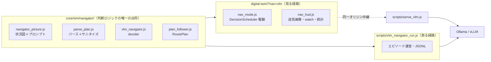

# L1 — 単艦VLM自動航行を core へ抽出し、3D海域DT上で動かした（2026-09-05）

> 位置づけ: [`l1-vlm-navigator-plan.md`](l1-vlm-navigator-plan.md) の Task 2・5・6 と、
> [`l1-vlm-closed-loop-smoke-2026-08-30.md`](l1-vlm-closed-loop-smoke-2026-08-30.md) の
> 「1本のスクリプトに全部埋まっている」状態の解消。
> 前提の設計: [`system-design.md`](system-design.md)・[`time-model.md`](time-model.md)

---

## 1. 何が変わったか

08-30 の時点で閉ループ自体は動いていた。しかし判断のロジック（状況図・プロンプト・パース・
サニタイズ・プランの保持）が [`scripts/vlm_navigator_run.js`](../scripts/vlm_navigator_run.js) の
700行の中に全部埋まっており、**テストが1件も無く、ブラウザで見ることもできなかった**。

| | 08-30（スモーク） | 09-05（本実装） |
|---|---|---|
| 判断ロジックの置き場 | ランナー1本の中 | [`core/sim/navigator/`](../core/sim/navigator/) 4モジュール |
| テスト | 0件 | `tests/navigator.test.js` 7ケース（ネットワーク不使用） |
| 画像入力の経路 | ランナーが `fetch` を直書き | `llm_http.js` の `images`（失敗の kind 体系・有界時間の担保つき） |
| 時間モデル | ランナー自前のループ・**発効遅延なし** | `DecisionScheduler` の `stages:[render, infer]`・発効は `t_issue + 2.1s` |
| ブラウザで見られるか | 不可（終了後のPNGだけ） | **`digital-twin/?nav=vlm` で3Dの中を自動航行**（送信画像・応答・統計をHUD表示） |
| シナリオ | `tokyo_bay_minimal` を流用・目的地は `protectedAsset` の借用 | `pilotage_m1.json`（単艦・`destinationLatLon`） |

## 2. 構成



**要点は「見る経路と測る経路が同じモジュールを使う」こと。** 画面の挙動と実験ログの数字が
別のコードから出ていると、デモで良く見えたものが実験で再現しない（あるいは逆）ことが起きる。

`llm_http.js` の画像対応は**画像を渡さないときの body をバイト同一に保つ**形で足した
（テストで固定）。これが崩れると L0 の 1,554 コールの実測と比較できなくなる。

## 3. 実測

### 3.1 ヘッドレス1エピソード（`pilotage_m1`・目的地まで直線 673 m・判断10シム秒ごと）

RTX 3060 12GB × Ollama 0.33.2。`--arm vlm --model qwen2.5vl:7b`。

| アーム | 到達 | サイクル | 経路長比 | infer p50/max | render p50 | keep率 | パース失敗 |
|---|---|---:|---:|---|---|---:|---:|
| `vlm` | **到達** | 8 | 0.96 | 1,138 / 1,802 ms | 265 ms | 63% | 1 |
| `scripted` | 到達 | 8 | 0.95 | — | — | 100% | 0 |

サニタイズが落としたもの: `duplicate waypoint collapsed`×2、`unparsable`×1。
**パース失敗1件は現行プランの維持として吸収され、船はそのまま到達した**（設計どおり）。

### 3.2 ブラウザ（`digital-twin/?nav=vlm`）

`serve_vlm.js` 経由・1280×800・`?speed=3`。ウォームアップ成功、5コール（`replace` 2 / `keep` 3）、
通信失敗0・パース失敗0。HUD に送信画像・`watch`・差し替えたwaypoint・宣言値と実測が並んで出る。
`?nav=` を付けない従来表示に回帰は無い（パネルの縦伸び1件を発見して修正した。§5）。

### 3.3 モデル選定 — thinking系VLMは使えない（新しい実測）

`qwen3-vl:8b`（および ctx8k 派生）は画像1枚の判断で reasoning に 1,100〜1,600 文字を費やし、
**`maxTokens` を 1,400 まで上げても本文が空のまま返る**。10サイクル全てが `thinking_overrun`
だった（それでも航路は維持され、船は到達した）。

さらに Ollama 0.33.2 では **`think:false` を送ってもこのモデルのテンプレートでは thinking が止まらない**
ことを直接の curl で確認した（`message.thinking` が返る）。
[`thinking-model-plan.md`](thinking-model-plan.md) §2 が記録している「Ollama は OpenAI互換の
`enable_thinking` を無視する」に加えて、**ネイティブ `think:false` も効かないモデルがある**という
一段強い事実である。

結論: **非thinking の VLM を使う**（`qwen2.5vl:7b` / `qwen2.5vl:32b`）。既定値をそちらに変えた。

### 3.4 VLM の空間計画の弱さは変わらず観測される

ブラウザ実測で、`replace` の返答が `(目的地) → (中間点) → (目的地)` という**引き返すプラン**に
なった。08-14 に記録された「順序逆転」の再現である。

これを受けて `parse_plan.js` に `DOUBLES_BACK` の検出を足したが、**並べ替えて直すことはしない**。
落とすのでも直すのでもなく数えるだけにしてある——直すと VLM の空間計画の弱さが軌跡から消え、
「幾何の責務をコード側へ移すべきか」（計画 §5 の `vlm-watch` アーム）の判断材料が失われる。
軌跡はこの検出の有無で1mmも変わらない。

## 4. 時間モデルとの接続

この航海士が §12.5「パイプライン宣言」の**最初の実使用者**である。宣言と実測の対応は
[`time-model.md`](time-model.md) §7 に表として記録した（そちらが正典）。要点2つ:

- 宣言は1箇所（`stages: [{name:'render', seconds:0.1}, {name:'infer', seconds:2.0}]`）で、
  `latencyS` の併記は設定ミスとして落ちる。回帰テストで固定してある。
- ヘッドレスランナーは**発効を2段で刻む**: 推論を await したあと `advance(latencyS)` で
  現行プランのまま進め、そこで初めてプランを差し替え、残り `intervalS - latencyS` を進める。
  こうしないと「推論が速かったから早く曲がった」が起きる（マシン速度が実験結果に混入する）。

## 5. 見つけて直した不具合

| 不具合 | 気付いた経路 | 対処 |
|---|---|---|
| HUD の Camera/Radar/GNSS パネルが縦に引き伸ばされる（背の高い航行パネルに合わせて flex が伸ばす） | **スクリーンショット目視**（静的チェックでは絶対に出ない） | `#hud { align-items: flex-start }` |
| `ThreeCameraSensor` が表示canvasの解像度で撮るため、ウィンドウの大きさで画像トークン数が変わる | 設計時に気付いた（実測の比較可能性が壊れる） | `captureSize` を足し、撮影中だけ固定解像度＋`setPixelRatio(1)` |

[`quality-assurance-method.md`](quality-assurance-method.md) が警告しているとおり、
1件目は静的チェックを100回やっても出ない種類の不具合だった。

## 5.5 実機フィードバックによる修正と、M3 の追加（同日・第2ラウンド）

手元の Mac のブラウザで実際に見た結果から、次の3件を直した。いずれも**ヘッドレスでは絶対に出ない**
種類の不具合である（[`quality-assurance-method.md`](quality-assurance-method.md) の主張どおり）。

| 指摘 | 原因 | 対処 |
|---|---|---|
| HUDパネルが船に重なる | 航行パネルを `#hud` のフレックス列の4枚目に並べたため、画面中央まで伸びていた | パネルを右端へ絶対配置 |
| 俯瞰視点が回り続けて読めない | `updateOverviewCamera` が 0.12 rad/s で周回する（デモGIF用の既定） | カメラモードを3つにした。既定は **`chase`＝進行方向と同じ向きの第三者視点**（艇の真後ろ42m・上16m から、22m 先を見る）。`north` は方位をワールドに固定、`orbit` は従来 |
| カメラが船体に対して上下する | `updateShips` は `group.position.y` に波高を足すのに、`camera_sensor.js` は `SHIP_DECK_HEIGHT` の固定値から高さを計算していた。**船だけが波で動きカメラが取り残される** | 高さの出所を `three.shipGroup(id)` の実描画位置1つに統一。上下動は「海面に対して」だけ起きる |

検証（`?nav=scripted` で12点サンプル）: `camAboveHull` が全サンプルで **2.640 m 一定**（船体は波で
0.037→0.397 m 変動）。`chase` では船の針路とカメラの視線方位の差が旋回中の −15.6° から
直進に入るにつれ −5.5° へ単調に縮み、追従していることを確認した（残差は意図的な平滑化の遅れ。
生の針路を使うと追従制御の毎ステップの舵で常時小刻みに揺れる）。`north` では `viewDir` が全サンプル同一。

### 追加した2つの機能

**M3 シナリオ（`pilotage_m3.json`）** — spline 経路を一定速力で走る交通船2隻を航路上に置いた。
`core/sim/spline_path.js`（Catmull-Rom ＋ **弧長パラメータ化**）と `core/sim/traffic.js` が実体で、
交通船は運動学を解かず経路上を弧長で進める。理由は2つ:

1. **決定論**——障害物の動きが実験のたびに揺れてはならない（乱数も実時刻も使わない）
2. **観察対象を自艇の判断だけに絞る**——相手も避けてくると効果が混ざる

配置は「直行すると寄りすぎる」ことをテストで担保している
（`pilotage_m3 blocks the direct route`: 6 m/s で直行すると **9 m** まで寄る）。
交通船はレーダーに点として映り、カメラにも見えるので、どちらが効いたかは `vlm` と `blind` の比較で切り分ける。

**3Dシーン上への waypoint 表示（`digital-twin/nav_overlay_3d.js`）** — VLM が置いた waypoint を
柱＋球で立て、自艇からの航路線・目的地の到達半径リング・自艇の航跡・交通船の spline 経路を描く。
**俯瞰カメラ専用のレイヤー（`OVERLAY_LAYER`）に入れてある**のが要で、こうしないと
オーバーレイがブリッジカメラの画像にも写り、**VLM が自分の引いた線を見て判断する循環**が生まれる。

### M3 の初回実測（各アーム n=1。比較にはまだ使えない）

| アーム | 到達 | 経路長比 | 交通船との最接近 | keep率 | 落とした waypoint |
|---|---|---:|---:|---:|---|
| `scripted`（直行） | 到達 | 0.95 | **36 m** | 100% | — |
| `vlm`（`qwen2.5vl:7b`） | 到達 | **1.07** | **36 m** | 22% | non-numeric×3 / no-usable×1 / duplicate×1 / dest-appended×2 |

ブラウザ側（`?nav=vlm&speed=2`）でも別途1本回し、**最接近 7 m** を記録した。送信画像には
交通船（赤）がはっきり写っており、`watch` は「Traffic ahead, close range」と正しく報告している。

**読み取り: 見えてはいるが、回避できていない。** 経路は 12% 長くなり（＝迂回する動きは出ている）、
`watch` も交通船を捉えている（「Traffic ahead at close range」「Traffic astern at a safe distance」）。
しかし**最接近距離は両アームで 36 m と同じ**、ブラウザ実行では 7 m まで寄っており、
VLM を入れたことによる改善は観測できていない。原因として最も疑わしいのは §3.4 の
**waypoint 幾何の破綻**で、実際にこのランでも `(29,-523) → (9,-417) → (-317,-278)` のように
**自艇の後方の点を先頭に置くプラン**（`DOUBLES_BACK`）を返している——
危険を言語で正しく報告しながら、それを避ける座標を作れていない。
これは計画 §5 が予告していた切り分け（「見るのは強い・測るのは弱い」）そのものの形である。
n=1 なのでこれ自体は結論ではないが、**「障害物を置いたから回避するはず」という期待は実測で裏づかなかった**
ことは記録しておく。次の一手は §6 のとおりアームごとに複数エピソード取ることで、
それでも改善が出ないなら計画 §5 の `vlm-watch` アーム（VLM は危険の報告だけ・幾何はコード側）へ切り分ける。

なお、この構成で初めて**測れる**ようになった——M1 では最接近距離という指標そのものが存在しなかった。

## 5.6 レーダー情報は VLM に届いているか — 届いている。使い方が壊れている（2026-09-06）

「VLM はレーダーの検知した周辺物体情報を解釈しているのか」への答えは **している**。
状況図（`renderNavigatorPictureText`）には最初からレーダー節があり、実物はこう出ている:

```
Radar (range 600 m):
  - traffic-cross: range 36 m, relative bearing -79 deg (on the starboard bow / starboard side), at east=37, north=-494
  - traffic-slow:  range 105 m, relative bearing -36 deg (on the starboard bow / starboard side), at east=19, north=-414
```

距離・相対方位・船乗りの言い方（左舷/右舷/正面）・シーン絶対座標の4つを併記してある。
そしてモデルは**確かに読んでいる**——`watch` に「Traffic ahead on the starboard side」と正しく返す。

### 問題は、読んだ座標の使い方である

同じサイクルの応答:

```json
{"watch": "Traffic ahead on the starboard side",
 "action": "replace",
 "waypoints": [{"eastM": 37, "northM": -494},   ← traffic-cross の位置そのもの
               {"eastM": -317, "northM": -278},
               {"eastM": -317, "northM": -278}]}
```

**「危険がある」と報告した相手の座標を、そのまま次の目標点として返している。**
つまり避けるどころか舵を向けている。1エピソードで採用された24点のうち **6点**がこれだった
（4点は接触位置と誤差0m）。

これは自船位置の混入（2026-08-14）と原因が同じで、**プロンプト中の目立つ座標をそのまま書き写す**
という失敗である。「見るのは強い・測るのは弱い」（計画 §5）の、最も具体的な形と言える。

### 対処1（実施）— サニタイズ規則の追加

`parse_plan.js` に `CONTACT_WAYPOINT_REJECT_M = 30` を足し、
**レーダー接触の30m以内に置かれた waypoint を落として数える**（`PLAN_NOTES.ON_CONTACT`）。
自船位置の除去とまったく同型の対処である。迂回点をコード側で作ることはしない
——作ると VLM の幾何能力の評価にコード側の航法が混ざる。

ブラウザ実測で即座に効き、HUD に `落とした点: waypoint on a radar contact dropped` が出た。
ヘッドレスで取り直した結果（`qwen2.5vl-7b-ctx3k`・12サイクル上限）:

| | 到達 | 経路長比 | 交通船との最接近 | 落とした waypoint |
|---|---|---:|---:|---|
| `scripted`（直行） | 到達 | 0.95 | 36 m | — |
| `vlm`（規則を入れる前） | 到達 | 1.07 | **36 m** | on-contact 規則なし |
| `vlm`（規則を入れた後） | 到達 | 1.09 | **57 m** | **on-contact ×6** / duplicate ×4 / doubles-back ×1 / dest-appended ×1 |

**1エピソードで6点が「接触の上」だった**——事前の分析（24点中6点）と完全に一致する。
最接近は 36 m → 57 m へ改善し、**初めて `vlm` が `scripted` を上回った**。
ただし n=1 であり、6点も落としている状態は「VLM が回避を計画できている」とは呼べない
（落として直行に戻ったことによる改善の可能性が残る）。アームごとに複数エピソードが必要。

`num_ctx` の検証も同時に走っており、`prompt最大 1,524 + 400 / 3,072  overflow 0 / tight 0` と出た
——入力が切り捨てられていないことが毎ラン確認できる（§ [multi-vlm-gpu-budget.md](multi-vlm-gpu-budget.md)）。

### 対処2（未実施・選択肢）— 統合の強め方

順に安く、下ほど「VLM に幾何を任せない」方向へ寄る。**測れる形で1つずつ**入れること。

| 案 | 中身 | 効くと考える理由 | コスト |
|---|---|---|---|
| **A. 座標を渡さない** | レーダー節から絶対座標 `at east=..., north=...` を落とし、距離＋相対方位だけにする | 書き写す対象を消せば書き写せない。**最も安く、仮説が最も直接検定できる**（1行削るだけ） | 極小 |
| **B. 画像に方位目盛と接触マーカーを重ねる** | ブリッジ画像の上端に方位目盛、接触の相対方位の位置に三角マーカーを描く（`camera_sensor.js` の撮影後、送信前に合成） | テキストの座標と画素を対応づけられる。ユーザー提案の「画像の中に埋め込む」形 | 中（合成は純JSで可能） |
| **C. 俯瞰プロットを2枚目の画像として渡す** | `vlm-multi-agent-plan.md` §6.4 の `tactical_plot.js` を単艦へ流用 | 空間配置を図で読ませる。ただし**画像1枚 +1,034 tok**（§ num_ctx）でコストが倍 | 中 |
| **D. 出力を「操作の選択」に変える** | 座標を作らせず、`{"maneuver":"pass_port"\|"pass_starboard"\|"hold", "offset_m":N}` から選ばせ、waypoint はコード側が幾何で作る | 計画 §5 の `vlm-watch` アームそのもの。**座標生成という壊れている作業を取り上げる** | 中 |

**推奨は A → D の順。** A は「座標の書き写しが原因」という仮説の直接の検定で、1行の削除で済む
（効かなければ仮説が違う）。D は計画が最初から用意していた切り分けで、
A が効いても効かなくても最終的にここへ来る見込みが高い。
B・C は「見せ方」の改良で、A/D より高くつくうえ、**画像を増やすと num_ctx と VRAM に直接跳ねる**
（[`multi-vlm-gpu-budget.md`](multi-vlm-gpu-budget.md)）。

## 6. まだ残っていること

- **視覚の効果は測れていない。** M3（交通船）で最接近距離という指標は手に入ったが、初回実測では
  `vlm` と `scripted` の差が出なかった（§5.5）。**アームごとに複数エピソードを取ることが次の一手。**
  なお交通船はレーダーにも映るので、M3 だけでは「視覚が効いた」とは言えない
  ——カメラにしか映らない障害物（ブイ列）を置く **M2 が別途必要**（計画 §6）。
- **入力画像の品質**。08-30 に記録した「灰色の板を barriers と誤認」の原因は未特定のまま。
- **送信画像の下側 3〜4割が自艇の積荷で埋まっている。** ブリッジカメラの搭載位置が
  船体中心より**前方 +1.32 m**（`BRIDGE_FORWARD_OFFSET_M`）で、3Dモデルの操舵室は
  **後方 −1.21 m**（`scene_builder.js` の `bridgeX`）にあり、両者が食い違っている。
  実際のカメラは甲板の積荷クレート（前方 +2.86 m・高さ約0.8 m）のすぐ手前に居るため、
  画角の下側を積荷が占める。物理的には「実船のブリッジカメラも自船の船首を映す」ので誤りとは言い切れないが、
  **画像トークンの3〜4割を自艇で使っている**のは実験効率として損である。
  直すならマスト上（前方 −1.65 m・高さ約4.3 m）への移設が候補だが、
  **VLM への入力画像が変わる＝過去の実測と比較できなくなる**ため、
  挙動指標つきの単独の変更として扱うべきで、今回は手を付けていない。
- アームごとの n が1のままで、§2 の数値は「回った」ことの記録であってアーム間の比較には使えない。
- ブラウザから目的地をクリックで変える口（`setDestination` は実装済み・UIは未配線）。
- `analyze_run.js` は航海士の JSONL 形式を知らない（集計は `summary.json` を直読みしている）。

## 7. 実行方法

```bash
# ブラウザで見る（静的配信＋推論中継）
node scripts/serve_vlm.js --upstream http://localhost:11434
#  → http://localhost:8080/digital-twin/?scenario=pilotage_m1&nav=vlm&model=qwen2.5vl:7b

# ヘッドレスで測る
node scripts/vlm_navigator_run.js --arm vlm --model qwen2.5vl:7b --scenario pilotage_m1
node scripts/vlm_navigator_run.js --arm blind --model qwen2.5vl:7b
node scripts/vlm_navigator_run.js --arm scripted        # 推論サーバ不要

# テスト
node tests/navigator.test.js && node tests/command.test.js && node tests/core_smoke.test.js
```
