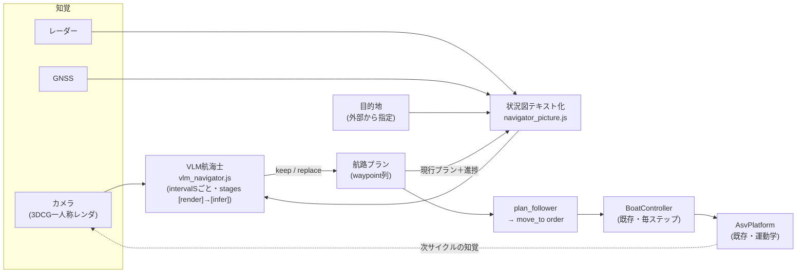

# L1 実装計画 — VLM航海士（単艦・視覚航行の縦切り）

> 作成: 2026-08-14 / v1
> 位置づけ: [`development-roadmap.md`](development-roadmap.md) §6 の L1 を「静止画1枚の接続実証」から
> **「単艦の閉ループ視覚航行」へ拡張して前倒しする**実装計画。1隻の船をVLMで実際に動かすコアがないと、
> Phase 2（艇レベルエージェント）にもその先にも中身が入らない、という判断による。
> 前提となる設計: [`system-design.md`](system-design.md)（§2.3 L1データフロー）・[`time-model.md`](time-model.md) v2.0
> 教訓の出典: [`l0-experiment-log.md`](l0-experiment-log.md)（死んだwaypoint・プロンプトA/Bの悪化）
>
> **更新 2026-09-05: Task 2・5・6 は完了した。**
> 結果と、それによる §8 の状態更新は
> [`l1-vlm-navigator-implementation-2026-09-05.md`](l1-vlm-navigator-implementation-2026-09-05.md)。
> 要点: 判断ロジックを `core/sim/navigator/` へ抽出（テスト7ケース）、`llm_http.js` を画像対応、
> `DecisionScheduler` の `stages:[render, infer]` に接続、`digital-twin/?nav=vlm` で
> **3Dの中を1隻がVLMで自動航行する様子をブラウザで見られる**ようになった。
> 新しい実測2件: ①thinking系VLM（qwen3-vl）は画像判断で本文が空になり使えない
> （Ollama 0.33.2 では `think:false` でも止まらない）②「順序逆転」の退化が再現した。
> **M1 は成立。ただし §6 のとおり視覚の効果は M2（ブイ列）が無いと測れない——ここが次の一手。**

---

## 1. 何を作るか

**外部から大まかに与えられた目的地**に向けて、1隻のASVが

- (a) ブリッジ一人称の**カメラ画像**（3DCGレンダリング）
- (b) **レーダー**コンタクト
- (c) **自船状態**（GNSS: 位置・針路・速力）
- (d) 現行の航路プランと進捗

を入力として、**VLMが中間ウェイポイント列を定期的に生成・監視・差し替える**。
ウェイポイントの追従は既存の `BoatController`（LLMなしの追従制御）が毎物理ステップで行い、
3DCGの中の船が実際に動く。この縦切りが、そのまま Phase 2 の艇レベルエージェントの実体になる
（Phase 2 ＝ これの複製＋指揮官接続。スループット制約下では画像なし運用へ退化させる）。



## 2. 事前検証 — そのようなVLMは実在するか（2026-08-14 実測）

手元の `qwen2.5vl:7b`（6.0GB・pull済）× Ollama 0.32.11 × RTX 3060 12GB に対し、
合成ブリッジ画像（640×360、水平線・右舷前方に赤ブイ・左舷に緑ブイ・船首）でスモークテストを行った。

| テスト | 結果 | 実測 |
|---|---|---|
| OpenAI互換 `/v1/chat/completions` の `image_url`（data URL）受理 | **成立** | 既存 `llm_http.js` の拡張だけで済む |
| A: グラウンディング（各ブイの色・左右・水平位置%をJSONで） | **完全正解**（緑=左25%・赤=右75%。真値21%/72%） | コールド 12.0s / **ウォーム 756ms**・画像≈918トークン |
| B: 状態テキスト＋画像→航路JSON（keep/replace・waypoints・速力） | 形式は成立（有効JSON・replace判断・危険1行報告） | ウォーム 3.3s（出力113トークン） |
| B の waypoint の幾何 | **弱い**。自船位置(0,0)をwaypointに混入、順序逆転、危険物への横偏位なし | — |
| B2: 同条件で画像なし | 危険報告が消え直行プラン維持 → **画像入力が判断を実際に変えている** | 1.4s |

読み取りは3点。

1. **接続と速度は問題にならない。** ウォーム1〜3.5sは L0 の `latencyS=3s` と同じ桁で、3060で閉ループが回る。
   GPUクラスタ（Qwen3-VL-30B-A3B）が採択されれば `baseUrl`/`model` の差し替えだけで載る。
2. **「見る」は強く「測る」は弱い。** 何がどちら側に見えるかは正確、そこから幾何的に正しいwaypointを
   置くのは7Bには重い。**ここがこの計画の主戦場**であり、§5 の責務分割の根拠。
3. 出力は ```json フェンス付きで返る。パーサはフェンス剥がしを前提にする（L0 `parse_orders.js` と同様）。

限界: 合成画像1枚・n=1 の予備測定である。本計測（実レンダ画像・解像度水準・持続負荷）は Task 1 で行い、
宣言値（`renderS`/`inferS`/`intervalS`）はそちらの実測から決める。

## 3. 「0から」の線引き

縦切り（シナリオ・航海士・ページ・ランナー）は**新規に書く**。ただし L0 のテスト38件と実験1,554コールで
検証済みの葉モジュールは**無変更で再利用する**。書き直すと同じバグをもう一度踏むだけで、「0から」の
目的（中身のあるコアを最短で立てる）に反する。

| 区分 | 対象 |
|---|---|
| **新規** | `core/sim/navigator/`（状況図・パース・VLM航海士・プラン追従）、`core/scenarios/pilotage_*.json`、単艦ミッション判定、`navigator/` ページ、`scripts/vlm_probe.js`、実験ランナー |
| **変更** | `llm_http.js`（images対応・後方互換）、`camera_sensor.js`（固定解像度キャプチャ）、`scene_builder.js`（ブイ描画） |
| **無変更で再利用** | `AsvPlatform`・`BoatController`・`steering.js`・`radar.js`・`gnss.js`・`DecisionScheduler`・`episode_logger.js`・`World`/`EnvApi` |
| **使わない** | 指揮官階層（`fused_picture`/`orders`の指揮系統・`tracks`）、攻防ミッション、comms。単艦に陣営も指揮官も要らない |

## 4. 入出力契約

**座標の正典はシーン原点基準の east/north (m)** で統一する（L0 統合図のアセット基準と同型。
自船相対だと船が動いた瞬間にプランが腐る）。GNSSの読み値 lat/lon は状況図の生成時に
`projection.latLonToLocal` で east/north へ戻して見せる（センサー値由来であることは保つ）。

### 入力（毎判断サイクル）

| 入力 | 形式 | 出所 |
|---|---|---|
| カメラ画像 | 640×360 PNG 1枚（固定解像度オフスクリーン。≈918トークン） | `ThreeCameraSensor`（ブリッジ一人称） |
| 自船 | east/north/針路deg/速力m/s | GNSS読み値から復元 |
| 目的地 | east/north・到達半径 | シナリオ設定＋ページ上のクリックで変更可（「外部から指定」の実体） |
| レーダー | contacts（range/bearing と east/north 併記） | `RadarSensor` |
| 現行プラン | waypoint列・現在目標wp・前回判断からの進捗（残距離の変化） | プラン状態 |

### 出力（JSON 1個）

```json
{
  "watch": "画像とレーダーから見えている危険の1行報告",
  "action": "keep",
  "waypoints": [{ "eastM": 0, "northM": 0 }],
  "speed": "stop | slow | cruise"
}
```

- **`keep` を第一級にする。** L0 の教訓（`move_to` の80.9%が同一座標の再送＝死んだwaypoint）への直接の対策で、
  「プランを変えないなら waypoints を書き直させない」。同一プラン再送率は挙動指標として監視する（§6）。
- `waypoints` は `action:"replace"` のときだけ有効。1〜5点・手前から順・シーン原点 east/north 絶対値。
  パース時に運用領域でクランプし、自船位置と重なる点（スモークで実際に出た混入）は捨てる。
- パース失敗・`LlmHttpError`（kind別集計は `llm_http.js` の契約どおり）→ **keep にフォールバック**。
- **初期プランは目的地1点の直行。** 推論サーバが死んでいてもエピソードは scripted 統制群と同じ挙動に退化して必ず終わる。

## 5. 責務分割 — VLMにどこまで任せるか

スモークの結果（見るのは強い・測るのは弱い）を踏まえ、**同じプラン供給インターフェースの背後に2アームを持つ**。

| アーム | VLMの責務 | コードの責務 |
|---|---|---|
| **vlm-plan（主経路）** | waypoint列そのものを生成・監視 | 検証・クランプ・追従 |
| **vlm-watch（対抗）** | 画像内の危険物の報告のみ（色・左右・概算距離＝検証Aで強かった仕事） | 報告＋目的地から幾何計画（危険方位を避けた迂回waypoint） |

主経路はユーザー要求（VLMが航路を生成監視）そのもの。対抗アームは「7Bの空間計画の弱さ」が
成績を律速したときの切り分けに使う。**比較は Task 8 で1変更ずつ・挙動指標で行う**
（L0 の教訓: プロンプト1行の善意の追加が再送率 80.9%→98.3% に悪化させた。変更は必ず計測とセット）。

## 6. センサーごとの役割分担と実験設計 — 「視覚が効いている」を測る形

各入力が判断に**独立に**効くよう、障害の種類をセンサーに割り当てる。

| 見えるもの | 経路 | 意図 |
|---|---|---|
| 目的地 | テキスト座標のみ（画像に写らない遠方） | 位置情報の利用 |
| 交通船（M3） | レーダーのみ（コンタクト） | レーダーの利用 |
| ブイ・浅瀬標識（M2） | **カメラのみ**（レーダー非搭載の小型物標） | **視覚が載っていないと原理的に避けられない** |

### マイルストーン

| | シナリオ | 通過条件 |
|---|---|---|
| **M1** | 空海面・直行 | vlm-plan アームがブラウザで完走（到達半径内）。ループと時間モデルの成立確認 |
| **M2** | 航路上にブイ列（視覚のみ障害・接触=座礁） | vlm の座礁率 < blind の座礁率（各アーム20エピソード目安） |
| **M3** | 横切り交通船1隻（レーダー障害） | 最接近距離の分布で vlm/blind を比較 |

### アームと指標

アームは **scripted（直行・統制群）/ blind（画像なし・同プロンプト）/ vlm** の3本。
主指標は**挙動指標**とする（L0 の教訓: 勝率型の成績指標は分離に1アーム約170エピソード要る。
挙動指標は反復間で安定し、小さいNでも読める）:
座礁・接触率、最接近距離、到達率、経路長比（対直行）、keep率、**同一プラン再送率**、遠方死waypoint率、
パース失敗率・`LlmHttpError` kind別率。

## 7. 時間モデルとの接続

L0 で「設計だけ済み」だった**複数ステージ合成の最初の使用者**になる。

- 登録: `register('navigator', { intervalS, stages: [render, infer], deadlineS: ∞, onMiss: keep-current })`。
  発効は `t_issue + renderS + inferS`（[`time-model.md`](time-model.md) §12.5。D-2 で受け口は実装済み）。
- 宣言値は Task 1 の実測から決める（スモークの目安: infer はウォーム1〜3.5s）。`intervalS` 初期値は 10s
  （航海士は指揮官より低頻度でよい。3s の L0 指揮官と違い1隻なので処理能力の制約は緩い）。
- ステージ別実測 t_wall は D-3 のログがそのまま使える（`renderS`/`inferS` を分けて記録し宣言値と比べる）。
- ブラウザは推論待ち停止（L0 パターン）、headless は await（決定論保持。有限 deadline の経路2問題は
  L0 の未決事項のまま持ち越し、既定 ∞ で回す）。
- コールドスタート実測 12.0s → エピソード開始前の**ウォームアップ1発**は必須（L0 実行器と同じ）。

## 8. 実装タスク

実行順は L0 と同じく**実測が最初**。

| # | やること | 成果物 / 完了条件 |
|---|---|---|
| **1** | ~~VLM本計測~~ → **完了（2026-08-30）**。`scripts/vlm_probe.js` ＋ 閉ループスモーク。宣言値は `renderS=0.1` / `inferS=2.0` / `intervalS=10` に決定 | [`l1-vlm-closed-loop-smoke-2026-08-30.md`](l1-vlm-closed-loop-smoke-2026-08-30.md) |
| **2** | ~~`llm_http.js` に `images` 対応~~ → **完了（2026-09-05）**。省略時の body はバイト同一（テストで固定）。OpenAI互換は `content` 配列、Ollamaネイティブは `messages[].images` の生base64 | `tests/navigator.test.js`。既存テスト全PASS |
| **3** | シナリオとミッション: `core/scenarios/pilotage_m1..m3.json`（**m1・m3 は 2026-09-05 に作成済み**——m3 は spline 経路の交通船2隻。`core/sim/spline_path.js` ＋ `core/sim/traffic.js`。**m2（カメラにしか映らないブイ列）は未着手**）（出発・目的地・visualObstacles・交通船。海域は差し替え対象の設定値）、単艦判定（到達/座礁/タイムアウト） | 3シナリオが headless で scripted 完走 |
| **4** | 描画: `scene_builder.js` にブイ描画（review-findings の obstacles 未描画にも接続）、`camera_sensor.js` に固定解像度オフスクリーンキャプチャ | QA法（スクリーンショットPDCA）で目視確認 |
| **5** | ~~航海士コア~~ → **完了（2026-09-05）**。`core/sim/navigator/{navigator_picture,parse_plan,vlm_navigator,plan_follower}.js` ＋ scripted/blind アーム（vlm-watch は未着手） | 完了。fixture応答でネットワークなしテスト7ケース |
| **6** | ~~専用ページ~~ → **完了（2026-09-05）。ただし独立ページではなく `digital-twin/?nav=` として実装した**——DT の3D部品（scene_builder・camera_sensor）を輸入する新ページを作るより、既存ページにモードを1つ足すほうがコードの重複が無い。既定（`?nav=` 無し）はサーバー不要の静的サイトのまま。目的地のクリック変更は `setDestination` まで実装・UI未配線 | M1 をブラウザで完走。推論待ち停止・失敗表示・送信画像プレビュー・統計HUD すべて動作 |
| **7** | 実験ランナー: Puppeteer（`.devtools` 既存）で `navigator/` をヘッドレス駆動、`calls/decisions/episodes` の JSONL | 1コマンドでNエピソード・ログが揃う |
| **8** | 比較ラン: M2/M3 × 3アーム＋vlm-watch、§6 の挙動指標で記録。プロンプト/画像注釈のA/Bはここで1変更ずつ | `docs/l1-experiment-log.md`。roadmap/README/time-model §7 更新 |

## 9. リスクと対策

| リスク | 対策 |
|---|---|
| 7Bの空間計画が弱い（**実測済み**: waypoint幾何の破綻） | §5 の2アーム構成で切り分け。画像への方位目盛オーバーレイ（注釈付き画像）は Task 8 のA/B枠で1変更ずつ試す |
| プロンプト改変による悪化（L0で実証済みのリスク） | 変更は必ず1つずつ＋挙動指標で計測。悪化したら即revert |
| ```json フェンス・自船位置混入（実測済み） | parse_plan で剥がし・除去・クランプ。fixtureテストで固定 |
| thinking系の `EMPTY_CONTENT`・タイムアウト | `llm_http.js` の既存契約で捕捉済み。maxTokens は Task 1 で実測して決める |
| VRAM | 6GB単体・並列1で12GBに収まる（スモークで確認）。`OLLAMA_NUM_PARALLEL` 変更は不要（decider 1体） |

## 10. やらないこと

- 複数隻・攻防への組み込み（Phase 2 の仕事。この計画は単艦で閉じる）
- DT⇔swarm-sim の World 統合（roadmap §9 踏襲。`navigator/` は DT の View 部品を輸入する独立ページ）
- COLREGs 準拠の避航規則（M3 は「近づかない」だけ）
- 学習・微調整、3D品質の向上（ブイ描画は実験成立に必要な最小限のみ）

## 11. 着手前の注意

- **リポジトリは L0 の成果がすべて未コミット**（[worklog 08-14](worklog-2026-08-14_l0-complete.md)）。
  この計画の実装に入る前に、まず L0 のコミットと push を行うこと。
- その後 `feat/l1-vlm-navigator` を切って作業する。
