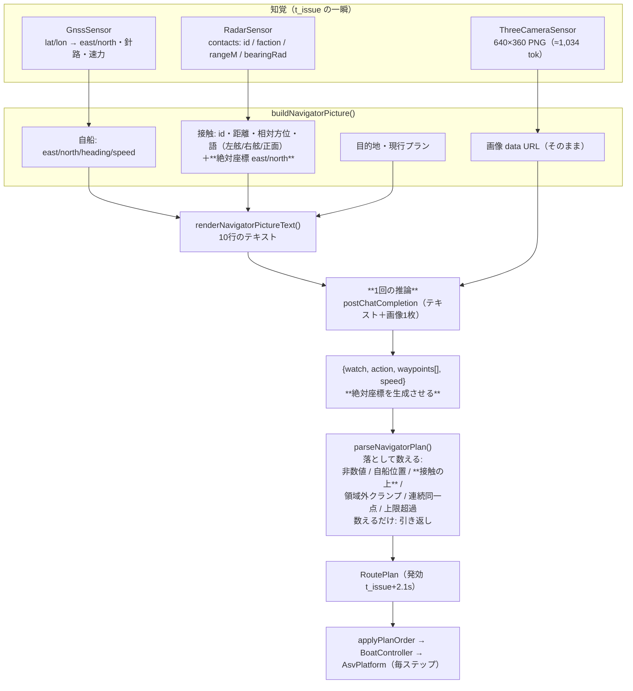
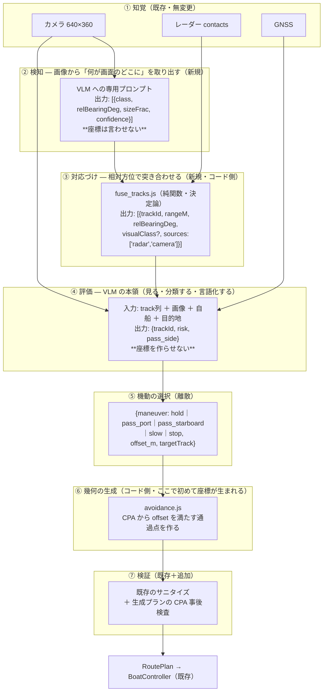
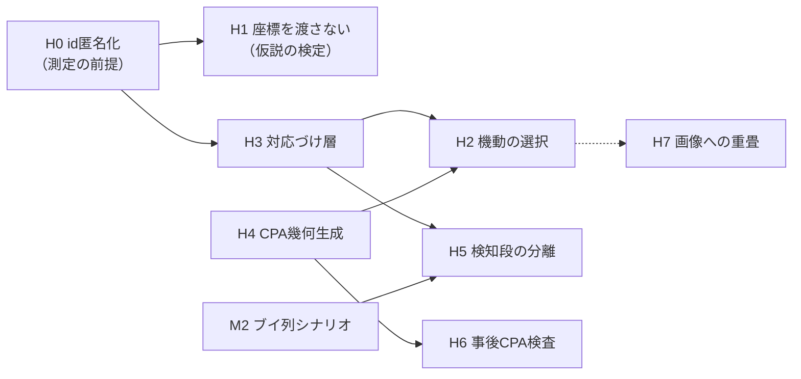

# 知覚から航路計画まで — 現状の処理フローと、あるべき構成

> 作成: 2026-09-06
> 対象: 単艦VLM自動航行（`digital-twin/?nav=vlm`）の
> 「画像＋レーダーで障害物を検知 → 推論 → 航路計画 → waypoint 化」までの流れ
> 実装の正典: [`core/sim/navigator/`](../core/sim/navigator/)
> 実測の出所: [`l1-vlm-navigator-implementation-2026-09-05.md`](l1-vlm-navigator-implementation-2026-09-05.md)（§5.6 が本ドキュメントの発端）

---

## 1. 要点

現状は **7段の処理のうち「検知」と「対応づけ」の2段が存在せず、
残り全部を1回の推論に押し込んでいる。** その結果、VLM は

- 危険を**言語では正しく報告する**（「Traffic ahead on the starboard side」）
- しかし**その危険の座標をそのまま waypoint として返す**（実測: 採用24点中6点）

という壊れ方をする。改修の方向は「VLM をもっと賢く使う」ではなく、
**壊れている作業（座標生成）を VLM から取り上げ、段を分けて1つずつ測れるようにする**ことである。

---

## 2. 現状のフロー



### 2.1 何が起きているか（構成上の性質）

| # | 性質 | 帰結 |
|---|---|---|
| 1 | **「検知」の段が無い。** 画像は生のまま推論器へ入る | 「何がどこに見えたか」がどこにも残らない。真値と照合できないので**見えていたのかを測れない** |
| 2 | **「対応づけ」の段が無い。** 画像とレーダーは独立した2チャネルとして並置され、同一物体だという宣言がない | 相関づけがモデルの内部に閉じる。カメラにしか映らない物体とレーダーにしか映らない物体の区別も付かない |
| 3 | **1回の推論に4つの仕事を同時に要求している**（知覚の解釈・危険の評価・幾何の計画・座標の生成） | 実測では後半2つが壊れる。どの仕事で失敗したのかを分離できない |
| 4 | **出力が絶対座標**で、しかも同じ座標系の数値がプロンプトに書いてある | プロンプト中の座標の書き写しが即座に「そこへ向かう」になる（§5.6 の6/24点） |
| 5 | **幾何の妥当性はサニタイズ（事後の除去）だけで担保している** | 除去は「悪い点を消す」だけで「良い点を作る」ことはしない。落とすと直行へ戻る |
| 6 | 接触の `id` がそのまま渡っている（例 `traffic-cross`） | **名前が答えを漏らしている**（§4 の H0）|

### 2.2 実際の入出力（2026-09-06 の実物）

```
Radar (range 600 m):
  - traffic-cross: range 36 m, relative bearing -79 deg (on the starboard bow / starboard side), at east=37, north=-494
```
```json
{"watch": "Traffic ahead on the starboard side",
 "action": "replace",
 "waypoints": [{"eastM": 37, "northM": -494},   ← traffic-cross の位置そのもの
               {"eastM": -317, "northM": -278}]}
```

---

## 3. あるべきフロー

**方針は「段を分け、各段の契約を決め、失敗に名前を付ける」。**
これは `llm_http.js` が失敗に kind を付けているのと同じ思想を、知覚〜計画の側にも通すということである。



### 3.1 各段の契約と、そこで測れるもの

| 段 | 誰がやるか | 契約（出力） | そこで測れること |
|---|---|---|---|
| ① 知覚 | 既存センサー | 画像・contacts・GNSS | — |
| ② 検知 | **VLM** | 相対方位と見かけの大きさだけ（**距離も絶対座標も言わせない**） | **検知の正解率・見落とし率・識別できた距離**。3D側が真値を持っているので正解ラベルが自動で作れる |
| ③ 対応づけ | **コード** | track（レーダー由来の距離＋カメラ由来の種別） | 対応づけの正解率。**カメラのみ／レーダーのみに映る物体の区別**（M2/M3 の指標が自動で出る） |
| ④ 評価 | **VLM** | どの track が危険か・どちら側を通るか | 危険判定の適合率・再現率。誤警報率 |
| ⑤ 機動 | **VLM**（離散選択） | 有限個の選択肢＋offset | 機動選択の分布。人間の常識との一致 |
| ⑥ 幾何 | **コード** | waypoint 列 | 生成プランの CPA が offset を満たすか（決定論的に検査できる） |
| ⑦ 検証 | コード | 落とした理由の内訳 | 落とした件数＝上流のどの段が壊れているかの指標 |

### 3.2 なぜこの分割なのか

- **②と⑤で「座標」に触らせない。** 書き写し（§2.1-4）・順序逆転・自船位置混入は、
  **座標を出力させることの帰結**である。出力を相対方位と離散選択に変えれば原理的に起きない。
- **③と⑥をコードに置く。** 相対方位の突き合わせと CPA の計算は決定論的にできる作業で、
  VLM に任せる理由がない。実測でもここが壊れている。
- **④だけを VLM の本番にする。** 実測で強いのは「見る・分類する・言語化する」だった
  （2026-08-14 のグラウンディング検証は完全正解、`watch` の報告も正しい）。
- **段が分かれていれば対照実験が組める。** ②をルールベースに差し替えれば「視覚の効果」だけを、
  ④をルールベースに差し替えれば「評価の効果」だけを切り出せる。
  現状の1段構成では「VLM 有り／無し」しか比較できない。

### 3.3 「段を分ける」とは何を分けることか — 誤読しやすい点

§3 の図は**推論を段の数だけ増やす**という意味ではない。分けているのは次の2つで、
**推論の回数は3つ目の別問題**である。

**分けているもの① 責務の所在（コード側か VLM 側か）**

| 段 | 実行主体 | なぜそちらか |
|---|---|---|
| ② 検知 | **VLM 推論** | 画像から「何が見えるか」はコードでは書けない |
| ③ 対応づけ | **コード**（純関数） | 相対方位の突き合わせは決定論的にできる。推論に任せる理由が無い |
| ④ 評価 / ⑤ 機動 | **VLM 推論** | 危険かどうかの判断・どちら側を通るかは言語的な判断 |
| ⑥ 幾何生成 | **コード**（純関数） | CPA を解いて通過点を置くのは算術。**実測でここが壊れている** |
| ⑦ 検証 | **コード** | 既存のサニタイズの延長 |

**分けているもの② モデルの本数 → 分けない。1モデルを複数回呼ぶ。**

推論する段（②と④⑤）に**別々のモデルを当てることはしない**。VRAM がモデル本数に線形に増えるためで、
実測では素の `qwen2.5vl:7b` と `qwen2.5-7b-ctx8k` の2本で 94.6 GB を占有していた
（[`multi-vlm-gpu-budget.md`](multi-vlm-gpu-budget.md) §3.1）。役割はプロンプトで分け、
モデルは共有する。別モデルが要るのは能力差が本質的なときだけで、実測で該当したのは
「thinking 系か非thinking系か」の1件だけである。

**3つ目の問題: 1判断サイクルあたり何回推論するか**

これは段の分割とは独立に選べる。**そして最優先の改修（H0〜H2・H4）は推論回数を増やさない。**

| 構成 | 1サイクルの推論 | 画像 | 変更点 | 期待できること |
|---|---:|---:|---|---|
| **現状** | 1回 | 1枚 | — | 危険は報告するが座標が壊れる |
| **A: 1回のまま出力だけ変える**（H0+H1+H2+H4） | **1回** | 1枚 | レーダー節から絶対座標を削り、出力を `{maneuver, offsetM, targetTrack}` に。waypoint はコードが生成 | **書き写し・順序逆転・幾何破綻が原理的に消える。** 推論コストは現状と同じ |
| B: 2回に分ける（＋H5） | 2回 | **1枚**（②のみ） | ②検知（画像あり）→ ④⑤評価（②の結果＋track のテキストのみ） | 「見えていたか」を真値と照合できる。画像は1枚のままなのでトークンは倍にならない |

**推奨は A。** 実測された故障（座標の書き写し）は**出力スキーマの問題**であって、
推論を分ければ直るものではない。A は1呼び出しのまま、プロンプトの1節と出力スキーマ、
それに `avoidance.js` の追加で済む。

B（②を分ける）の見返りは精度ではなく**測定可能性**である
——検知の正解率・見落とし率が真値と照合できるようになる。
したがって **M2（カメラにしか映らない障害物）が無いと B の価値は薄い**。順序として後になる。

**時間モデルへの影響（B を選んだ場合のみ）**

推論が2回になると `stages` の宣言が `[render, infer_detect, infer_assess]` の3段になり、
合成後の `latencyS` は 2.1s → 約4.1s へ伸びる（`intervalS=10s` なら収まる）。
一方 **同時推論スロットは増えない**——`DecisionScheduler` の不変条件 I2
「1 decider につき同時1推論」により、2回は1サイクルの中で直列に実行されるためである。
つまり B は**シム時間の遅延とランの実時間を増やすが、VRAM の要求は増やさない**。

---

## 4. 改修のヒント（順序つき）

**「証拠があるか × 安いか」で並べてある。上から順に、1回に1つ、挙動指標とセットで。**

### H0. 接触 id の匿名化（最優先・極小）

`traffic-cross` という名前がプロンプトに出ている。**モデルは名前を読むだけで「横切る船」だと分かる**——
何も見なくても正解できてしまい、測定そのものが無意味になる。
`vlm-multi-agent-plan.md` §3 がトラックid匿名化を「VLMと独立に必要な修正」として挙げているのと同じ穴が、
単艦側にも空いていた。`TRK-01` 等へ置き換える（`navigator_picture.js` で表示名を割り当てるだけ）。

> これを直さないまま H1 以降を測っても、結果を信用できない。**先にここ。**

### H1. 絶対座標を渡さない（1行の削除・仮説の直接検定）

レーダー節から `at east=..., north=...` を落とし、距離＋相対方位だけにする。
「書き写しが原因」という仮説はこれで直接検定できる。効かなければ仮説が違う。
`ON_CONTACT` で落とす件数（現在1エピソード6件）が指標になる。

### H2. 出力を機動の選択に変える（§3 の⑤⑥。計画 §5 の `vlm-watch` アームの実体）

```
{"watch": "...", "maneuver": "pass_starboard", "targetTrack": "TRK-01", "offsetM": 120, "speed": "slow"}
```
waypoint は `avoidance.js` が CPA から生成する。**同じプラン供給インターフェースの背後に置く**ので
`RoutePlan` 以降は無変更。`vlm-plan`（現行）と `vlm-watch`（H2）を切り替えられる形にして比較する。

**推論は1サイクル1回のまま**である（§3.3 の構成A）。変わるのは出力スキーマと、
waypoint を誰が作るかだけで、推論コスト・VRAM・宣言 `latencyS` はいずれも現状と同じ。

### H3. 対応づけ層（`core/sim/navigator/fuse_tracks.js`）

まず**レーダーだけで track 化**する（`{trackId, rangeM, relBearingDeg, sources:['radar']}`）。
画像検知（H5）は後から `sources` に足せる形にしておく。純関数なのでテストが安い。
H0 の匿名化はここに置くのが自然（trackId の発番元になる）。

### H4. CPA ベースの幾何生成（`core/sim/navigator/avoidance.js`）

`(自船状態, track, 機動, offsetM, 目的地) → waypoint列` の純関数。
最接近点（CPA）を解いて offset を満たす通過点を置く。**H2 の相方**で、これが無いと H2 は動かない。
テストで「生成したプランの CPA ≥ offset」を固定できる。

### H5. 検知段の分離（②）

画像から `[{class, relBearingDeg, sizeFrac, confidence}]` を取り出す専用の推論を1回入れる。
**推論が2回になるのでコストは倍**（画像は②だけに渡し、④はテキストの track 列で済ませれば
トークンは倍にならない）。見返りは「見えていたか」を真値と照合できること。
**M2（カメラにしか映らない障害物＝ブイ列）が無いと意味が薄い**ので、M2 と同時に。

### H6. プランの事後 CPA 検査（サニタイズの拡張・安い）

出たプラン（推論由来でも生成由来でも）の最接近距離を計算し、閾値未満なら落として数える。
`ON_CONTACT`（点が接触の上にある）より一般で、**「点は接触から離れているが、
点と点を結ぶ線が接触を貫く」**ケースを捕まえられる。現在これは検出できていない。

### H7. 画像への方位目盛・接触マーカーの重畳（任意）

撮影後・送信前に、方位目盛と接触の相対方位マーカーを画像へ合成する。
テキストの方位と画素を対応づける助けになる（ユーザー提案の「画像に埋め込む」形）。
H1/H2 より高くつき、効果の証拠がまだ無いので**後**。
なお画像を増やす方向（俯瞰プロットを2枚目に渡す）は
**1枚 +1,034 tok で `num_ctx` と VRAM に直接跳ねる**（[`multi-vlm-gpu-budget.md`](multi-vlm-gpu-budget.md)）。

### 依存関係



---

## 5. 意図的にやらないこと

- **VLM に「もっと丁寧に考えさせる」方向の改修**（思考手順の指示・例示の追加）。
  L0 で善意の1行追加が死んだwaypoint率を 80.9%→98.3% に悪化させた実績があり、
  プロンプトを厚くする方向は実測で裏切られている。壊れている作業は**取り上げる**ほうが確実。
- **迂回点をサニタイズの中で作ること。** 落とす層と作る層を混ぜると、
  VLM の幾何能力の評価にコード側の航法が混ざる（現状の規律を維持する）。
- **COLREGs 準拠の避航規則。** H2 の `pass_port`/`pass_starboard` は
  「近づかない」ための離散選択であって、航法規則の実装ではない。
