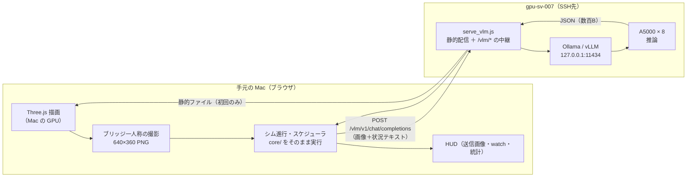

# GPUクラスタで動かし、手元のブラウザで見る — 接続性の設計

> 作成: 2026-09-05
> 対象: 単艦VLM自動航行ビュアー（`digital-twin/?nav=vlm`。実装は
> [`l1-vlm-navigator-implementation-2026-09-05.md`](l1-vlm-navigator-implementation-2026-09-05.md)）
> サーバ: [`scripts/serve_vlm.js`](../scripts/serve_vlm.js)
> 実測環境: `gpu-sv-007`（RTX A5000 × 8 / 64コア / 376GB）・SSH元 `10.10.3.1`・Ollama 0.33.2
> 接続形態: **VS Code Remote-SSH**（ワークスペース `ASV_SWARM_DT [SSH: AUTOMATA2]`）
> 既知の制約: **手元の Mac は `unpkg.com` へ到達できない。** `replay-viewer/` は
> `vendor/three.module.js` の同梱でこれに対処済みで、`digital-twin/`・`swarm-sim/` は
> GitHub Pages 公開デモの軽量さを優先して CDN 参照のまま残している。
> 本ドキュメントの `--vendor-three` は、リポジトリのファイルを変えずに
> **配信時だけ**同じ問題を回避する経路である（同梱済みのファイルがあればそれを再利用する）

---

## 1. 結論

**ポート転送1本で足りる。画面転送（VNC・X11・映像ストリーム）は要らない。**
このリポジトリの通常の作業環境（**VS Code Remote-SSH**）なら、その1本も自動で張られる。

```bash
# クラスタ側 — VS Code の統合ターミナルで
node scripts/serve_vlm.js --vendor-three
```

あとは VS Code 右下の通知「ポート 8080 で実行されているアプリケーションは使用可能です」から
**「ブラウザーで開く」**を押し、URL に航行モードのパラメータを足すだけである。
通知が出なければ下部パネルの「ポート」タブで確認・手動追加する。

```
http://localhost:8080/digital-twin/?scenario=pilotage_m1&nav=vlm&model=qwen2.5vl-7b-ctx3k
```

素の SSH で繋いでいる場合はトンネルを自分で1本張る（`serve_vlm.js` が起動時に、
実際のホスト・ユーザ・ポート込みでこのコマンドを表示する）。

```bash
ssh -N -L 8080:127.0.0.1:8080 ben_ben@10.10.0.107
```

`--vendor-three` を付ける理由は §6 の1件目——**この環境では手元の Mac が unpkg.com へ
到達できないことが確認されている**（`replay-viewer/` が先に Three.js の同梱で対処済み）。
画面転送が要らない理由は §2 の役割分担にある。

## 2. なぜ画面転送が要らないのか — どこで何が走るか

**3Dの描画は「見ている側のブラウザ」で走る。** `digital-twin/` は Three.js の静的サイトで、
GPUクラスタはレンダリングに一切関与しない。クラスタが持つ仕事は2つだけである。



この分割の帰結が3つある。

1. **帯域はほぼ要らない。** 初回に静的資産が約1.4MB（うち Three.js が1.28MB）、以後は
   判断1回あたり**上り 45〜52KB・下り 0.4〜0.5KB**（中継の実測ログ）。判断は10シム秒ごとなので、
   等速表示なら平均 5KB/s、`?speed=3` でも 15KB/s 程度。SSHトンネルで問題になる桁ではない。
   映像を送る方式（案C）は同じものを見るために桁違いの帯域を使うことになる。
2. **描画品質は Mac の GPU で決まる。** クラスタのA5000は使われない。逆に言えば、
   クラスタ側のヘッドレス描画（ソフトウェアラスタライザ）より速くきれいに出る
   （実測: ヘッドレス swiftshader の撮影 p50 265ms に対し、ブラウザ実測 729〜1,119ms は
   1280×800 の表示canvasを撮影後に再描画しているぶんで、いずれも判断間隔10秒に対して無視できる）。
3. **推論だけがクラスタの資源を使う。** これが本来やりたいことである。

## 3. 中継（プロキシ）を挟む理由 — 実測に基づく3点

ブラウザから推論サーバを直接叩く構成（`?vlmurl=http://localhost:11434/v1`）は、この環境では**成立しない**。

| 障害 | 実測 |
|---|---|
| Ollama がループバックにしか listen していない | `ss -tlnp` で `127.0.0.1:11434`。トンネルを 11434 に張れば届くが、次の行の問題が残る |
| ポートが違えば別オリジン＝CORS | ページは `localhost:8080`、推論は `localhost:11434`。`OLLAMA_ORIGINS` の設定が必要になる |
| 推論URL・モデル名・認証情報がページ側に残る | CLAUDE.md「APIキーが必要な実LLM呼び出しをブラウザ側に埋めない」に反する |

同一オリジンの `/vlm/*` を1本置くと3つとも消える。`--token` で上流に付ける Bearer も
クラスタ側のプロセスに留まり、ブラウザには渡らない。

## 4. 接続方式の比較

| | 案A: SSHローカル転送（`-L`） | 案B: `0.0.0.0` に bind して直接 | 案C: クラスタ内で描画して映像を転送 |
|---|---|---|---|
| 手順 | トンネル1本 | サーバ側 `--host 0.0.0.0` | VNC / X11 / WebRTC など |
| 追加の依存 | 無し（SSHだけ） | 無し | VNCサーバ等が要る |
| 帯域 | 5〜15 KB/s（実測） | 同じ | 桁違いに大きい |
| 認証 | SSH に乗る | **無し**（誰でも叩ける） | VNC の認証を別に用意 |
| 共有クラスタでの安全性 | ○ | **×** 同一ネットワークの誰でもGPU推論を叩ける | △ |
| 描画品質 | Mac の GPU | Mac の GPU | クラスタのソフトウェア描画 |
| **推奨** | **これ** | 事情がある場合のみ | 使わない |

案Bが技術的には最短である（SSH元 `10.10.3.1` とクラスタ `10.10.0.107` は同一セグメントで、
実際に別プロセスが `0.0.0.0:8000` を公開している）。それでも既定にしないのは、
**この中継はGPUの推論を無認証で開放する口**だからである。`serve_vlm.js` は
`--host 0.0.0.0` を明示したときだけ公開し、そのとき警告を出す。

**案Cを使わない判断について1点補足**しておく。「Mac を閉じても走らせ続けたい」という要求は
案C（映像転送）ではなく、**ヘッドレス実験ランナーを tmux で回す**ことで満たすべきである:

```bash
tmux new -s vlmrun 'node scripts/vlm_navigator_run.js --arm vlm --model qwen2.5vl-7b-ctx3k --cycles 40'
```

こちらはクラスタ内で完結し、送信画像・`decisions.jsonl`・`summary.json` が `logs/` に残る。
**ビュアーは「見る」ためのもの、ランナーは「測る」ためのもの**で、両者は同じ
`core/sim/navigator/` を使うので挙動は一致する。見たいのか測りたいのかで道具を選べばよい。

## 5. 手順（コピペ用）

### クラスタ側

```bash
cd ~/automata2/asv_swarm_dt

# 端末を閉じてもサーバを残す
tmux new -s vlmview 'node scripts/serve_vlm.js --port 8080'

# 手元のブラウザが unpkg.com へ到達できない場合（§6 の1件目）
tmux new -s vlmview 'node scripts/serve_vlm.js --port 8080 --vendor-three'

# 推論サーバが別ホスト・別ポートの場合（llama-server / vLLM 等）
node scripts/serve_vlm.js --upstream http://127.0.0.1:39145
```

起動時に上流のモデル一覧を取得し、**thinking系VLMを名指しで警告する**
（画像判断で本文が空になるため。§6）。実測の出力例:

```
[serve] 上流チェック: ok (ollama) — 14 モデル
        使えるVLM（非thinking・推奨）: qwen2.5vl-32b-ctx4k:latest, qwen2.5vl:32b, qwen2.5vl:7b
        避けるVLM（thinking系）: qwen3.5:122b, qwen3.5:9b, qwen3-vl-8b-ctx8k:latest, qwen3-vl:8b, qwen3.8:27b
```

ポートが埋まっていれば自動で +1 する（共有クラスタでは 8000 番台が埋まっていることが普通にある）。
**そのとき手元の `-L` も同じ番号に合わせること。** 起動ログが実際の番号を表示する。

### 手元（Mac）側

#### VS Code Remote-SSH で繋いでいる場合（このリポジトリの通常の使い方）

**何もしなくてよい。** VS Code はリモートで listen し始めたポートを検出して自動で転送する。
`serve_vlm.js` が既定で `127.0.0.1` に bind するのはこの検出とも相性が良い
（ネットワークへ公開せずに手元だけで見られる）。

1. 右下の通知「ポート 8080 で実行されているアプリケーションは使用可能です」→「ブラウザーで開く」
2. 通知が出なければ下部パネルの**「ポート」タブ**を開く。載っていなければ「ポートの転送」で 8080 を追加
3. 開いた URL に航行モードのパラメータを足す（VS Code が開くのはルートなので、
   `/digital-twin/?scenario=pilotage_m1&nav=vlm&model=qwen2.5vl-7b-ctx3k` を付ける）

`serve_vlm.js` は VS Code の統合ターミナルから起動されたことを検出し、この手順を表示する。

#### 素の SSH で繋いでいる場合

```bash
# 新しくトンネルだけ張る（-N = コマンドを実行しない）
ssh -N -L 8080:127.0.0.1:8080 ben_ben@10.10.0.107

# 踏み台がある場合
ssh -N -J ユーザ@踏み台 -L 8080:127.0.0.1:8080 ben_ben@10.10.0.107

# すでに繋いでいるSSHセッションに後から足す:
#   Enter を押す → ~C と入力 → プロンプトに次を打つ
#   -L 8080:127.0.0.1:8080
```

そのうえで Mac のブラウザで:

```
http://localhost:8080/digital-twin/?scenario=pilotage_m1&nav=vlm&model=qwen2.5vl-7b-ctx3k
```

| URL パラメータ | 意味 |
|---|---|
| `?nav=vlm` / `blind` / `scripted` | アーム。`blind` は同一プロンプトで画像だけ無し（統制群）、`scripted` は推論なし（サーバ不要で必ず完走） |
| `?model=` | モデル名。非thinkingのVLMを選ぶ |
| `?speed=3` | 表示の早送り（シム時間の倍率） |
| `?dest=east,north` | 目的地の上書き（メートル） |
| `?interval=10&render=0.1&infer=2.0` | 時間の宣言値 |
| `?transport=ollama&thinking=off` | Ollama ネイティブ経路（`?vlmurl=/vlm`） |
| （`?nav=` を付けない） | 従来のセンサー実証表示。推論サーバも中継も要らない |

## 6. 失敗モードと切り分け

| 症状 | 原因 | 対処 |
|---|---|---|
| ブラウザが真っ白（12秒後に赤い診断メッセージが出る） | **手元のブラウザが unpkg.com へ到達できない**（学内プロキシ等）。`replay-viewer/main.js` が既に想定している既知の環境 | サーバを `--vendor-three` で起動する。クラスタが代わりに取得し、同一オリジンの `/vendor/three.module.js` から配る。配信するHTMLの importmap だけを書き換えるので、リポジトリのファイルは無変更（GitHub Pages 配置は壊れない） |
| HUDが「ウォームアップ失敗」・通信失敗が増える | 上流が落ちている／`--upstream` が違う | `serve_vlm.js` のログに `[proxy] ... FAILED` と 502 が出る。`ollama serve` を確認 |
| `outcome` が `thinking_overrun` ばかり | thinking系VLMを選んだ | 非thinkingのVLMへ。起動時の警告一覧を見る |
| ページは動くが船が進まない | Macのタブが裏に回っている（`requestAnimationFrame` がブラウザに絞られる） | タブを前面に置く。または `vlm_navigator_run.js` で回す |
| `ERR_CONNECTION_REFUSED` | トンネルの番号がサーバの実ポートと違う／トンネルが張れていない | 起動ログのポート番号と `-L` を一致させる。`ss -tlnp \| grep 8080` で確認 |
| 途中でトンネルが切れた | ネットワーク・スリープ | **船は止まらない**。推論が `kind=connection` で失敗し、航路は現状維持のまま走り続ける（設計どおり）。トンネルを張り直せば次のサイクルから再開する |
| ポート転送が拒否される | `sshd_config` の `AllowTcpForwarding no` | 本機は明示指定が無く既定 `yes`（確認済み）。禁止されている環境では案Bを検討する |
| VS Code の「ポート」タブに出てこない | 検出漏れ、または別ポートで起動している | 起動ログの実ポートを見て「ポートの転送」で手動追加する |
| ハードリロードしても古い挙動のまま | ブラウザキャッシュ | `Cmd+Shift+R`。サーバは静的ファイルに `Cache-Control: no-cache` を付けているが、`/vendor/three.module.js` だけは1日キャッシュさせている |

### 白紙の画面に理由を出す仕掛けについて

Three.js の importmap 解決が失敗すると、`main.js` の `main().catch()` は**一度も走らない**
——`main()` に入る前にモジュールの読み込み自体が死ぬためで、画面は白紙のまま何も出ない。
リモートで見ている人にとっては最も切り分けが難しい故障なので、`digital-twin/index.html` に
`type="module"` ではない素のスクリプトで見張りを1つ置き、原因と対処（`--vendor-three`）を
画面に出すようにした。

実測では **`window` の `error` イベントは発火せず**、12秒のタイムアウト側
（`window.__debug` が未設定）が拾った。両方を仕掛けておいたのが結果的に正しかった。

## 7. 実測で確かめたこと（2026-09-05・`gpu-sv-007`）

| 確認項目 | 結果 |
|---|---|
| bind するアドレス | `127.0.0.1:8080` のみ（`ss -tlnp` で確認） |
| ループバックからの到達 | HTTP 200 |
| LANアドレス（`10.10.0.107:8080`）からの到達 | **接続拒否**（＝ネットワークへ公開されていない） |
| `--vendor-three` の importmap 書き換え | `{"imports":{"three":"/vendor/three.module.js"}}` |
| `/vendor/three.module.js` の配信 | HTTP 200 / 1,284,652 B。**出所は `replay-viewer/vendor/three.module.js`**（リポジトリに同梱済みのものを再利用し、コピーを増やさない。無ければ `.devtools/tmp/vendor/` へ取得する） |
| VS Code 統合ターミナルの検出 | `VSCODE_IPC_HOOK_CLI` / `TERM_PROGRAM=vscode` で判定し、自動転送を前提とした手順を表示 |
| **外部到達性ゼロのブラウザで3Dが出るか** | **出る。** 外部へのリクエスト0件のまま Three.js 読み込み・シーン構築・VLM 5コール（画像あり・`keep` 80%・通信失敗0）まで成立 |
| 上流チェック | Ollama の 14 モデルを取得し、vision×非thinking 3件を推奨・thinking系5件を警告 |
| 中継の実測（1判断あたり） | 上り 45.1 / 49.6 / 52.0 KB、下り 0.4〜0.5 KB、往復 1,238〜1,667 ms |
| 推論の実測（ブラウザ経由） | render 364〜878ms / infer 1,994〜2,189ms（`qwen2.5vl:7b`・640×360）。宣言値 `render 0.1s + infer 2.0s = 発効 2.1s` は据え置き（実測は記録であって宣言値へ書き戻さない。[`time-model.md`](time-model.md) §2.5） |
| sshd のポート転送方針 | `sshd_config` に `AllowTcpForwarding` の明示指定なし＝既定 `yes` |
| `--vendor-three` **なし**＋外部到達性ゼロ | 再現: `threeLoaded=false` でページ全体が起動せず。12秒後に原因と対処が画面に出る（上記の見張り） |
| 上の見張りが正常時に誤発火しないか | しない（`--vendor-three` あり・VLM 3コール・診断メッセージなし） |
| `--vendor-three` なしの importmap | CDN のURLのまま（＝GitHub Pages 配置の前提を壊していない） |

**未検証**: SSHトンネル自体を Mac から実際に張って通した確認はしていない
（このクラスタ上から `ssh localhost` は公開鍵を要求するため、同一手順を自分で再現できなかった）。
トンネルの成立条件（`AllowTcpForwarding`）と、トンネルの向き先である
「クラスタのループバック 8080 が生きていること」は上表のとおり確認済みなので、
残るのは手元の `ssh -L` が通るかだけである。

## 8. セキュリティ上の判断

- **既定は `127.0.0.1`。** この中継は事実上「無認証のGPU推論API」なので、共有クラスタで
  素で公開しない。公開は `--host 0.0.0.0` を明示したときだけで、そのとき警告を出す。
- **アクセス制御はSSHに委ねる。** トンネル経由なら、見られるのは鍵を持っている本人だけになる。
  中継側に独自の認証を足していない理由もこれで、独自実装のほうが穴になりやすい。
- **上流の認証情報はクラスタ側に留まる。** `--token`（既定は環境変数 `VLM_TOKEN`）は
  中継が上流へ付けるヘッダで、ブラウザへは渡らない。
- **中継はパスを素通しするだけで body を書き換えない。** 書き換えると、ブラウザ経由と
  ヘッドレス経由で送っているものが変わり、実験の比較可能性が壊れる。
- ディレクトリトラバーサルは塞いである（`ROOT` 外に解決されるパスは 403）。
