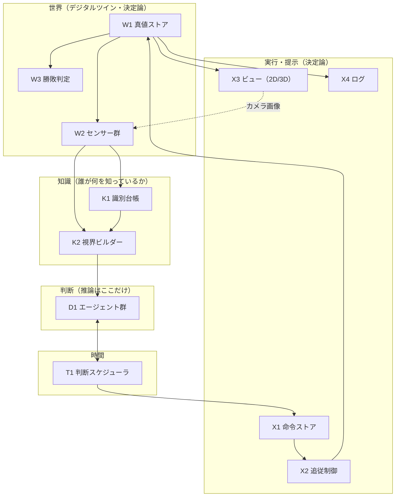
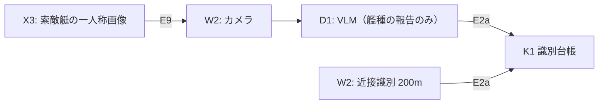

# システム構成 — ノードと入出力契約

> 作成: 2026-08-30 / v1
> 位置づけ: [`game-design.md`](game-design.md)（ゲームのルール）を実現するシステムの**ノード構成と、
> ノード間の入出力契約**の正典。個々のノードの内部実装ではなく「何と何が、何を渡して繋がるか」を定める。
> 前提: [`system-design.md`](system-design.md)（既存4層）・[`time-model.md`](time-model.md)（時間の扱い）

---

## 0. 全体像

システムは 10 個のノードでできている。矢印はすべて後述の入出力契約（§2）を持つ。

**設計の不変条件は 3 つ。**

1. **推論があるのは D1 だけ。** D1 を決定論の実装に差し替えると、系全体が完全な決定論になる
   （統制群がバイト単位で再現するという既存の性質を壊さない）。
2. **エージェントは真値に触れない。** D1 への入力は必ず W2 → K2 を通った観測である。
3. **エージェントは操船しない。** D1 の出力は「命令」止まりで、舵と推力は X2 が毎ステップ計算する。

---

## 1. ノード一覧

### 世界（デジタルツイン）

| ノード | 責務 | 実装状態 |
|---|---|---|
| **W1 真値ストア** | 地物（海岸線・旗）・8隻の位置・針路・速力・生死・**艦種**・環境・時計。10Hz固定ステップ | 済 |
| **W2 センサー群** | 真値から観測を作る。GNSS / レーダー / **近接識別** / カメラ | 近接識別のみ未実装 |
| **W3 勝敗判定** | 爆破・相討ち・巻き添え・旗の破壊・時間切れ。毎ステップ真値だけを見て判定 | 済（旗の破壊条件のみ要修正） |

W2 の要点: **観測は真値の劣化コピー**であり、何をどう落とすかがゲームの不確実性を作る。

| センサー | 返すもの | 落とすもの | 実装方式 |
|---|---|---|---|
| GNSS | 自艦の位置・針路・速力 | なし | 真値の読み出し |
| レーダー | 探知範囲内の**点**（ID・距離・方位） | **艦種** | 幾何計算 |
| 近接識別 | 200m 以内の相手の**艦種** | 遠方 | 距離判定 |
| カメラ | 一人称画像 | — | **3Dレンダリング（X3 が実装を兼ねる）** |

カメラだけは真値からの計算では作れず、シーンを描画して初めて画素が得られる。
**3Dビューは表示装置ではなくセンサーの実装**である（§3）。

### 知識

| ノード | 責務 | 実装状態 |
|---|---|---|
| **K1 識別台帳** | 「どの艇が、どの相手の艦種を知っているか」の唯一の記録。書き込み口は近接識別と（次段階）VLM の 2 系統、**どちらも同じ台帳に書く** | **未実装** |
| **K2 視界ビルダー** | エージェントごとの視界を組み立てる。艇用（自艦レーダー＋自分の識別・即時）と指揮官用（陣営融合＋陣営の識別・10秒ごと） | 済（台帳の反映が未） |

K1 が情報の非対称を一箇所に閉じ込める。**「誰がいつ台帳を読むか」だけで
即座 / 10秒 / 13秒 の三層遅延（game-design §5）が出る**ため、遅延を別途プログラムしない。

### 判断

| ノード | 責務 | 実装状態 |
|---|---|---|
| **D1 エージェント群** | 視界を受けて命令を返す。防御指揮官（LLM）・防御艇×3（LLM）・侵入側（事前航路の決定論） | 指揮官の語彙拡張・艇の avoid・侵入側航路が未 |

全エージェントは単一の契約 `decide(視界) → 命令 | null` を満たす（§2 の E3）。

### 時間

| ノード | 責務 | 実装状態 |
|---|---|---|
| **T1 判断スケジューラ** | 発行（intervalS ごと）と発効（latencyS 後）の管理。推論待ち停止・締切・エピソード跨ぎの破棄 | 済・変更不要 |

T1 はエージェントの中身を知らない。指揮官も艇も同じ形で登録され、区別されない。

### 実行・提示

| ノード | 責務 | 実装状態 |
|---|---|---|
| **X1 命令ストア** | 正規化済み命令の現在値（艇ID → 命令）。後から発効したものが前を上書きする | 済（4語彙対応が未） |
| **X2 追従制御** | 命令 → {舵, 推力}。毎ステップ・瞬時。先回り航法・回避ブレンド | 済（avoid ブレンドの防御側適用が未） |
| **X3 ビュー** | 2D=純粋な表示（消しても系は不変）。3D=表示＋**カメラセンサーの実装** | 済（艦種別の船体形状が未） |
| **X4 ログ** | step/decision/call の JSONL。学習データ互換 | 済 |

---

## 2. ノード間の入出力契約

矢印 1 本ずつ。**この表が安定していれば、ノードの中身は自由に差し替えられる。**

| # | 経路 | 渡すもの | 形式 | 設計上の要点 |
|---|---|---|---|---|
| E1 | W1 → W2 | 真値の読み出し | メモリ参照 | W2 だけが真値を読める。ここで情報を「落とす」 |
| E2a | W2 → K1 | 識別イベント | `{観測者, 相手, 艦種, t}` | 近接識別と VLM が**同じイベント型**で書く |
| E2b | W2 → K2 | 観測 | GNSS/レーダーの構造体 | 位置は点、艦種なし |
| E3 | K2 → D1 | **視界** | **テキスト 1 本** | §2.1。エージェントへの唯一の入力 |
| E4 | D1 → T1 | 判断結果 | `命令 | null` | `null` = 出さない。失敗も「従う」も null |
| E5 | T1 → X1 | 発効した命令 | 正規化済み命令 | 発効時刻 = 発行 + latencyS。ここまで世界に効かない |
| E6 | X1 → X2 | 現在の命令 | `艇ID → 命令` | 毎ステップ参照。命令が無い艇は前の命令を続ける |
| E7 | X2 → W1 | 操舵 | `{throttle, steering}` | 世界に触れる唯一の口。座標や速度を直接書かない |
| E8 | W1 → W3 | 真値 | メモリ参照 | 判定は観測でなく真値で行う（判定に不確実性を持ち込まない） |
| E9 | X3 → W2 | カメラ画像 | data URL | 3D → 世界への唯一の逆流。レンダ結果がセンサー観測になる |
| E10 | W1 → X3/X4 | 状態スナップショット | 構造体 | 表示と記録。世界へ書き戻さない一方通行 |

### 2.1 E3（視界）の設計思想

視界はテキスト 1 本である。フォーマットの各行は「何を渡し、何を渡さないか」の決定であり、
見た目の話ではない。原則は 5 つ。

1. **真値と観測を語り分ける。** 自軍は `truth`、敵は `track ... last seen Xs ago` と書く。
   古い情報に基づく判断もそれ自体が観察対象なので、鮮度を隠さない。
2. **知らないことを明示する。** 未識別の相手は `CLASS: unknown` と書く。省略ではなく明記
   にするのは、「識別しに行く」という行動の価値をエージェントに見せるため。
3. **自分のリズムを教える。** 「あなたは N 秒ごとに判断でき、判断は M 秒後に効く」を視界に含める。
   自分の指示が遅れて届くことを知らないエージェントは原理的に正しく采配できない。
4. **判断材料の数字は視界の中に全部ある。** 爆破半径・旗までの距離・制限時間。
   エージェントに世界の定数を暗記させず、視界だけで判断が閉じるようにする。
5. **座標は整数メートル・原点は旗。** 小数はモデルの注意を食うだけで判断を変えない。
   原点を旗に固定するのは、全エージェント・全命令で座標系を 1 つにするため。

### 2.2 E4（命令）の設計思想

出力フォーマットの原則は 4 つ。

1. **出力は「目標の指定」であって「動きの指定」ではない。** waypoint 座標や舵角を出させない。
   幾何は X2 が解く（実測: LLM/VLM は「見る」が強く「測る」が弱い）。
   例外は screen の方角（`sector: "east"`）だが、これも**言葉**であり、座標への変換は X1 が行う。
2. **「変えない」を第一級の応答にする。** 艇の `obey`、指揮官の null。
   L0 の実測（同一 waypoint の再送 80.9%）への直接の対策で、変えないなら書き直させない。
3. **指揮官と艇の出力は同じ正規化形へ落ちる。** 艇の `switch` は engage 命令として X1 に入る。
   これにより X1 以降（発効・追従・ログ・描画）は発令者を区別せずに済む。
   調停規則は置かず「後から発効した方が勝つ」だけとし、上書きの発生自体を記録して観察する。
4. **失敗はフォールバックさせず null に落とす。** 推論失敗時にルールベースで代行すると
   「LLM の腕」の成績にルールの采配が混ざる。null = 現状維持は世界にとって自然な無応答である。

### 2.3 語彙（E4 の中身）

| 発令者 | 語彙 | 意味 |
|---|---|---|
| 指揮官 | `engage 艇 相手` | 討て（具体） |
| 指揮官 | `identify 艇 相手` | 寄って艦種を見て来い（具体） |
| 指揮官 | `screen 艇 方角 距離` | 方面を警戒せよ（抽象） |
| 指揮官 | `hold 艇 距離` | 旗の手前で待て（抽象） |
| 艇 | `pursue` / `disengage` / `switch 相手` | 続行 / 離脱 / 目標変更 |
| 艇 | `avoid [相手...]`（上と併用） | 避けながら動く |

---

## 3. 2D と 3D の位置づけ

| | 2D ビュー | 3D ビュー |
|---|---|---|
| 系における役割 | **純粋な表示** | **表示 ＋ カメラセンサーの実装** |
| 消したらどうなるか | 何も変わらない（ヘッドレス実行が成立する理由） | **カメラ観測が消える → VLM が成立しない** |
| 品質要求 | 判読性 | **艦種が形で見分けられること** |
| 接続 | E10 のみ | E10 ＋ E9 |

次段階（VLM）で増える配線は E9 → VLM → E2a の 1 本だけ。
**近接識別と VLM は K1 への別の書き込み口にすぎず、K1 より上のノードは一切変わらない。**

---

## 4. 実装差分（このアーキテクチャに対して）

| ノード | 差分 | 規模 |
|---|---|---|
| W2 | 近接識別センサー新設 | 小（距離判定のみ） |
| W3 | 旗の破壊を「全武装艦の爆破半径」に修正 | 小 |
| K1 | 識別台帳の新設（書き込み・読み出し・エピソードリセット） | **中・最重要** |
| K2 | 視界に台帳の内容（CLASS 行）を反映 | 小 |
| D1 | 指揮官 4 語彙化・艇の avoid・侵入側の事前航路 | 中 |
| T1 | 変更なし | — |
| X1 | screen の方角→座標変換、hold の座標化 | 小 |
| X2 | avoid ブレンドを防御側にも適用 | 小 |
| X3 | （次段階）艦種別の船体形状 | 次段階 |
