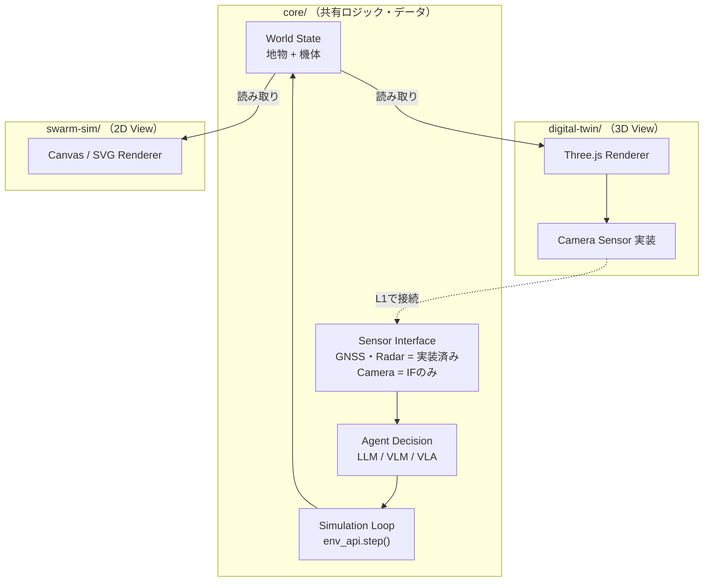

# システム設計書 — マルチASVスウォーム攻防シミュレーション基盤

- 作成: 2026-08-07 / v1
- 位置づけ: リポジトリ構成に入る前の、システム要件・アーキテクチャの整理
- **舞台となる海域は特定の場所に固定しない。** データ取り込み層（①アダプター）とシナリオ設定（JSON）を差し替えるだけで任意の海域に対応できることを設計原則とする。東京湾は今回のデフォルトシナリオ（`scenarios/tokyo_bay_minimal.json`）として使う一例に過ぎない

## 1. システム要件

### 1.1 機能要件

| ID | 要件 |
|----|------|
| FR1 | 海域DTは、設定された任意の海域（デフォルトシナリオは東京湾）の3D空間内の任意の艇位置・姿勢から、カメラ画像・レーダー観測・GNSS位置を生成できる |
| FR2 | スウォームシムは、複数のASV（防御・侵入）を2D俯瞰で可視化し、LLM/VLM/VLAエージェントの意思決定によって時間発展させられる |
| FR3 | 海域の地物（海岸線・障害物等）とASVの状態表現は、DTとスウォームシムで**同一のデータ形式・座標系**を用いる |
| FR4 | 意思決定ロジック（エージェント）は描画方式（2D/3D）に依存せず、共有ロジック側で完結する |
| FR5 | 将来、DTが生成したカメラ画像をエージェントの意思決定入力として接続できる（L1で実施） |
| FR6 | データ取り込み元（S-100/PLATEAU/AIS/ドローン観測等）・センサー種別・機体タイプ（AUV）・環境力学モデル（波）を追加・差し替えできる |
| FR7 | 将来、多数体・多シナリオでの並列実行・学習ループに利用できる |
| FR8 | `step()`の入出力（観測・行動・報酬相当の評価値）を、将来の模倣学習・強化学習の学習データとして使える形式でログできる（学習パイプライン自体は対象外、ログ形式のみ） |

### 1.2 非機能要件

| ID | 要件 |
|----|------|
| NFR1 | ソロ・短期間（本選8/15〜8/30）で実装可能な複雑度に収める |
| NFR2 | 静的Web技術（GitHub Pages）で完結し、サーバー不要 |
| NFR3 | 各コンポーネントは独立に起動・確認できる（片方が壊れても他方に影響しない） |

### 1.3 今回のスコープ外

- DTとスウォームシムの**ランタイム接続**（L1で実施。今回は「同じコードを共有する」までに留める）
- AUV・AIS/ドローンアダプター・OpenUSD対応・波のサロゲートモデル・**学習パイプライン本体**（データ収集ループ・学習・評価）の実装（インターフェースの予約のみ）
  - 学習パイプライン本体は対象外だが、**FR8のログ形式は今回から実装する**（学習ループを作るのではなく、後から学習データとして読める記録を残すだけなのでコストが小さく、拡張性への効果が大きいため）

## 2. システム構成

### 2.1 コンポーネントと責務

| コンポーネント | 責務 |
|----------------|------|
| **core/** | ワールド状態（地物＋機体）の保持、シミュレーションループ、エージェント意思決定（LLM/VLM/VLA）、レンダリング不要なセンサー（GNSS・レーダー）の算出 |
| **digital-twin/**（3D View） | coreのワールド状態を読み取りThree.jsで描画。**カメラセンサーの実装を提供**（レンダリングが必要なためcore外に置く） |
| **swarm-sim/**（2D View） | coreのワールド状態を読み取りCanvas/SVGで俯瞰描画。人間向けの状況表示とエージェント意思決定ログの可視化 |

### 2.2 Core ⇔ 各Viewの接続方式

ここが今回の要点。「coreを共有する」とは**コードとデータ形式の共有**であり、今日時点では**実行中の状態（ランタイム）の共有ではない**。

- `digital-twin/`と`swarm-sim/`は、それぞれ別々にcoreをインポートし、**別々のシナリオ設定で別々のワールドを起動する**（静的Web構成のため、Viewからcoreへのアクセスはネットワークではなく直接の関数呼び出し）
- これにより「3Dと2Dは今回接続しなくてよい」という要求と、「地物・座標系・機体表現を重複させたくない」という要求の両方を満たす

coreが各Viewに公開するインターフェースは3種類:

1. **WorldState読み取り**: 地物ジオメトリ（静的）とエンティティ状態（動的：位置・姿勢・陣営等）を返す
2. **Sensorインターフェース**: `observe(entityId, sensorType) -> data` という抽象。GNSS・レーダーはcore内に実装を持つ（純粋な計算のため）。**カメラだけはcore側にインターフェースのみ定義し、実装はdigital-twin View側が提供する**（レンダリングエンジンが必要なため）
3. **Stepインターフェース**: `step(actions) -> newState`。エージェントの意思決定はcore内で完結し、Viewは関与しない

### 2.3 データフロー（今回 / L1以降）



- **今回**: `digital-twin`と`swarm-sim`はそれぞれ独立したcoreインスタンス・独立したシナリオを持つ（図の点線は未接続）
- **L1以降**: 「2つのcoreを1つに統合する」のではなく、**digital-twinが生成したカメラ画像を、swarm-simが動かしているcoreのSensor実装として登録する**形で接続する。coreのインターフェースが最初から決まっていれば、この差し替えだけで済む

### 2.4 ディレクトリ構成（前回案を踏襲、命名のみ修正）

命名は開発段階（デモ）ではなく機能で付ける。

```
asv_swarm_dt/
├── core/            # 2.1のcore。①〜④層（データ取込/シーン表現/シミュレーション/インターフェース）
├── digital-twin/    # 3D View。カメラSensor実装を含む
├── swarm-sim/       # 2D View。coreのAgent Decisionを可視化
└── docs/
    └── system-design.md   # 本ドキュメント
```

各層内部のファイル粒度は、本ドキュメントの合意後に別途詰める。
