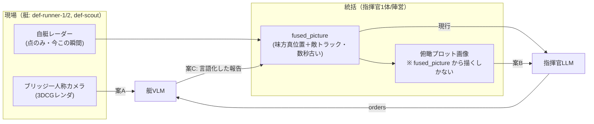
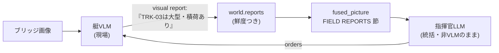

# VLM をマルチLLMエージェントへ挿す — 挿入点の選択と実装計画

> 作成: 2026-08-31
> 前提となる設計: [`system-design.md`](system-design.md)・[`time-model.md`](time-model.md)（遅延は設定値・実測は記録のみ）
> 実測の出所: [`l1-vlm-closed-loop-smoke-2026-08-30.md`](l1-vlm-closed-loop-smoke-2026-08-30.md)（単艦VLM閉ループ）、
> [`../submission/measurements/multi-llm-32b-2026-08-30.md`](../submission/measurements/multi-llm-32b-2026-08-30.md)（指揮官1＋艇3の同時推論）
> 位置づけ: L1（単艦VLM）と Phase 2（艇レベルLLM）が**別々のランナーで別々に動いている**状態から、
> VLM を攻防シムのマルチエージェント構成の中へ入れるための計画。
> 関連: [`l1-vlm-navigator-plan.md`](l1-vlm-navigator-plan.md)（単艦の縦切り。本計画はその責務分割 §5 を引き継ぐ）

---

## 1. 現在地 — 部品は4つとも揃っている

新規に発明が要るものは無い。**繋がっていないだけ**である。

| 部品 | 実体 | 状態 |
|---|---|---|
| 統括の推論 | [`core/sim/command/llm_commander.js`](../core/sim/command/llm_commander.js) | 動作・20ep実測済み |
| 現場の推論 | [`core/sim/agents/boat_agent.js`](../core/sim/agents/boat_agent.js) | 動作・20ep実測済み（艇3体） |
| VLM の閉ループ | [`scripts/vlm_navigator_run.js`](../scripts/vlm_navigator_run.js) | 動作。ただし**単艦・攻防なし・別ランナー** |
| 画像の生成 | [`digital-twin/camera_sensor.js`](../digital-twin/camera_sensor.js)（ブリッジ一人称） | 動作。撮影 p50 84〜115 ms／枚 |

欠けているのは接続点だけで、それは2つある——**統括（指揮官）に挿すか、現場（艇）に挿すか**。

## 2. 挿入点は2つ、画像の出所も2つ。そして両者は対称ではない



| | 現場のカメラ画像 | 統括の俯瞰プロット画像 |
|---|---|---|
| 生成方法 | Three.js のレンダ（実在の描画） | `buildFusedPicture()` の出力を**こちらで描く**合成画像 |
| 情報量 | **テキストに無い情報を持つ**（後述） | **テキスト統合図と完全に同一**（同じデータから描くので） |
| 部分観測の危険 | 無し（カメラは見えるものしか映さない） | **大**。3Dの俯瞰を撮ると未探知の敵まで映り、部分観測が壊れる |
| レンダ要否 | 要（ブラウザ＋Three.js） | 不要（純JSで描ける） |
| 実装コスト | 中〜大 | 小 |

**この非対称性が結論を決める。** 統括に画像を渡しても情報は1ビットも増えない——増やしたら部分観測の前提
（[`fused_picture.js`](../core/sim/command/fused_picture.js) 冒頭の禁止事項）を破ったことになる。
したがって案Bは「同じ情報を図で見せると判断が変わるか」という**表現形式のA/B**に縮む。
それ自体は測る価値があるが、VLM を使う理由としては弱い。

対して現場のカメラには、**レーダーが原理的に返さない情報が既に仕込まれている**。

## 3. 現場のカメラだけが持つ情報 — 艦種

[`core/sim/sensors/radar.js`](../core/sim/sensors/radar.js) の末尾コメントが宣言している:

> レーダーに映るのは「点」であって、どれが重装艇かは分からない

一方 [`digital-twin/scene_builder.js`](../digital-twin/scene_builder.js) は艦種を見た目で描き分けている:

| 艦種 | 表示スケール | デッキ | ミッション上の意味 |
|---|---:|---|---|
| `runner`（快速） | 1.00 | 小さい積荷（爆破半径50m） | 旗を壊せる |
| `scout`（索敵） | 0.82 | 積荷なし | **旗に着いても無害** |
| `heavy`（重装） | **1.32** | 大きい積荷（爆破半径100m） | **これ1隻だけが勝敗を決める** |

シナリオ [`flag_defence_squadrons.json`](../core/scenarios/flag_defence_squadrons.json) の note が
「どれが本命かの識別が防御側の課題になる」と書いているとおり、**識別問題はミッションの中心**であり、
**カメラはそれを解ける唯一のセンサー**である。VLM を挿す動機としてこれ以上のものは無い。

### ただし、いま識別問題は成立していない（着手前に必ず塞ぐ）

[`tracks.js`](../core/sim/command/tracks.js) は自分で書いているとおり「トラック id はレーダーが返す
真の entityId をそのまま使う（匿名化は将来課題）」。そしてスポーン id は `int-heavy` / `int-scout` である。
つまり**指揮官も艇も、トラック名を読むだけで艦種が分かる**。

これは既存の計測の読み方にも影響する。[`emergence/README.md`](../submission/measurements/emergence/README.md)
の指標2「艦種の対応づけ（`def-heavy`→`int-heavy` 等）84.0%」は、**文字列の一致で説明が付いてしまう**——
モデルが艦種を推定した証拠にはならない。匿名化はVLMと独立に必要な修正であり、
かつ**匿名化して初めて視覚識別に意味が生まれる**。順序として先に来る（§5 Step 1）。

## 4. 構成案

### 案A — 現場VLM（艇が自分の目で見る）

艇の入力に自艇ブリッジ視点の画像を1枚足し、出力に**視認した艦種の申告**を足す。指揮官は無変更。

```
[render 0.1s] → [infer ~2s]                （stages 宣言。時間モデルの複数ステージ初使用）
自艇レーダー(点) ＋ ブリッジ画像 ＋ 現order → 艇VLM → {decision, visual: [{track, class, confidence}]}
```

- 入力: `buildBoatPicture()` の出力（現行）＋ `imageDataUrl`
- 出力: 現行の `{"decision":"obey"|"override", ...}` に `"visual"` 配列を追加（省略可＝後方互換）
- 測れること: **艦種同定の正解率**（真値と照合できる。新しいログ項目は `visual` だけ）、
  誤識別率、識別できた距離、そして勝率への波及
- コスト: 判断1回につきレンダ1枚（84〜115ms）＋ 画像トークン ≈1,040

### 案B — 統括VLM（指揮官が図で読む）

`buildFusedPicture()` の出力から俯瞰プロットを描き、テキスト統合図と一緒に渡す。

- 入力: 現行テキスト ＋ 合成PNG（自軍真位置・敵トラック（鮮度で濃淡）・アセット・レンジリング・北）
- 出力: **現行のまま**（`orders` スキーマは変えない）
- 測れること: L0 の既知欠陥に効くか——**死んだ waypoint 率**（`move_to` の80.9%が同一座標の再送）と
  **標的の重複**。空間配置の把握は図のほうが読める、という仮説の直接の検定になる
- 限界: 情報は増えない。**「VLMだから解けた」とは言えない**（言ってはいけない）

### 案C — 階層型（現場が見て言語化し、統括の采配が変わる）＝ 本命

案Aの上に**報告の経路を1本足すだけ**で成立する。



- 指揮官は**VLMにしない**。画像を渡す必要が無い（現場が言語化して上げてくるから）。
  推論コストの増分は現場側だけに乗り、統括は現行モデルのまま使える。
- 主題との一致: 「視覚 → 言語 → 采配」という**情報の階層的伝播**が観察対象になる。
  これはマルチエージェントの主題そのものであり、既存の創発指標（役割の分化・標的の割当）に直結する。
- 測れること: 報告が指揮官の指示を実際に変えた率、誤報が采配を誤らせた事例、
  報告があった陣営とない陣営の勝率差。

### 比較と推奨

| | 案A 現場VLM | 案B 統括VLM | 案C 階層型 |
|---|---|---|---|
| 新しい情報が入るか | **入る（艦種）** | 入らない | **入る＋伝わる** |
| 実装コスト | 中〜大（レンダ経路） | 小 | 中〜大（案A＋α） |
| 推論コスト増 | 艇の呼び出し（全体の85%）に画像 | 指揮官のみ（15%） | 案Aと同じ |
| 主題（マルチエージェント）との噛み合い | 中 | 低 | **高** |
| 失敗しても残るもの | 識別可能距離の実測 | 表現形式のA/B結果 | 同左 |

**推奨: 案C（案A を作り、その上に報告の経路を足す）。案B は独立に安いので、余力があれば対照アームとして作る。**
案Bを主経路にしない理由は §2 のとおり——情報が増えないので、良い結果が出ても悪い結果が出ても
「VLMの価値」の話にはならない。

## 5. 段階と完了条件

**原則は L0・L1 と同じ: 実測が最初。** 作ってから「見えなかった」と分かるのが最も高い。

| Step | やること | 完了条件 | 実装量 |
|---|---|---|---|
| **0** | **識別可能距離の実測**。`vlm_probe.js` を拡張し、距離を 100/200/300/400/600 m と振った実レンダ画像で「どの艦種か」をVLMに答えさせる | 正解率が距離の関数として出る。**ここで 300m 以上まったく当たらないなら案A・Cは設計から見直す**（判断距離を縮める／画像を拡大する／ズーム相当の切り出しを入れる） | ほぼ無し（既存スクリプトの引数追加） |
| **1** | 前提の穴を塞ぐ: **トラックIDの匿名化** ＋ `llm_http.js` の `images` 対応 | 既存テスト全PASS＋新規テスト。匿名化前後で1ランずつ取り、指標2の変化を記録 | 小 |
| **2** | **レンダリングのサービス化**（§6.2）。シムはNodeのまま、ブラウザは「絵を返すだけ」にする | 攻防シムの任意スナップショット＋艇idから、その艇のブリッジ画像が1枚返る。3D品質の穴（§9）が潰れている | 中 |
| **3** | 案A: 艇VLMを `headless_run.js` に載せる（`--boat-mode vlm`） | 1エピソード完走。`visual` の正解率が出る。発効時刻が `t_issue + renderS + inferS` に一致 | 中 |
| **4** | 案C: 報告の伝播（§6.5） | 報告が指揮官プロンプトに載り、指示を変えた事例がログから抽出できる | 小〜中 |
| （並行） | 案B: `tactical_plot.js`（§6.4） | 真値が描かれていないことをテストで担保。指揮官アームとして走る | 小 |

## 6. 実装方法

### 6.1 共通 — `llm_http.js` に画像を足す（L1計画 Task 2、未実施）

```js
/**
 * @param {string[]} [images] - data URL の配列。省略時は現行とバイト同一の body（後方互換）
 */
```

- `images` があれば `messages[1].content` を配列形式
  （`[{type:'text',text},{type:'image_url',image_url:{url}}]`）にする。無ければ現行の文字列のまま。
- **触ってはいけないもの**: 有界時間の担保（AbortSignal ＋ 締切レース）と `LlmHttpError` の kind 体系。
- `maxTokens` の既定は据え置き。画像は入力側なので出力予算とは独立だが、
  `timeoutMs` は Step 0 の実測で決め直す（[`thinking-model-plan.md`](thinking-model-plan.md) §3 Step 3 の `--timeout-ms` と同じ口）。
- テスト: `fetchImpl` を差し替え、①`images` 省略時の body が現行と同一 ②付与時に `image_url` が入る。

### 6.2 レンダリングのサービス化 — この計画の設計上の要

**シムをブラウザへ移さない。** [`headless_run.js`](../scripts/headless_run.js) は989行あり、
エピソードループ・スケジューラ配線・ミッション判定・JSONLログを持つ。これをページ側へ複製すると、
[`vlm_navigator_run.js`](../scripts/vlm_navigator_run.js) がやったこと（ページ内でシムを回す）を
攻防シムの規模で繰り返すことになり、決定論とログの二重管理が発生する。

代わりに**ブラウザを純粋なレンダリング関数**として扱う:

```
Node（シム・決定論・ログ）  ──snapshot + boatId──▶  ページ（Three.js）
                            ◀──── PNG data URL ────
```

`scripts/render_service.js`（新規・CJS）の外形:

```js
const svc = await startRenderService({ scenario: 'flag_defence_squadrons', port: 8975, res: {w:640,h:360} });
const png = await svc.renderBridgeView(world.state.snapshot(), world.clock, 'def-scout');
await svc.close();
```

ページ側に注入するコード（`digital-twin/` は**無変更**。`window.__debug` フックだけを使う。
[`vlm_navigator_run.js`](../scripts/vlm_navigator_run.js) の `INSTALL_NAV` と同じ作り）:

1. `window.__debug.paused = true`（main.js の rAF ループを止める）
2. 受け取った snapshot を**ページ側 World の `state` へ書き戻す**（x/y/heading/speed/alive）。
   同じシナリオを `?scenario=flag_defence_squadrons` で読ませてあるので id は一致する
3. `three.updateShips(world.state.snapshot(), clock)` → `world.observe(boatId, 'camera')`
   （[`ThreeCameraSensor`](../digital-twin/camera_sensor.js) をそのまま使う＝ブリッジ位置・艦種スケールの
   補正が二重実装にならない）
4. 撮影のあいだだけ renderer を固定解像度へ切り替え、終わったら戻す

**この作りの見返り**: 画像がスナップショットの純関数になる。同じスナップショットからは同じ絵が出るので、
再現・キャッシュ・後からの再レンダ（デバッグ）ができ、シム側の決定論に一切触れない。

落とし穴（すべて実測で踏んだもの、または読めば分かるもの）:

| 落とし穴 | 対処 |
|---|---|
| `state.snapshot()` は**死んだ艇を除外する**が、`updateShips` は既存の Group を消さない → 撃沈済みの艇が絵に残る | snapshot に無い id の Group を `visible=false` にする。**沈んだ敵が見えている画像でVLMに判断させるのは致命的** |
| 近傍海面パッチと影が注視点へ 8%/回で追従するため、間引くと船が海面パッチから出て「陸色の絵」になる | 08-30 スモークの注記どおり、**判断サイクルではなく物理ステップ側の頻度で `updateShips` を呼ぶ**。サービス化した場合は撮影前に数回空回しして補間を収束させる |
| コールドスタート 20s超 | エピソード前にウォームアップ推論1発（L0/L1 と同じ） |
| 表示canvasのサイズ依存 | 撮影中だけ `setPixelRatio(1)` ＋ `setSize(w,h,false)` |

### 6.3 案A の配線 — `boat_agent.js` の拡張

**変えない**: `createLlmBoatAgentFn` の戻り値の型（`decide(picture) → {orders,intent}|null`）、
`DecisionScheduler` への登録の仕方、`BoatController`、`applyOrders`。艇が decider として同型であることは
[`decision-architecture.md`](decision-architecture.md) の契約なので壊さない。

| 対象 | 変更 |
|---|---|
| `buildBoatPicture()` | 引数に `{ image }` を受け、picture に `imageDataUrl` を持たせる（省略時 null＝現行） |
| `buildBoatSystemPrompt()` | 画像がある場合の説明1行と、`visual` フィールドのスキーマを追加 |
| `parseBoatDecision()` | `visual: [{track, class, confidence}]` を任意項目として受理。**不正でも判断は捨てない**（報告は付加情報） |
| `createLlmBoatAgentFn` | `images` を `postChatCompletion` へ渡す。`stats` に `visualReports` / `visualCorrect` を追加 |
| `headless_run.js` | `--boat-mode vlm` を追加。`stages: [{name:'render',seconds:renderS},{name:'infer',seconds:inferS}]` で register し、発行時に `render_service` から画像を取る |

**時間モデル**: これが「複数ステージ宣言」の最初の実使用者になる（[`time-model.md`](time-model.md) §12.5、
L0 で受け口だけ実装済み）。`register()` は `stages` を合成して `latencyS` にするので、
`latencyS` は**併記しない**（併記すると設定ミスとして落ちる仕様）。宣言値は Step 0 の実測から決める
（目安: `renderS≈0.1` / `inferS` は 8基GPU環境で測り直す。3060＋7B では p50 1.78s / max 2.91s）。

**プロンプトの変更は1回に1つ。** L0 で「善意の1行追加が死んだwaypoint率を80.9%→98.3%に悪化させた」
実績があるので、画像の追加と `visual` スキーマの追加は**別のランで測る**。

### 6.4 案B の配線 — `core/sim/command/tactical_plot.js`（新規）

`buildFusedPicture()` の出力 → 描画命令列 → 2つのバックエンド:

```js
export function buildPlotOps(picture, { widthPx, heightPx, scaleMPerPx }) → Op[]   // 純粋関数
export function rasterizeToPng(ops, w, h) → Buffer        // Node: node:zlib だけで完結（依存追加なし）
export function drawToCanvas(ops, ctx)                    // ブラウザ: 同じ命令列を Canvas2D で
```

- 描くもの: アセット(0,0)・自軍艇（真位置・針路の矢印・id）・敵トラック（**鮮度で濃淡**）・
  レンジリング（`INTERCEPT_RANGE_M` / `ASSET_BREACH_RANGE_M`）・北矢印・スケールバー。
- 描いてはいけないもの: **`world.state` から取った敵の真位置**。
  入力を `picture` だけに限る（`world` を引数に取らない）ことで構造的に禁止し、
  さらに「未探知の敵がプロットに現れない」テストを書く。
- `rasterizeToPng` は塗りつぶし円・線・矩形・5×7ビットマップ文字だけで足りる。
  PNG は `node:zlib.deflateSync` ＋ CRC32 で作れるので**外部依存はゼロ**、出力は決定論的で
  バイト比較のテストができる。
- 指揮官側は `createLlmCommanderFn` に `plot: true` を足し、`postChatCompletion` へ `images` を渡すだけ。

### 6.5 案C の配線 — 報告の伝播

| 追加物 | 中身 |
|---|---|
| `world.reports[faction]` | `{trackId, class, confidence, fromBoat, t}` の鮮度つきストア（`tracks.js` と同型。上書き＝最新優先） |
| `boat_agent.js` | パースした `visual` をここへ書く（艇の判断とは独立に、報告だけでも残る） |
| `fused_picture.js` | 返り値に `reports` を追加（**真値を混ぜない**規律は同じ。艇が言ったことしか載せない） |
| `commander_prompt.js` | `FIELD REPORTS (from own boats; may be wrong):` 節を追加。各行に鮮度と報告元を明記 |
| `extract_emergence.js` | 「報告 → 指示の変化」を抽出する第5の指標 |

**時間の扱い**: 報告は艇の判断サイクル（3s）で生まれ、指揮官の判断サイクル（10s）で読まれる。
つまり**何もしなくても自然に古びる**。ここに専用の遅延を足さないこと——
遅延の出所は `DecisionScheduler` の設定値だけ、という不変条件（[`time-model.md`](time-model.md) §2.5）を守る。

## 7. 実験設計

アーム（防御側の艇のみ差し替え。侵入側は scripted で固定し、比較の分散を減らす）:

| アーム | 艇 | 指揮官 | 意味 |
|---|---|---|---|
| `text` | LLM（画像なし） | LLM | 現行ベースライン（20ep実測済み） |
| `vlm` | **VLM（画像あり）** | LLM | 案A |
| `vlm-report` | VLM | LLM ＋ FIELD REPORTS | 案C |
| `plot` | LLM | LLM ＋ 俯瞰プロット | 案B |
| `blind` | VLMと同一プロンプト・**画像なし** | LLM | **統制群**。「視覚が効いた」と言うために必須 |

指標（既存ツールで足りるものを優先）:

- **VLM固有**: 艦種同定の正解率／誤識別率（真値と照合）、識別が成立した距離の分布、
  報告が指示を変えた率（案C）
- **既存の挙動指標**: 死んだ waypoint 率（`analyze_run.js` の `STALE_WAYPOINT_M`）、標的の重複解消、
  override/obey 率、`parseFailures`／`LlmHttpError` kind別
- **成績指標**: 勝率・`outcome`。ただし**1アーム約170エピソード要る**（L0 の実測）。
  20ep 規模では挙動指標で読む——これは L0・L1 で確立済みの読み方。

## 8. コストの見積り（実測からの算術）

20エピソードランの実測内訳は**指揮官84コール／艇483コール**。案A・Cで増えるのは艇側だけ:

| 項目 | 値 | 根拠 |
|---|---:|---|
| レンダ | 483枚 × 0.1s ≈ **48秒／20ep** | 08-30 実測 84〜115ms |
| 画像トークン | +1,040 tok／コール（640×360） | 08-14・08-30 とも同じ桁 |
| 推論の増分 | 7B・3060 で 1.4s→2.7s（画像なし→あり） | 08-30 vlm_probe |
| VRAM | 並列4スロットぶんの画像コンテキストが乗る | `OLLAMA_NUM_PARALLEL=4` は現構成と一致。VLモデルのサイズは pull 前に manifest で確認する |

レンダは**律速にならない**。効くのは画像ぶんの推論時間で、これはシム時間には一切影響しない
（`latencyS` は設定値）。増えるのは**ランの実行にかかる実時間だけ**である。

## 9. リスク

| リスク | 実測の有無 | 対策 |
|---|---|---|
| **遠距離で艦種が見えない** | 未実測 | **Step 0 がまさにこれを測る。** 見えないなら案A・Cは成立しないので、最初に判定する |
| 入力画像そのものが壊れている（明るい帯・灰色の板を "barriers" と誤認、周囲が陸色） | **実測済み**（08-30 スモーク §3-4） | Step 2 のゲート条件。[`quality-assurance-method.md`](quality-assurance-method.md) のスクリーンショットPDCAで潰す。**原因未特定のまま先へ進めない** |
| 撃沈済みの艇が絵に残る | コード上明らか（§6.2） | snapshot に無い Group を非表示 |
| VLMの空間計画が弱い（waypoint幾何の破綻） | **実測済み**（08-14・08-30） | 案A・Cでは**VLMに座標を作らせない**。艇の出力は現行の `obey`/`override` ＋ **見たものの申告**に留める（L1計画 §5 の vlm-watch 側の責務分割を採る） |
| プロンプト改変による悪化 | **実測済み**（L0: 80.9%→98.3%） | 変更は1回に1つ＋挙動指標で計測。悪化したら即 revert |
| thinking系VLMの予算超過 | 実測済み（テキスト側） | [`thinking-model-plan.md`](thinking-model-plan.md) §3 の `thinking`/`transport` 対応をそのまま使う |
| 匿名化で過去ランと比較できなくなる | — | 匿名化前後で1ランずつ取り、指標2の差分を記録に残す（それ自体が §3 の主張の証拠になる） |

## 10. 意図的にやらないこと

- **指揮官をVLMにすること（案Bを主経路にすること）**。渡せる絵に新しい情報が無く、
  情報を増やそうとすると部分観測が壊れる。対照アームとしてだけ残す
- **VLMに waypoint 座標を生成させること**。2回の実測で幾何が破綻している。座標はコード側の責務
- **DT と swarm-sim のランタイム World 統合**（[`development-roadmap.md`](development-roadmap.md) §9 踏襲）。
  ブラウザは「絵を返す関数」であって、シムの一部にはしない
- **実測 t_wall を `latencyS` へ書き戻すこと**（[`time-model.md`](time-model.md) §2.5）。宣言値は人間が実測を根拠に選ぶ
- 学習・微調整、COLREGs、3D品質の全面的な向上（§9 の入力画像の破損だけは直す）
