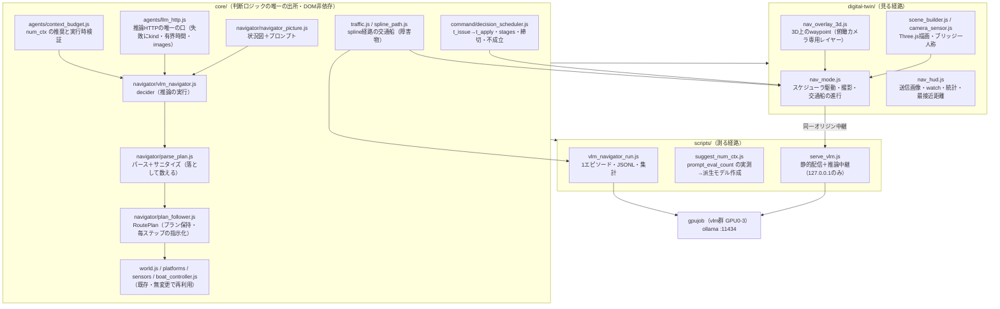
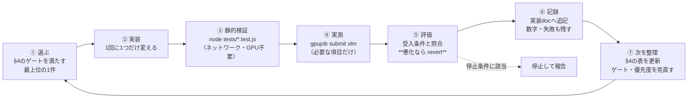

# VLM側 システム構成・作業計画・自律反復の手順

> 作成: 2026-09-06
> 位置づけ: VLM側（GPU群 vlm = GPU0-3）の**全体像と作業計画の入口**。
> 個別の詳細は既存ドキュメントが正典で、ここはそれを束ねる索引＋計画部分だけを持つ。
>
> | 主題 | 正典 |
> |---|---|
> | 知覚〜航路計画のフロー（現状と理想・改修順序） | [`perception-to-waypoint-flow.md`](perception-to-waypoint-flow.md) |
> | 実装の経緯と実測 | [`l1-vlm-navigator-implementation-2026-09-05.md`](l1-vlm-navigator-implementation-2026-09-05.md) |
> | GPUメモリ・`num_ctx` | [`multi-vlm-gpu-budget.md`](multi-vlm-gpu-budget.md) |
> | リモート閲覧の接続性 | [`remote-viewer-connectivity.md`](remote-viewer-connectivity.md) |
> | 時間の扱い | [`time-model.md`](time-model.md) |
> | フェーズの見取り図 | [`development-roadmap.md`](development-roadmap.md) |

---

## 1. VLM側システム構成



**不変条件（崩したら他が壊れる）**

1. **判断ロジックは `core/sim/navigator/` にしか置かない。** 見る経路と測る経路が同じモジュールを使う
2. **推論の口は `llm_http.js` だけ。** `fetch` を直書きしない（失敗の kind 体系・有界時間の担保が消える）
3. **発効遅延の出所は `DecisionScheduler` の設定値だけ。** 実測を設定へ書き戻さない
4. **サニタイズは落として数える。** 黙って直さない（どこが壊れているか分からなくなる）
5. **3Dオーバーレイは俯瞰カメラ専用レイヤー。** センサー画像に写ると VLM が自分の線を見る循環になる

## 2. シミュレーションとビューアの関係

**同じ `core/` を、2つの実行器が回す。** どちらも「シムを持つ」が、役割が違う。

| | ビューア（見る） | ランナー（測る） |
|---|---|---|
| 入口 | `digital-twin/?nav=vlm` | `node scripts/vlm_navigator_run.js` |
| シムが走る場所 | **見ている側のブラウザ** | ブラウザ（Puppeteer）＋ Node が推論と記録 |
| 描画 | 手元のGPU | ソフトウェア描画（撮影のためだけ） |
| 時間の刻み | 固定ステップの蓄積（`?speed=` 倍） | 固定ステップ（実時間と無関係） |
| 推論の待ち方 | fire-and-forget、`blockedAt` で停止表示 | await（決定論を保つ） |
| 成果物 | 画面・HUD | `logs/vlm-nav-*/` の画像・JSONL・summary |
| GPU | `serve_vlm.js` 中継経由 | 直接 |

**ビューアは「壊れ方を目で見つける」ため、ランナーは「数字にする」ため。** 実際、
HUDパネルの重なり・カメラの上下・視点の回転はビューアでしか見つからず、
座標の書き写し（24点中6点）はランナーのJSONLでしか数えられなかった。

## 3. GPUリソースの管理方

**正典は [`multi-vlm-gpu-budget.md`](multi-vlm-gpu-budget.md)（VRAMの算術と `num_ctx`）と
`/tmp/GPU-USAGE-CONVENTION.md`（共有の取り決め）。** ここでは運用手順だけ。

### 3.1 使ってよい資源

| グループ | GPU | ollama | 誰が使うか |
|---|---|---|---|
| **vlm** | 0,1,2,3（96GB） | `127.0.0.1:11434` | **こちら（VLM航行）** |
| sim | 4,5,6,7（96GB） | `127.0.0.1:11435` | マルチエージェント実験（別セッション） |

### 3.2 必ず `gpujob` を通す

```bash
gpujob status                      # 空きVRAM・worker・キューを見る
gpujob serve vlm                   # vlm群の ollama を正しい環境変数で起動
gpujob submit vlm <名前> --need-gb 8 -- node scripts/vlm_navigator_run.js --arm vlm ...
gpujob submit vlm <名前> --need-gb 8 --exclusive -- node scripts/suggest_num_ctx.js ...
gpujob logs <名前> -f
```

- **シムラン（`vlm_navigator_run.js`）は `shared`**。結果は宣言値 `latencyS` だけで決まるので、
  GPU競合の影響を受けない（変わるのは実行時間と記録専用の実測値だけ）
- **レイテンシ計測（`suggest_num_ctx.js` / `llm_probe.js`）は `--exclusive`**。
  レイテンシそのものが成果物なので単独で走らせる
- **`ollama serve` を手で起動しない。** `CUDA_VISIBLE_DEVICES` は CUDA にしか効かず、
  **Vulkan バックエンドは独自にGPUを列挙して分割の外へモデルを載せる**（実測）。
  `gpujob serve` が `OLLAMA_VULKAN=0 GGML_VK_VISIBLE_DEVICES=""` を併記して正しく立てる

### 3.3 モデルは `num_ctx` を絞った派生モデルだけを使う

素のモデルは KV キャッシュで VRAM を食い潰す（実測 `qwen2.5vl:7b` = **85.9GB**、
派生 `qwen2.5vl-7b-ctx3k` = **5.64GB**）。

```bash
# 実際に使う画像・プロンプトで測ってから作る
node scripts/suggest_num_ctx.js --model <base> --system-file ... --prompt-file ... \
  --image <実画像> --max-tokens 400 --create <新名>
```

`num_ctx` をコード側に書かない。`serve_vlm.js` の起動時表示とランのサマリが、
モデルの宣言値と実測 `prompt_tokens` を毎回突き合わせる。

### 3.4 片付け

```bash
curl -s http://127.0.0.1:11434/api/generate -d '{"model":"<名前>","keep_alive":0}'  # アンロード
```

`ppid=1` の `llama-server` は**孤児**（親のollamaが死んだ残骸）で、
どのollamaも管理していないのにVRAMを掴む。`nvidia-smi` で見つけたら落とす。

---

## 4. 作業TODO（ジョブ設計）

**原則: 1イテレーションで1つだけ変える。** L0 で善意の1行追加が死んだwaypoint率を
80.9%→98.3% に悪化させた実績があるため、変更と計測は必ず対にする。

### 4.1 単艦VLM航行の改修（進行中）

| # | やること | ゲート（着手条件） | 受入条件 | GPU |
|---|---|---|---|---|
| **H0** | 接触idの匿名化（`traffic-cross` → `TRK-01`） | — | — | **完了・合格**（on-contact 6→0） |
| **R1** | エピソードの決定論回復＋設計されたばらつき | — | — | **完了・合格**（同一epの軌跡が16/16点一致） |
| **H4** | `avoidance.js`（CPAから通過点を生成する純関数） | — | — | **完了・合格** |
| **H6** | プランの事後CPA検査（`planClearance`） | — | — | **完了・合格** |
| **H2** | 出力を機動の選択（enum）に変える＝`vlm-watch` アーム | — | 最接近距離が統制群を安定して上回る | **完了・合格**（median 14→76.7m・最悪 1→63m・6/6改善） |
| **H3** | 対応づけ層 `fuse_tracks.js`（匿名化＋速度推定） | — | — | **完了**（一度悪化させ、原因は外挿の上限120sだった） |
| **A1** | 到達と離隔のトレードオフ | — | 到達 6/6 かつ最悪ケース維持 | **完了・合格**（`roomFraction 0.35` を既定に。到達 6/6・最悪 55m・経路比 1.07） |
| **A2** | 評価段（④）の過剰反応 | — | 不要な回避を減らす | **完了・合格**（CPA veto。**65判断中35回=54%が不要な回避**だった） |
| **S1** | シナリオの永久封鎖を解消 | — | 遭遇するが去る配置 | **完了**（`traffic-slow` を周回→横断へ。直行なら最接近1m・t=171sで離脱） |
| **H1** | レーダー節から絶対座標を削る（単独では未実施） | — | — | **watch アームに内包**（座標を渡さない設計にした） |
| **H3** | 対応づけ層 `fuse_tracks.js` | H0 完了（trackIdの発番元をここへ移す） | レーダーのみで track 化。純関数テスト | 不要 |
| **M2** | カメラにしか映らない障害物（ブイ列）シナリオ | なし | `vlm` と `blind` の差が原理的に出る配置をテストで担保 | 要 |
| **H5** | 検知段の分離（②を独立した推論に） | M2・H3 完了 | 検知の正解率が真値と照合できる | 要 |
| **H7** | 画像への方位目盛・接触マーカー重畳 | H1/H2 の結果次第 | — | 要 |

### 4.2 マルチエージェント（VLM）— 実装TODO

**ゲート: 単艦で「危険を検知して回避を計画できる」ことが成立するまで着手しない。**
現状 VLM は危険を報告するが回避を計画できていない。これを N 体並べても壊れ方が N 倍になるだけである。

| # | やること | 備考 |
|---|---|---|
| MA-1 | `boat_agent.js` に画像入力を足す（`buildBoatPicture` に `imageDataUrl`） | `vlm-multi-agent-plan.md` §6.3。**プロンプト変更は1回に1つ** |
| MA-2 | レンダリングのサービス化（Nodeのシムから任意スナップショットの絵を取る） | 同 §6.2。シムをブラウザへ移さない |
| MA-3 | 艇の出力に `visual`（脅威の申告のみ・非対称スキーマ）を足す | 「無害だ」は書かせない（適合率55%の実測） |
| MA-4 | 報告の伝播（`world.reports` → `fused_picture` の FIELD REPORTS 節） | 同 §6.5。案C（階層型） |
| MA-5 | トラックIDの匿名化（指揮官側） | H0 と同型。**指揮官側は未対応** |

### 4.3 マルチエージェント — 試験TODO

| # | 試験 | 測るもの | 前提 |
|---|---|---|---|
| MT-1 | `num_ctx` の再測定（艇の状況図＋画像） | 派生モデルの窓 | MA-1 |
| MT-2 | 同時スロット数と実効判断レート | 艇N体で必要な `OLLAMA_NUM_PARALLEL` | MA-1・MA-2 |
| MT-3 | 位相ずらし（`firstIssueAtT`）の効果 | 同時推論のピーク低減 | MT-2 |
| MT-4 | 32B VLM の VRAM と速度の実測 | §3 の見積り（26GB）の検証 | — |
| MT-5 | アーム比較（`text` / `vlm` / `vlm-report` / `blind`） | 艦種同定の正解率・勝率 | MA-1〜4 |

---

## 5. 自律反復の手順（このプロジェクトでの1イテレーションの定義）

**「簡易なものから順に実装と検証を繰り返し、程よいところで止める」を手順として固定する。**



### 5.1 各段の規則

| 段 | 規則 |
|---|---|
| ① 選ぶ | §4 の表で**ゲートを満たす最上位の1件**。飛ばさない（H0 を飛ばすと以降の測定が無意味になる） |
| ② 実装 | **1イテレーション＝1変更**。プロンプトと出力スキーマを同時に変えない |
| ③ 静的検証 | `navigator` / `command` / `core_smoke` の3スイート。**GPU も推論サーバも使わない**ので必ず先に通す |
| ④ 実測 | `gpujob submit vlm`。シムランは shared、レイテンシ計測は `--exclusive` |
| ⑤ 評価 | 受入条件と照合。**n=1 は「回った」記録であって比較ではない**と明記する |
| ⑥ 記録 | 数字を残す。**うまくいかなかったことも残す**（期待が裏切られた事実が次の判断材料） |
| ⑦ 次を整理 | §4 の表を書き換える。ゲートが変わったら順序も変える |

### 5.2 停止条件（「程よいところ」の定義）

次のどれかに当たったら**手を止めて報告する**。自分で判断して先へ進まない。

1. **受入条件を満たしたが、その先の改修が「主題（マルチエージェント）」から離れる**とき
2. **同じ指標が2イテレーション続けて改善しない**とき（打ち手の仮説が違う）
3. **変更が悪化させた**とき（即 revert して報告）
4. **GPUの取り決めに触れる判断が必要**なとき（vlm群の外を使う・分割を変える）
5. **入力・出力の契約を変える判断が必要**なとき（過去の実測と比較できなくなる）
6. **n=1 で結論を出したくなった**とき（複数エピソードを回すかは人の判断）

### 5.3 記録先

| 何を | どこへ |
|---|---|
| 実装の経緯・実測・読み取り | [`l1-vlm-navigator-implementation-2026-09-05.md`](l1-vlm-navigator-implementation-2026-09-05.md) |
| 生ログ（画像・JSONL・summary） | `logs/vlm-nav-<日時>-<arm>/` |
| TODOの状態 | 本ドキュメント §4 |
| 設計判断の変更 | 該当する正典ドキュメント（§冒頭の表） |

### 5.3.5 サイクル上限は実行過程に応じて伸縮させる（A1-(2)）

**固定上限では「未到達」の中身が区別できない。** 2026-09-06 の実測で、離隔を最大化した結果
6エピソード中2本が14サイクルの上限に達して未到達だったが、片方は残り **74 m**
（あと1〜2サイクルで着く）、もう片方は残り **232 m**（本当に迷走）だった。
同じ「未到達」に見えて、前者は観測窓が短すぎただけである。

`--cycles auto`（既定）の規則:

| | 条件 | 停止理由 |
|---|---|---|
| **伸ばす** | 目的地までの残距離が縮み続けている | — |
| **切る** | 残距離が `--stall-progress`（既定 20 m）ぶんも縮まないサイクルが `--stall-cycles`（既定 4）回続いた | `stalled` |
| 天井 | `--max-cycles`（既定 40）に達した | `ceiling` |
| 到達 | 到達半径に入った | `arrived` |

**決定論を壊さない。** 判定材料は**シム上の量（残距離）だけ**で、実時間は一切見ない
——同じエピソード番号なら同じサイクル数で同じ理由で止まる。
これは「どこまで観測するか」という実行器の設定であって、シムのルールではない
（[`time-model.md`](time-model.md) の遅延の出所には触れない）。
`summary.json` に `stopReason` と `bestRemainingM` を残すので、
未到達の中身（惜しい／迷走）を後から区別できる。

`--cycles N` と数値で書けば従来どおりの固定上限になる（`stopReason: 'fixed-limit'`）。

### 5.3.6 到達と離隔のトレードオフを制御する3つのつまみ（A1）

**それぞれ独立に切れる**ようにしてある——どれが効いたのかを1つずつ測るため。

| つまみ | 既定 | 何をするか | 無効化 |
|---|---|---|---|
| `--widen-factor` / `--widen-max` | 1.35 / 2 | 離隔不足のとき offset を広げて作り直す（以前は 1.6×2 で強すぎた） | `--widen-max 0` |
| `--room-fraction` | 0.35 | **目的地までの残距離**に対する offset の天井。残り200mの地点で300m横へ出るのは到達を捨てているのと同じ | `--room-fraction 0` |
| `--no-arrival-aware` | （有効） | プロンプトに「迂回は距離のコスト。**最小の offset を選べ**」の1行を入れる | このフラグで外す |

距離の情報は状況図に最初から載っていたが、**それがコストであることは言っていなかった**。
3つ目はその1行だけの変更である。

### 5.4 実行中に見つけた運用上の欠陥（記録）

自律反復を実際に回して初めて出た問題を残しておく。**手順そのものの欠陥**なので §3・§5 に反映済み。

| 見つかった問題 | 何が起きたか | 対処 |
|---|---|---|
| `vlm_navigator_run.js` が固定ポート（8974）で内部サーバを立てていた | `gpujob` は shared ジョブを**意図的に並走させる**（max_shared=3）ため、3本同時投入で2本が `EADDRINUSE` で落ちた（rc1） | 既定を**ポート0（OSが割り当て）**に変更。`--port N` は単発デバッグ用に残す |

**教訓**: 「複数エピソードを回す」は実験計画の話だと思っていたが、
**ランナーが並列に耐えるかという実装の要件**でもあった。
GPU管理の仕組み（shared/exclusive）と実行器の作りは対で考える必要がある。

### 5.5 現在地

- 完了: コア抽出・画像入力・時間モデル接続・ビュアー・接続性・交通船・3D waypoint・`num_ctx` の仕組み
- 完了: **H0（接触idの匿名化）** — `TrackNamer`。真の id は `trueId` に残して真値照合を可能にしてある
- 完了: ランナーの並列実行対応（§5.4）
- **M5 達成。** 完了: R1・H4・H6・H2・H3・S1・A1・A2
  （最終: median 28.6→83.0m・最悪 10→55m・経路比 1.07・**到達 6/6**・離隔不足 0）
- 次の候補: **M2**（カメラにしか映らない障害物）で「視覚が効いている」を分離する。
  M3 はレーダーにも映るので、現状の成果は「視覚の効果」ではなく「責務分割の効果」である
- そのあと §4.2 のマルチエージェント（ゲートは M5 だったので**解除された**）
- 停止中: §4.2 / §4.3（単艦の回避が成立するまで着手しない）
