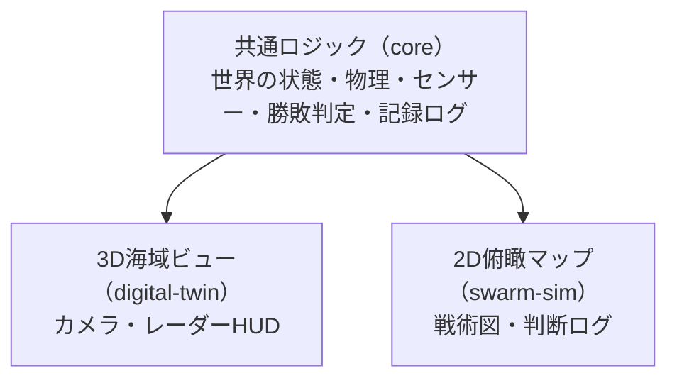
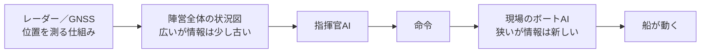
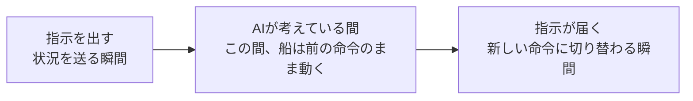

# スライド骨子 — マルチASVスウォームの攻防シミュレーション

対象: 初めてこのプロジェクトを見る人（自社用語・専門用語の解説なしでは読めない前提を置かない）。
方針: トップダウン（何か → なぜ → どうやって → 独自性 → 証拠 → 正直な結果(旧盤面) → 対応 → 検証 → 再検証(新盤面) → 今後）。
専門用語（ASV / LLM / VLM 等）は初出時に必ず一文で定義する。

> **進行中の実測に関する注記（2026-08-30 23:44〜）**
> `qwen2.5:32b` を指揮官・艇AI双方に使い、新盤面（`flag_defence_squadrons`）でルールベース統制群と
> 比較する20エピソード実行が**バックグラウンドで実行中**（PID 72595、確認時点で6/20エピソード消化）。
> これはスライド11（再検証）の数値ソース。**完了するまでスライド11の数値は確定させない**。
> 本ドキュメントでは、それ以外の全スライドの内容を先に固める（＝今回の穴埋め作業）。
>
> 実行コマンド:
> ```
> node scripts/headless_run.js --scenario flag_defence_squadrons --blue llm --boat-mode llm \
>   --model qwen2.5:32b --llm-url http://127.0.0.1:11434/v1 --episodes 20 \
>   --out submission/measurements/qwen2.5-32b/qwen2.5-32b-20ep.jsonl \
>   --decision-log submission/measurements/qwen2.5-32b/qwen2.5-32b-20ep-decisions.jsonl \
>   --llm-log submission/measurements/qwen2.5-32b/qwen2.5-32b-20ep-calls.jsonl
> ```
> 完了後の埋め方: `submission/measurements/qwen2.5-32b/console-20ep.txt` の末尾（各エピソードの
> `outcome=`行）と `qwen2.5-32b-20ep.jsonl` の集計から、results-2026-08-30.md §1と同じ形式の表を作り、
> スライド11・このoutline・deck.htmlの3箇所に反映する。

---

## 全体構成（12枚）

| # | キッカー | 見出し（h2） | 目的 | 状態 |
|---|---|---|---|---|
| 1 | （表紙） | マルチASVスウォームの攻防シミュレーション | タイトルのみ。副題1文で何が起きるゲームか要約 | 確定 |
| 2 | WHAT — どんなゲームか | 守る側は"旗"を守り切れば勝ち、攻める側は旗に届けば勝ち | ASVを定義し、ルール（突破／防御成功／相討ち）と2画面の存在を先に見せる | 確定 |
| 3 | WHY — なぜ作ったか | 「AIが安全保障の判断を担う社会」を、小さな海の攻防で試す | ハッカソン主題、LLM/VLMの定義、中心の問いを提示 | 確定 |
| 4 | HOW — 全体の仕組み | 共通のルールが1つ、それを見る画面が2つ | 図A（アーキテクチャ図）を用いて構成を1枚で見せる | 確定 |
| 5 | 独自の仕掛け① — 見ている情報が違う | 指揮官と現場のボートは、違う情報を違うタイミングで見て判断する | 図B（情報階層フロー）。伝言ゲーム構造の説明 | 確定 |
| 6 | 独自の仕掛け② — 考えている間も時間は進む | AIが返事を返すまでの間、船は"古い命令"のまま動き続ける | 図C（時間モデルのタイムライン）。比較可能性と実験軸としての価値 | 確定 |
| 7 | 実測 — 動いていることの証拠 | 設計より実測が先、という家訓 | LLM推論回数・更新速度・VLM閉ループの数値（旧盤面時代の基礎実測） | 確定（出典1件要確認） |
| 8 | 正直な結果① — うまくいかなかったこと（旧盤面） | 指揮官をAIにしても、従来ロジックに有意には勝てなかった | 3パターン比較、有意差なしの理由を平易に、診断（死んだwaypoint） | 確定 |
| 9 | 対応 — 盤面の作り直し | 「どこまで近づいてよいか」が勝敗を分けるゲームへ | 艦種3種の役割表（将棋メタファーは一言種明かし）、爆破半径の3つの意味 | 確定 |
| 10 | 検証 — 新しい盤面は決着するか（ルールベース同士） | 勝敗が散らばった。ゲームとして成立している | 80%/20%、二峰性の決着時刻、決定論的再現性 | 確定（results-2026-08-30.md実測済） |
| 11 | 再検証 — 新盤面でAI指揮官は差を出すか | 防御成功率は80%→65%に低下。技術的な故障ではなく、艇の戦術判断の質の差 | qwen2.5:32b指揮官＋艇AI vs ルールベース統制群、20エピソード、新盤面 | 確定（20ep分）。170ep追試は実行中 |
| 12 | 現在地と今後 | 「AIが1つも動いていない」穴から、「主題であるAIの活躍がまだ足りない」穴へ | 到達点／次のタスク／計算資源の必要性 | 確定（11の結果で一部差し替えうる） |

---

## 各スライドの内容骨子

### 1. 表紙
- タイトル: マルチASVスウォームの攻防シミュレーション
- 副題: 複数の無人ボート（ASV）が2つの陣営に分かれ、"旗"を守る側と奪う側として戦う——その一連の攻防を再現するシミュレーション基盤
- キッカー: 第2回 AIエージェント社会シミュレーション・ハッカソン「メタ安全保障」
- フッター: リポジトリURL／公開デモの有無

### 2. WHAT — どんなゲームか
- **登場するもの**: ASV＝Autonomous Surface Vehicle。人が乗らず自分で動く無人ボート。守備側・攻撃側それぞれが複数隻の艦隊（＝スウォーム）を持ち、旗を挟んで対峙する
- **勝敗のルール**: 攻撃側が旗に到達→突破（攻撃側勝ち）／制限時間内に守り切る→防御成功（守備側勝ち）／ボート同士が至近距離→相討ちで双方消える
- **見る画面は2種類**: 3D海域（カメラ・レーダー視点）と2D俯瞰マップ（戦術図）。ルールは共通

### 3. WHY — なぜ作ったか
- **ハッカソンの主題**: 「メタ安全保障」。AIが意思決定に関わる社会を実際に動くシミュレーションで検証
- **使うAIの種類**: LLM＝文章で状況を読み指示を返す会話AI／VLM＝カメラ画像を見て判断できるAI／比較対象としてルールベース（AIを使わない従来ロジック）も用意
- **中心の問い**: 指揮官の判断が遅い・情報が古いと、戦況にどう影響するか

### 4. HOW — 全体の仕組み（図A使用）
- **共通ロジック**: 世界の状態・物理・センサー（GNSS／レーダー）・勝敗判定・記録ログを1か所に集約。ブラウザでもheadless実行でも同じものが動く
- **2つの画面**: 3D海域ビュー／2D俯瞰マップ。どちらも共通ロジックの上に乗るだけ
- **設計原則**: 海域は固定しない（設定ファイルで差し替え）／サーバー不要・ビルド不要／2画面は同じ座標系

### 5. 独自の仕掛け① — 見ている情報が違う（図B使用）
- **伝言ゲームのような構造**: 指揮官も現場ボートも「状況を受け取り→命令を返す（または何もしない）」という同じ形の判断。だからルールベースとLLMを同じ土俵で比較できる
- **役割の違いはプロンプトで作らない**: 指揮官には広いが古い状況図、現場には狭いが新しい観測結果。知っていることの食い違いを入力設計で意図的に作る

### 6. 独自の仕掛け② — 考えている間も時間は進む（図C使用）
- **なぜ重要か①公平な比較**: 「考えている時間」は実測値でなく設定値。同じ遅さの条件でルールベースとLLMを比較できる。速い環境に変えても結果は変わらない（実行時間だけ変わる）
- **なぜ重要か②実験の軸**: 命令をどれだけ待つか／間に合わなかったらどうするか、まで設定値。「指揮が遅い陣営は負けるのか」をコード変更なしに問える

### 7. 実測 — 動いていることの証拠
- 1,554回の実LLM推論（150エピソード連続、ローカルOllama qwen2.5:7b、解析失敗1件／通信失敗0件）
- 108,600 更新/秒（3隻・CPU1コア、30隻でも6,400/秒）※このスループット値は旧盤面基準の一般ベンチマーク。新盤面8隻での実測値（20,324.9更新/秒、艇あたり2,540.6）はスライド10に別掲するため、出典混同がないよう脚注で明示する
- VLM閉ループが実レンダリング画像で成立（8/30、AI応答中央値1.78秒／画像生成84–115ms）

### 8. 正直な結果① — うまくいかなかったこと（旧盤面）
- 明示的に「これは盤面再設計前（旧盤面）での結果」と冒頭でラベルする——スライド10・11の新盤面結果と混同されないようにするため
- 3パターン比較（両ルールベース／指揮官のみLLM／両LLM、各25エピソード）
- 勝率の差はばらつき（約12ポイント）の範囲に収まり、統計的に有意差なし（脚注: McNemar p=0.45、分離には1パターン約170エピソード必要）
- 診断: 移動命令の80.9%が直前と同座標への送り直し（死んだwaypoint）。ただし根本原因は指揮官の弱さでなく、盤面側に差の出る余地がなかったこと

### 9. 対応 — 盤面の作り直し
- 3艦種（快速艇＝歩・9m/s・探知300m・爆破50m・先鋒護衛／索敵艇＝金・6m/s・探知1200m・非武装・偵察／重装艇＝飛車・4m/s・探知400m・爆破100m・本命）
- 爆破半径の3つの意味: 対艦（相討ち）／対旗（旗を壊せる）／巻き添え（迎撃位置が旗に近いと旗も壊れる）→守備側は旗の上で待てず前に出る必要
- 中核の不確実性: レーダーは点しか映さず艦種不明。本命の識別は次段階でVLMに担わせる
- 実装メモ（発表では省略可）: 旗の破壊判定を「重装艇限定・80m固定」から「武装艦（爆破半径>0）が旗を自分の爆破半径に収めたら破壊」に修正（A-1）。修正前は重装艇不在シナリオが初手で即決着する不具合があった

### 10. 検証 — 新しい盤面は決着するか（ルールベース同士・確定数値）
出典: `submission/measurements/results-2026-08-30.md` §1（2026-08-30計測済）

- 20エピソード: 防御成功16（80.0%）／突破4（20.0%）／時間切れ0（0.0%）
- 隻数8（各陣営 快速2・索敵1・重装1）
- 平均決着時刻31.5秒（最短15.9秒・最長81.2秒、制限240秒に対し余裕）
- 決着時刻が二峰性: 防御成功は16〜35秒に集中（快速艇が序盤に相討ちで消える）、突破は75〜81秒に集中（重装艇が生き延びて旗へ届く）→意図した2段階の時間割が盤面上で実際に効いている
- スループット: totalSteps=6302／totalWallTime=0.310秒／**20,324.9更新/秒**（艇あたり2,540.6）
- 統制群は完全に決定論的（乱数・実時刻不使用）→誰が実行してもバイト単位で同じ結果。再現コマンド:
  ```
  node scripts/headless_run.js --scenario flag_defence_squadrons --episodes 20
  ```
- 回帰確認: 既定シナリオ（tokyo_bay_minimal）5エピソードも例外なく完走（defended 4／breached 1）

### 11. 再検証 — 新盤面でAI指揮官は差を出すか【確定・出典: qwen2.5-32b/analysis-20ep.md】
- **問い**: スライド8で「盤面に差の出る余地が無かった」と診断し、スライド9で盤面を作り直した。では作り直した盤面で、AI指揮官はルールベースの統制群（スライド10: 防御成功80%）と違う結果を出すか
- **条件**: qwen2.5:32b（指揮官・艇AI双方）vs ルールベース統制群、新盤面`flag_defence_squadrons`、20エピソード
- **結果**: 防御成功13/20（65.0%）／突破7/20（35.0%）／時間切れ0。ルールベース統制群（80.0%/20.0%）より**15ポイント低下**
- **決着時刻**: 二峰性は保たれる（防御成功は16.2〜34.2s、突破は69.3〜81.6s）。崩れたのは山の形ではなく、どちらの山に落ちる比率か
- **診断**: 指揮官AIのパイプラインは健全（適用率96.5%、未適用3件はいずれもエピソード終了時のin-flightで故障ではない）。艇AIのLLM呼び出しも技術的失敗ゼロ（568件全てfailure:null）——ただし44%は「指揮官命令に従う／現状維持」を選択し、独自の回避行動は56%。旧盤面の「死んだwaypoint」バグとは異なり、**技術的な故障ではなく戦術判断の質の差**という診断になった
- **交絡要因**: 指揮官と艇AIを同時にLLM化しているため、低下の原因が指揮官側か艇側かはこの1本の計測だけでは切り分けられない（要・分離計測）
- **副産物**: エピソード3の突破は重装艇でなく快速艇によるもの。`flag_defence_squadrons.json`のnoteフィールド（「重装艇だけが勝敗を決める」）がA-1修正前の記述のまま古くなっていることが判明（実装は正しい。ドキュメントのみ要修正）
- **次**: 統計的有意差の検証に向け、同条件で170エピソードの計測がバックグラウンド実行中（`submission/measurements/scaleup/`）。完了後にこのスライドを検定結果込みで更新

### 12. 現在地と今後
- **到達点**（実測済）: 共通ロジック／時間モデル／指揮官LLM比較（旧盤面）／VLM閉ループ／新盤面の決着（ルールベース）、（実装済）現場ボートAIの骨格
- **スライド11の結果次第で追記**: 新盤面でのAI指揮官比較結果を「到達点」に追加する
- **次にやること**: 識別台帳／現場ボートAIの本格運用（主題の本体）／VLM索敵艇
- **計算資源が必要な理由**: 勝率差の検証に1パターン約170エピソード必要。手元GPU（RTX 3060）では6隻運用に処理能力が3.4倍不足

---

## 重要なブロック図（3点、整理版）

書式は現行スライドと同じ「箱＋矢印」表現に合わせる（mermaidは整理用の下書きとしてここに記載し、実装はCSSの`.node`/`.arrow`で描く）。

### 図A：全体アーキテクチャ（4枚目で使用）

現状は文章カードのみで図が無い。以下の箱図を追加する。



- ポイント: 「1つの共通ロジックに2つの画面がぶら下がる」非対称な構造であることを一目で伝える
- 現行の`.node`/`.arrow`スタイルに合わせ、`core`を中央、左右に`view3d`/`view2d`を配置する横並び図にする

### 図B：情報階層フロー（5枚目で使用・既存を維持）



- 変更なし。既存デッキの図をそのまま踏襲

### 図C：時間モデルのタイムライン（6枚目で使用・既存を維持）



- 変更なし。既存デッキの図をそのまま踏襲

---

## 未確定事項

- **スライド11の実測値**（最優先の穴。実行完了後に埋める。上記「進行中の実測に関する注記」参照）
- スライド7の「108,600更新/秒」の出典スクリプト・計測日を確認し、脚注に明記する（新盤面の20,324.9更新/秒と取り違えないため）
- 図Aのレイアウト（横並び／中央集約型）の最終形は、実装時にCSSで微調整する
- 将棋メタファーの表記位置（表の上に一言添える形で確定済み）
